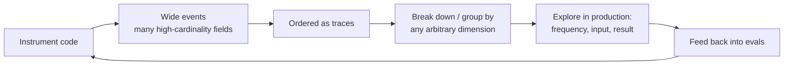

# LLMs Demand Observability-Driven Development

Honeycomb's argument (from the Charity Majors school of observability): LLMs are the far
end of a spectrum software has been sliding along for a decade toward complexity and
nondeterminism. They are **black boxes that produce nondeterministic outputs and cannot
be debugged or tested with traditional techniques.** Hooking a black box up to
production is where the terror starts — and the answer is not more unit tests, it's
observability.

## Why traditional debugging breaks down

Classical computing earned reliability through *constraint*: constrain the language and
the math, and an algorithm returns the same result every time. Concurrency, layered
abstractions, randomness, and weak telemetry all chip away at that. LLMs blow past all of
it: the same input can yield different outputs, and the *input distribution itself* is
unpredictable and drifts over time.

If you only have metrics, you literally cannot tell whether a spike in `api_requests` and
a spike in `503`s are the same events or disjoint ones — it's mathematically impossible
to disambiguate from aggregates. You need the raw events.

## The two things observability requires

1. **Gather and store telemetry as very wide events, ordered in time as traces.** One
   event carries many fields (request path, error code, prompt, input, output, cost,
   latency) so you never have to guess whether two signals belong to the same event.
2. **Break down and group by any arbitrary, high-cardinality dimension.** You must be
   able to slice by frequency, input, or result *without* locking data into predefined
   structures — because with LLMs the dataset *is going to be* unpredictable and *will*
   change over time.

## Observability-driven development, not test-driven

TDD assumes predictable failure modes; LLMs don't have them. So the loop becomes: ship
sooner, observe results in production, wrap observations back into development.
Strikingly, you can improve an LLM product *without touching the prompt at all* — examine
user interactions, score response quality, and fix correctable errors (data-model
mismatches, parsing/validation failures) in code. Each fix doubles as a test case
proving the correction works. Only after exhausting the "pure software" gains do you
reach for prompt engineering, and even then the loop is the same: tweak inputs, score
outputs, watch the dataset for representativity drift.

This connects directly to [Hamel Husain's evals](your-ai-product-needs-evals.md)
(looking at traces, sampling by outliers and negative feedback), to the
[patterns for building LLM systems](eugene-yan-llm-patterns.md) (evals + feedback
flywheel), and to [agent observability](agent-observability.md) more broadly. In
practice teams instrument against the OpenTelemetry GenAI `gen_ai.*` semantic conventions
so the backend is a config choice — see [OpenLLMetry](openllmetry-is-all-you-need.md).

## Takeaway

Software engineers used to boolean/discrete math and TDD now have to reason about data
quality, representativity, and probabilistic systems. The only way to improve
LLM-based software is by observability and experimentation.

## Related

- [Agent observability](agent-observability.md)
- [OpenLLMetry is all you need](openllmetry-is-all-you-need.md)
- [Your AI Product Needs Evals](your-ai-product-needs-evals.md)
- [Patterns for building LLM systems](eugene-yan-llm-patterns.md)

## References

- [LLMs Demand Observability-Driven Development — Honeycomb](https://www.honeycomb.io/blog/llms-demand-observability-driven-development)
