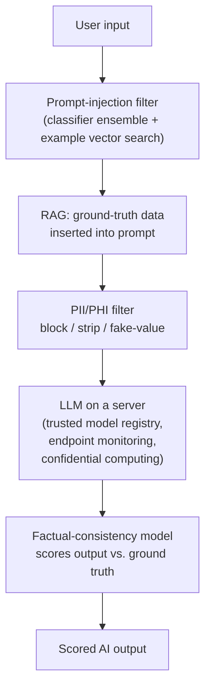

# LLM Safeguards: Security, Privacy, Compliance, Anti-Hallucination

A talk by **Daniel Whitenack** (founder/CEO, Prediction Guard) at the AI Engineer
conference, on deploying secure, accurate LLM systems in the real enterprise — where
adoption looks less like a smooth co-pilot demo and more like a pile of unaddressed risk.
He assumes open-access (self-hostable) models are at least part of the strategy, then
builds a **checklist of failure modes** and motivates a mitigation for each. Every
mitigation is a layer placed *around* the model, not a change to the model itself.

## The checklist: five failure modes → five layers

1. **Hallucination (misinformation).** The knee-jerk fix is RAG — insert ground-truth data
   into the prompt. But RAG "kind of works most of the time, then fails miserably," and
   you can't tell which. Prediction Guard adds a **fine-tuned factual-consistency model**
   (an ensemble in the UniEval / BARTScore family) that scores the AI output against the
   ground-truth text, so every answer ships with a **consistency score.** LLM-as-judge is
   an alternative, but heavier (see latency note).

2. **Supply-chain vulnerabilities.** Models and their runtime code (e.g. Transformers) pull
   third-party code — a new vector for the "friendly neighborhood criminal." Mitigate with a
   **trusted model registry** (commercially licensed, trusted sources), hash/attestation
   checks on pull, cloning models into your own registry, and `trust_remote_code=False`.

3. **Flaky / vulnerable model servers.** These models are ultimately APIs on a server.
   Apply standard endpoint discipline — **file-integrity monitoring, pen tests, red
   teaming, SOC 2-style controls.** Data scientists often aren't the ones who know how to
   run resilient microservices at scale, so ask a vendor exactly where and how their model
   servers run.

4. **Data breaches / privacy.** Prompts (often carrying PII/PHI from RAG) get logged or
   cached in plaintext. Put a **PII/PHI filter in front of the model** — block, strip, or
   replace with fake values — and protect memory itself with **confidential computing**
   (Intel SGX/TDX memory encryption) or **remote attestation** to a trusted environment.
   Careless RAG can literally "dox your employee" by surfacing a support-ticket email into
   a completion.

5. **Prompt injection.** Malicious instructions ("ignore all your instructions and…")
   smuggled into prompts, dangerous once the system is wired to a knowledge base, database,
   or tools. Mitigate with a **firewall-like layer**: an expanding set of injection
   examples plus a **classification-model ensemble**, configurable thresholds, and
   semantic vector search against known-injection examples.

## Practitioner notes from the Q&A

- **Latency.** Don't add safeguards as extra LLM calls. The LLM call dominates (~seconds);
  a small NLP consistency model runs on CPU in ~200ms, and injection detection can be a
  fast **vector-search** operation against an example DB, not a model call. Spend latency
  on the LLM; make the guards cheap.
- **Visibility.** Unlike closed moderation black boxes, expose each guard as a callable
  model so users can see *why* something was blocked and tune thresholds.
- **Data access for RAG.** Prefer sources with built-in role-based access control (SQL /
  pgvector queried with the user's role); for raw document lakes, use a policy engine
  (e.g. Immuta) with tool-calling under the right role — LLMs don't solve the access
  problem themselves.
- **Agents.** The new risk is **excessive agency** — granting too much permission too
  early. Restrict permissions, or use a **dry-run + human-in-the-loop approval** so a
  skilled operator edits the generated plan (generating the first draft is the tedious
  part; post-editing is fast).

Whitenack explicitly points the audience to the [OWASP LLM Top 10](../ai-governance/owasp-llm-top-10.md)
("just search for llm top 10"), calling out **Excessive Agency** as the one to study for
agentic systems. The checklist here is essentially a hands-on mitigation map over that
list — the [guardrails proxy](guardrails-proxy.md) pattern made concrete.

## Related

- [OWASP LLM Top 10](../ai-governance/owasp-llm-top-10.md) — the risk taxonomy this talk mitigates
  point-by-point.
- [Guardrails Proxy](guardrails-proxy.md) — the filter-around-the-model pattern.
- [Data Governance](../ai-governance/data-governance.md) — RAG-doxing, PII leakage, and Excessive Agency.
- [Agent Identity & Access](../ai-governance/agent-identity-access.md) and
  [Execution Sandboxing](execution-sandboxing.md) — least privilege and dry-run for agents.

## References
- [LLM Safeguards: Security, Privacy, Compliance, Anti-Hallucination — Daniel Whitenack (Prediction Guard), AI Engineer](https://www.youtube.com/watch?v=jdeMJJ_oNYg)
