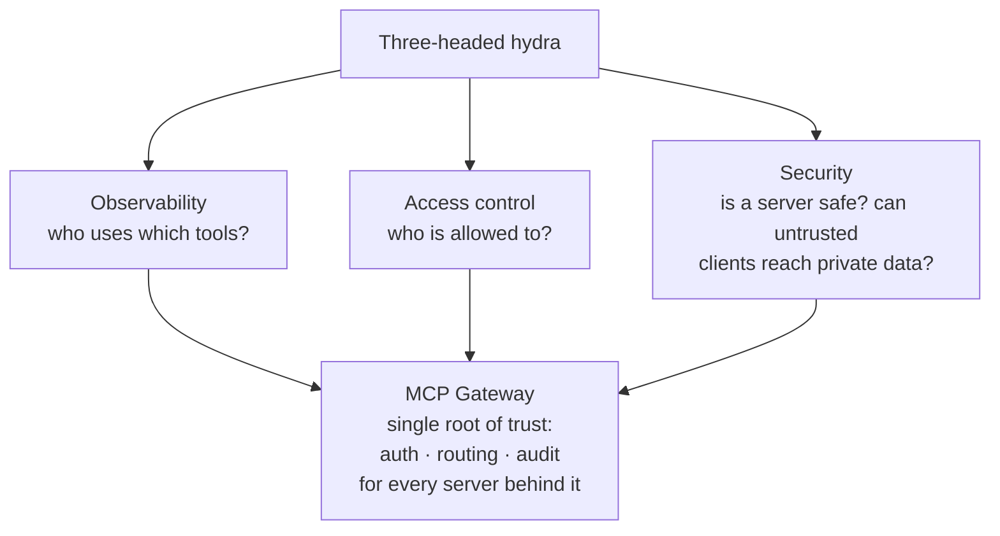

# MCP Gateway

The **Model Context Protocol (MCP)** is the open standard for connecting an agent
to the world outside its context window — tools, data, systems — through **one
uniform interface** instead of one-off integrations (see
[MCP architecture](mcp-architecture.md)). An official registry already lists
thousands of servers. For the platform, MCP is the **connective tissue**: how
every agent in the org reaches internal systems without each team reinventing
the plumbing.

The platform problem is making that connectivity **enterprise-ready**. Tobin
South (WorkOS): *"Everyone is building MCP servers… good demos, but not ready to
turn into production."*

## The three-headed hydra

Anthropic's forward-deployed teams name three linked problems — which is why
most enterprises struggle to run more than **single digits** of MCP servers:

The emerging answer is an **MCP gateway**: a single root of trust handling auth,
routing, and audit for every server behind it.

## Why it matters

MCP turns an **N×M** integration problem — every agent wired to every system —
into **N+M** against one protocol. But a hacky server isn't production: it needs
**authentication, scoped permissions, audit logs, and agent identity** before an
enterprise can trust it. Treating MCP as **platform infrastructure** — a gateway
in front of many servers, with scoped permissions and a [registry](registries.md)
of what exists — is what lets tool access scale past the demo.

It shares a control-point shape with the [model router](model-router.md): **one
routes model calls, the other routes tool calls.** (*"Gateways are all you
need"* — Sampath.)

## Related

- [MCP Architecture](mcp-architecture.md) — the host↔server protocol this gates.
- [MCP Configuration Reference](mcp-configuration-reference.md) — configuring
  individual servers + their security.
- [Model Router](model-router.md) — the sibling gateway for model calls.

## References
- [MCP Gateway — Tessl Patterns](https://tessl.io/patterns/agentic-platform/mcp-gateway/)
