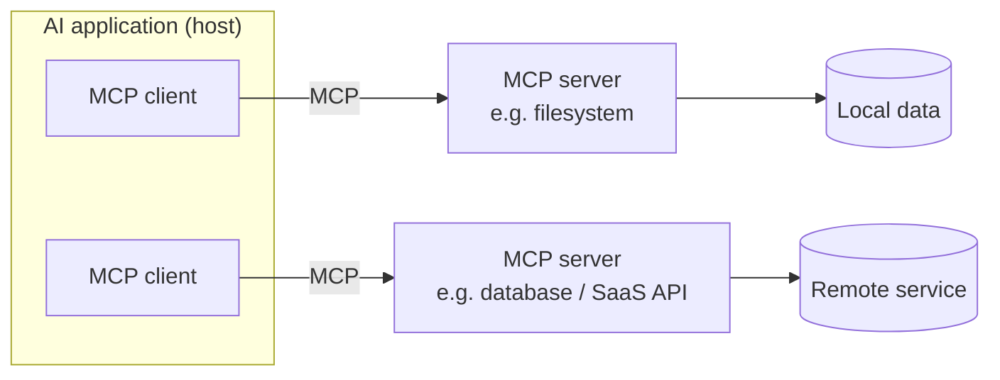

# Model Context Protocol (MCP)

MCP is an **open standard for connecting AI applications to external systems** —
tools, data sources, and services — through a single uniform interface instead of
one-off, per-integration glue. It is often described as a "USB-C port for AI": one
protocol any client can speak to reach any compliant server.

## The shape of it

- **Host** — the AI application (a chatbot, an IDE assistant, an agent) that wants
  outside context or actions.
- **Client** — the connector inside the host that speaks MCP; one client per server
  connection.
- **Server** — a program that exposes capabilities over MCP. A server can offer
  **tools** (functions the model can call), **resources** (data/context to read),
  and **prompts** (reusable templated interactions). The spec has more than most
  people realize.

Because the interface is uniform, a server written once works with any MCP client,
and a client can reach any server — the same interoperability argument as a
hardware bus.

## Why it matters

MCP is the connective tissue of an agent platform: it is how every agent in an org
reaches internal systems without each team reinventing the plumbing. An official
registry already lists thousands of servers. The hard part is making that
connectivity **enterprise-ready** — observability, access control, and security —
which is the job of an [MCP Gateway](mcp-gateway.md).

## Related

- [MCP Gateway](mcp-gateway.md) — the single root of trust (auth, routing, audit)
  that makes MCP servers safe to run at scale.
- [MCP Architecture](mcp-architecture.md) — deeper architectural detail on the
  protocol.
- [Registries](registries.md) — how discoverable MCP servers and agents are
  catalogued and governed.
- [Agent Runtime](agent-runtime.md) — the substrate the agents that speak MCP run
  on.

## References
- [Model Context Protocol — modelcontextprotocol.io](https://modelcontextprotocol.io)
