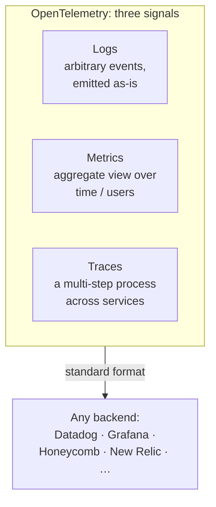

# OpenLLMetry Is All You Need

A talk by Nir, CEO of Traceloop, on **OpenLLMetry** — their open-source project for
observing LLM applications. The name is a tell: it's built on **OpenTelemetry**, and
its whole pitch is that LLM observability shouldn't be a new silo — it's plain cloud
observability applied to a new kind of app.

## First, OpenTelemetry

OpenTelemetry is a CNCF-maintained open-source project (one of the largest after
Kubernetes) that **standardizes cloud observability**. It's a **protocol** defining
three signal types, and it's supported by every major backend — Datadog, Dynatrace,
New Relic, Grafana, Honeycomb, and others — so instrumenting once lets you send to any
of them.

- **Logs** — arbitrary events emitted anytime (if you've ever written `print`, you've
  logged).
- **Metrics** — things you want to see *in aggregate*, over days or across users.
  Classic cloud metrics are CPU, memory, latency; for a **GenAI** app they become
  **token usage, latency, error rate**.
- **Traces** — tracking a **multi-step process**, e.g. a request spanning several
  microservices. The least trivial of the three, and the one that matters most for
  agents, whose work is inherently multi-step.

## What OpenLLMetry adds

OpenLLMetry extends OpenTelemetry with **instrumentations** for the LLM stack that fire
**automatically** — you don't hand-write spans. Example: the Pinecone instrumentation
captures queries going out, indexing happening inside, and vectors returned —
including vector distances, scores, and latencies — all emitted in the standard
OpenTelemetry format.

## Why the standard matters

Because it rides a **standard protocol**, you're **never tied to a platform**.
Switching observability backends is a configuration change, not a re-instrumentation
project — every OTel-supporting platform speaks the exact same format. That
portability is the argument in the title: for wiring an LLM app to whatever you
already run, OpenLLMetry (i.e., OpenTelemetry) is "all you need."

## Related

- [Agent Observability](agent-observability.md) — the general capability this instruments.

## References
- [OpenLLMetry is all you need — Traceloop (AI Engineer)](https://www.youtube.com/watch?v=KVgbERRPU4M)
