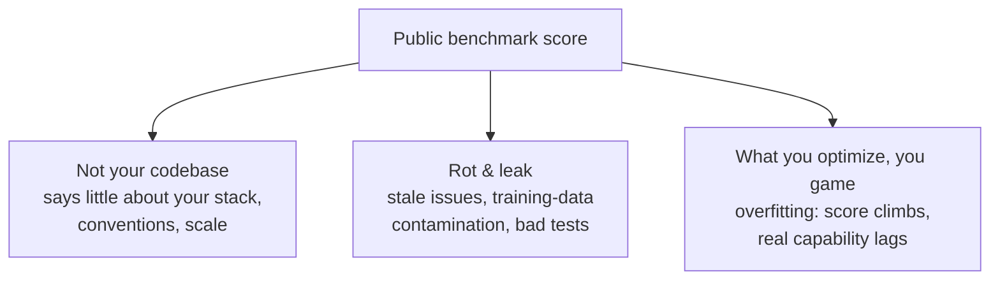

# Public Benchmarks

**Shared, comparable yardsticks** for agentic coding — the same tasks, the same
grader, run against every model and agent so results can be ranked against one
another. The **coarse capability filter** for choosing what to trial, **distinct
from your own [evals](evals-llm-as-a-judge.md)**: useful but easy to over-trust,
since benchmarks **rot, leak, and don't reflect your codebase.**

## SWE-bench and its flavours

The dominant one is **SWE-bench** — the agent is handed a real GitHub issue and
must produce a patch that makes the project's **hidden unit tests** pass. The
headline number labs quote; scores climbed fast — ~38% on SWE-bench Lite
(mid-2024) → open agents now resolving **well over 70%** of SWE-bench Verified,
some in only a few hundred lines of harness.

Flavours, all promising apples-to-apples comparison no single team could produce
alone:

- End-to-end issue resolution — **SWE-bench**
- Test-writing — **SWT-Bench** (see [automated QA](../agentic-coding/automated-qa.md))
- Terminal tasks, context retrieval, …

## Why it matters — and why to distrust the number

Benchmarks are how the field **calibrates**: they turn "this agent feels good"
into a rankable number and drive rapid, visible progress. For a platform team
they're the **coarse filter** for *which* model or agent is even worth trialing.

But treat the number with suspicion:

- **A benchmark is not your codebase.** A high SWE-bench score says an agent can
  fix *some* open-source Python issues — little about your stack, conventions, or
  scale. Same reason two models ranked as "statistical twins" can feel nothing
  alike in real work (see [models](models.md)).
- **Benchmarks rot and leak.** Toloka's SWE-bench audit found overly-specific
  tests rejecting correct fixes, vague problem descriptions, environment
  mismatches, and a newest issue dating to 2023 — stale and exposed to
  training-data contamination.
- **What you optimize, you game.** A public target invites overfitting — the
  score climbs while real-world capability lags behind it.

**So:** use public benchmarks to *choose what to trial*, and your own
[evals](evals-llm-as-a-judge.md) — run on your codebase — to decide what
actually works.

## Related

- [Models — Match Models to Tasks](models.md) — benchmarks as the coarse
  model-selection filter.
- [Evals & LLM-as-a-Judge](evals-llm-as-a-judge.md) — the fine filter, on *your*
  code.
- [Automated QA](../agentic-coding/automated-qa.md) — SWT-Bench is the test-writing benchmark.

## References
- [Public Benchmarks — Tessl Patterns](https://tessl.io/patterns/quality-security/public-benchmarks/)
