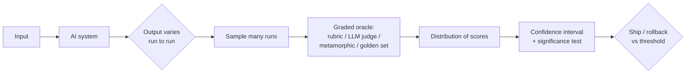

# Testing AI

*Testing AI — Beyond evals, for real software* is Jason Arbon's field guide to
testing systems whose behavior is probabilistic rather than deterministic. Arbon
co-wrote *How Google Tests Software* and founded test.ai / testRigor and later
testers.ai; the book is the distillation of that lineage applied to LLMs and ML
products. It is organized as ~110 short standalone chapters across three audience
tracks — **executives** (demand better quality evidence: samples, slices, severe
failures, rollback thresholds, cost, ownership), **product / domain teams** (turn
real workflows, policies, edge cases, and user language into representative eval
cases), and **engineers** (build repeatable validation around RAG, agents, MCP,
tools, traces, generated code, and production monitoring).

The through-line is a reframing of the tester's job: the next-generation tester
**measures uncertainty** rather than asserting a single correct answer.

## Why traditional pass/fail testing breaks down

Classic testing rests on a deterministic assumption: the same input yields the same
output, and a hand-coded expected value lets you assert equality. An AI system
violates this. The same prompt, at the same temperature, can produce different valid
outputs; a model update shifts the whole output distribution; "correct" is a spectrum,
not a bit. Equality assertions therefore produce false alarms (a different-but-fine
answer flagged as a regression) and false confidence (one lucky run declared a pass).
Arbon's move is **from exact assertions to evaluation criteria**: score quality on a
scale (e.g. 0–10) against a rubric, and treat a single run as almost no evidence.

## The test oracle problem

The hardest part of testing AI is the **oracle problem** — deciding what the right
output even is when there is no ground-truth answer to compare against. The book's
oracles are graded, not binary: rubric scoring, **LLM-as-a-judge** (using a model to
evaluate another model's output against criteria), reference/**golden sets** paired
with **live sampling** of production traffic, and **metamorphic testing** (assert
relationships that must hold across related inputs — e.g. paraphrasing the prompt
should not change the verdict — rather than one absolute expected value). This
connects directly to HAL's eval notes: [Evals: LLM as a Judge](evals-llm-as-a-judge.md),
the [LLM-as-a-Judge complete guide](llm-as-a-judge-complete-guide.md), and the
[LLM evals FAQ](llm-evals-faq.md).

## Uncertainty as the core discipline

Because a single output is noise, Arbon insists testers become fluent in statistics.
The book teaches the basics a tester needs: **sampling** (one run tells you almost
nothing; how many samples are enough), **variance** (not every difference is a bug),
**confidence intervals**, **t-tests** to compare model versions, **p-values as
evidence not permission**, **statistical vs. practical significance**, **power
analysis / minimum detectable effect**, and **multiple-comparisons / false-discovery**
control. The recurring warning — *stop chasing high-water marks* — is that a single
impressive score is not the same as a reliable distribution.

## Evaluating model quality: bias, robustness, adversarial inputs

Quality is measured across slices, not in aggregate. The book covers **stratified
reporting** and **risk-based sampling** so rare-but-severe failures aren't averaged
away, **rare-failure hunting**, and **adversarial / red-team sampling** to probe the
system where it is weakest. Search-quality work brings in ranking metrics like
**NDCG**. Fairness gets a dedicated arc — testing **bias in the data, in the labeling,
in the training, and in productization** — treating bias as something introduced (and
therefore detectable) at every stage of the pipeline, not one monolithic property.
Cost, latency, and quality are traded off explicitly rather than optimized in
isolation.

## Testing ML pipelines and data

Testing does not stop at the model output. The engineer track builds validation around
the whole system: **eval-data management**, RAG and retrieval, tool-using agents and
multi-step workflows, MCP and tool calls, execution traces, and **production
monitoring**. Because outputs keep changing, **regression testing** is redefined — you
watch the distribution and the rubric scores over time, with **human-review workflows
and escalation rules** for cases the automated oracle can't settle. The book also
scrutinizes the human layer: **using raters well** and **testing the value of data
labelers**.

## Using AI to test software

The inverse direction — AI *doing* the testing — is Arbon's practical thesis and the
foundation of testers.ai: agents and synthetic users that generate cases, execute
workflows, and evaluate results (the "LLM as a judge" pattern turned into a testing
engine). Chapters on **TestFoo / Promptfoo** and even **AI passing testing
certification exams** frame the tooling and the credibility question. This is the same
loop explored in HAL's automated-QA and agent-verification notes:
[Automated QA](../agentic-coding/automated-qa.md),
[Built by Agents, Tested by Agents](../ai-governance/built-by-agents-tested-by-agents.md),
and [Who Verifies AI Software?](../ai-governance/who-verifies-ai-software.md).

## Landing and closing the loop

The final chapters are operational: an **executive summary of why testing AI is
different**, an **AI quality release checklist**, how to **read an AI eval report**, a
worked example testing a customer-support chatbot, reusable templates, **governance for
AI quality**, and a **failure taxonomy** for AI systems.

## Related notes

- [Why AI Evals Are the Hottest New Skill](why-ai-evals-are-the-hottest-skill.md) — the market case for the discipline this book teaches
- [SWE-bench leaderboard](swe-bench-leaderboard.md), [τ-bench](tau-bench.md), and [SWT-bench (unit-test generation)](swt-bench-unit-test-generation.md) — benchmarks as one (limited) oracle for coding/agent models
- [Tessl coding-agent eval framework](tessl-coding-agent-eval-framework.md) — eval framework for coding agents
- [The Way of the Web Tester](../software-engineering/the-way-of-the-web-tester.md) — deterministic web testing the book contrasts against
- [Test-Driven Development by Example](../software-engineering/test-driven-development-by-example.md) — the exact-assertion paradigm AI testing departs from

## References

- Jason Arbon, *Testing AI — Beyond evals, for real software* — <https://testers.ai/book>
