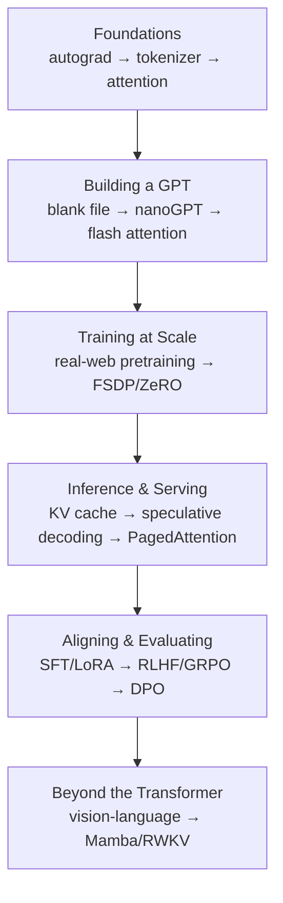

# Under the Hood: Build Every Layer of a Large Language Model from Scratch

A build-it-yourself manual by **Ramchand Kumaresan** (Leanpub, 2025) for understanding
how modern language models are built, where they fail, and how to reason about their
behavior "like an engineer instead of a spectator." The book is a companion to a public
code repository ([`mechramc/Under-the-hood`](https://github.com/mechramc/Under-the-hood),
MIT-licensed code; the book text itself is copyrighted and sold via Leanpub).

The whole book is a from-scratch tour of LLM internals — the same ground covered
conceptually in [large language models](../ai/large-language-models.md) and
[transformers and attention](../ai/transformers-and-attention.md), but here every layer
is implemented, sabotaged, and measured rather than described.

## The method: Build → Break → Measure

The organizing idea is that reading about a system teaches you half of it; the other half
lives in what breaks when you damage it on purpose. Each of the book's projects follows
the same disciplined rhythm:

1. **Hook** — the question the project answers.
2. **The Concept** — the idea in plain English, before any code.
3. **Why It Matters** — what fails in the real world without this piece.
4. **The Build** — step-by-step implementation, "written so shapes stay honest."
5. **Break It** — a deliberate sabotage, with a prediction made first, then the observation.
6. **Optional Homework** — a full lab, a proxy lab for limited hardware, and a result-guided version.
7. **Questions To Answer** — what you should be able to defend afterward.
8. **Go Further** — research anchors and next directions.
9. **What You Now Know** — the explicit deltas to your mental model.

The author is emphatic that the *breaks* are where the lessons actually live — running the
code without deliberately breaking it is described as half the experience.

## Scope: 35 hands-on projects

The projects march from a scalar autograd engine all the way to production serving and
post-Transformer architectures, grouped into six phases:

- **Foundations** — a scalar autograd engine, neurons, an MLP and training loop
  (see [backpropagation and gradient descent](../ai/backpropagation-and-gradient-descent.md));
  next-character prediction from bigram counts to learned embeddings; a byte-pair-encoding
  tokenizer from scratch with vocab size as a tunable knob; and attention from scratch —
  Q/K/V, scaled dot-product, masking, and multi-head.
- **Building a GPT** — the smallest complete GPT from a blank file, then a side-by-side
  with nanoGPT; the details that matter (norms, activations, positional encodings); and
  flash attention with tiled, memory-efficient kernels.
- **Training at Scale** — pretraining on real web data (FineWeb-EDU, mixed precision,
  val-bpb); data curation and contamination; training debugging (loss spikes, NaNs,
  profiling); and distributed training (FSDP and ZeRO, via a single-box proxy).
- **Inference and Serving** — the KV cache; speculative decoding; grouped-query attention;
  long-context extension (RoPE, YaRN, NTK-aware); and production serving with continuous
  batching and PagedAttention. This is the implementation side of the infrastructure
  covered in [serving LLMs with vLLM and SkyPilot](serving-llms-vllm-skypilot.md).
- **Aligning and Evaluating** — supervised fine-tuning and instruction tuning (SFT,
  conversational tuning, LoRA); evaluation methodology; reward models and RLHF (reward
  dataset, RM training, GRPO, KL leash); and DPO / preference optimization.
- **Beyond the Transformer** — a tiny multimodal vision-language model, and
  non-Transformer architectures (Mamba, RWKV).

## Why it belongs here

Most of the HAL platform notes treat models as a component you buy and wire up
(see [models](models.md)). This book is the counterweight: it explains what is actually
inside that component, so that decisions about serving, quantization, context length,
fine-tuning, and evaluation rest on a mechanical understanding rather than vendor framing.
The "break it, measure it" discipline also rhymes with the eval-first posture elsewhere in
this folder — you don't trust a layer until you've watched it fail on cue.

## References

- [Under the Hood — Leanpub](https://leanpub.com/under-the-hood) (the book)
- [mechramc/Under-the-hood — GitHub](https://github.com/mechramc/Under-the-hood) (code companion, MIT-licensed)
