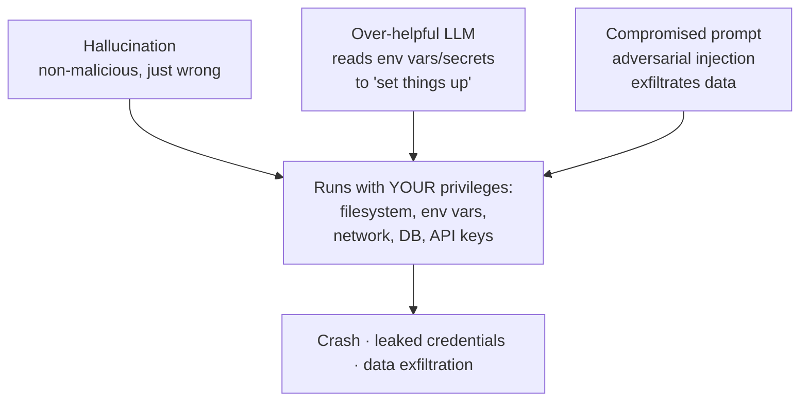

# Why, and How, You Need to Sandbox AI-Generated Code

A talk by **Harshil Agrawal** (Senior Developer Advocate, Cloudflare) at the AI
Engineer conference. The core reframe: strip away the AI hype and what we are
actually doing is **running untrusted code from the internet**. This note is the
"why sandbox" motivation behind [Execution Sandboxing](execution-sandboxing.md).

## The uncomfortable reframe

We went from autocomplete to full code generation to autonomous agents that write,
execute, review, and iterate on code — in about two years. But an LLM is a black
box: you send a prompt, get code, and often run it in your environment with your
credentials **without reviewing every line**. You would never do that with a
snippet from a random website — yet that is exactly what LLM-generated code is,
"just dressed up nicer." The model has **no intentions and no loyalty**; it is a
function that emits text that looks like code. Sometimes right, sometimes subtly
wrong, sometimes dangerous.

## Three threat scenarios

1. **Hallucination** (not even malicious) — imports a package that doesn't exist,
   writes an infinite `while True`, or a base-case-less recursion. Wrong code in
   production is still disastrous: eaten compute, crashed processes, blown stack.
   This is the baseline threat that exists **even with no bad actors**.
2. **The over-helpful LLM** — asked to configure a DB connection, it "helpfully"
   reads your environment variables, API keys, and secrets to set things up. Not
   theft, but sensitive data gets processed by code you never audited. Insidious
   precisely because the behavior looks reasonable.
3. **The compromised prompt** — adversarial injection turns the code against you to
   exfiltrate data, using the code exactly as designed against hostile input.

Why all three are dangerous: **AI-generated code runs with your application's
privileges — your actual production access, not a restricted subset.** We gave the
code the keys to the kingdom.

## The fix: capability-based security

This is not a new problem — we have sandboxed untrusted code for decades (your
browser isolates every tab; one tab can't read another's cookies). In the rush to
ship AI features we simply **forgot to apply what we already know**.

The unifying principle: **capability-based security — don't enumerate what to
block, enumerate what to allow.** A block list (deny 10,000 things) fails if you
miss one attack. An **allow list** grants only the few capabilities the code
actually needs — network to one host, read access to one directory — and denies
everything else by default.

## Related

- [Execution Sandboxing](execution-sandboxing.md) — the platform pattern this talk
  motivates; isolate first, grant narrow capabilities inside the boundary.
- [Agent Runtime](agent-runtime.md) — where those sandboxed runs are dispatched and
  managed.
- [AI Code Security](../security/ai-code-security.md) — securing the produced artifact.

## References
- [Why, and how you need to sandbox AI-Generated Code? — Harshil Agrawal, Cloudflare (YouTube)](https://www.youtube.com/watch?v=AHtGAgQ0Q_Q)
