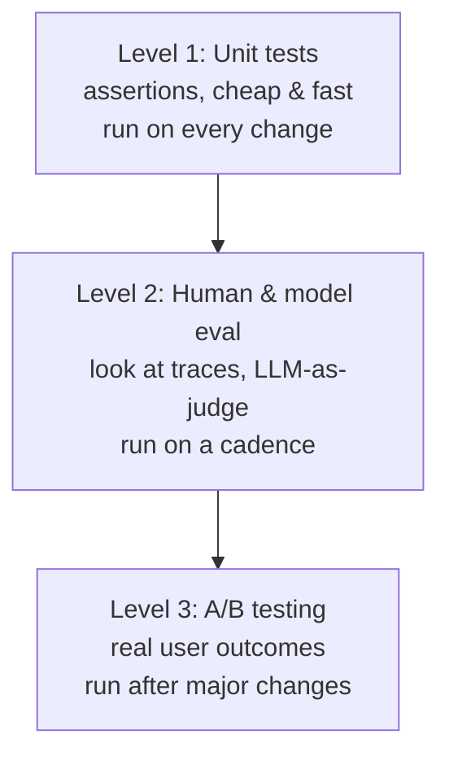

# Your AI Product Needs Evals

Hamel Husain's argument is blunt: the teams that win with LLM products are the ones that
**iterate fastest**, and you can only iterate fast if you can measure quality
automatically. Without evals you are flying blind — visually eyeballing outputs on every
change. A rigorous, streamlined evaluation system is the single highest-leverage
investment in an AI product; it sits at the center of everything else.

He grounds it in a case study (Lucy, a real-estate AI assistant at Rechat) and lays out
three levels of evaluation, ordered by cost.

## The three levels of evaluation

- **Level 1 — Unit tests.** Plain assertions (pytest-style). Scope the LLM into
  *features* and *scenarios*, then assert on each: e.g. a listing-finder feature has
  scenarios (one match, many matches, no matches) with assertions like
  `len(results) == 1`. Add generic tests too — a regex that fails if the model leaks a
  UUID it was told to hide. Rechat runs *hundreds* of these, continuously added from new
  failures seen in real data. Crucially, these assertions are reused beyond testing:
  for data cleaning and for automatic retries (feed the assertion error back to
  course-correct during inference). Don't skip this step.
- **Level 2 — Human & model eval.** Remove *all* friction from looking at data: build a
  domain-specific trace viewer (Gradio/Streamlit/Shiny in under a day) that puts trace
  log, CRM, and metadata on one screen, with filters and links. Log traces (Rechat used
  LangSmith). Label examples binary good/bad (scores are more onerous than they're
  worth). These labels measure system quality, validate automated evaluators, and curate
  fine-tuning data. Then graduate to [LLM-as-a-judge](llm-as-a-judge-complete-guide.md)
  and [model-graded evals](evals-llm-as-a-judge.md) for scale.
- **Level 3 — A/B testing.** Confirm the product drives the user behavior you want. Not
  very different from A/B testing any product; appropriate only for mature products.

Run cadence follows cost: Level 1 on every code change, Level 2 on a set cadence, Level 3
only after significant changes.

## Eval systems unlock "superpowers for free"

Once the eval machinery exists, three capabilities fall out almost for free:

- **Fine-tuning.** 99% of fine-tuning labor is assembling high-quality data covering the
  product's surface area — which a good eval system already produces. Fine-tuning is best
  for syntax, style, and rules; RAG is for facts and fresh context.
- **Data synthesis & curation.** Generate synthetic inputs with an LLM, then filter them
  through your Level 1/2 evals to keep only the good ones. Producing test cases and
  producing training data are nearly the same exercise.
- **Debugging.** The same trace tooling that scores quality is what you use to find and
  fix failures.

## A note on eval-driven development

In Husain's later FAQ he cautions *against* eval-driven development (writing evaluators
before building features) as a default: unlike traditional software, LLMs have infinite
failure surface you can't anticipate. Start with **error analysis** — write evaluators
for failures you actually observe, not ones you imagine — and always do a cost-benefit
check before building an evaluator. See [LLM Evals FAQ](llm-evals-faq.md).

## Related

- [LLM-as-a-Judge: Complete Guide](llm-as-a-judge-complete-guide.md)
- [Evals with LLM-as-a-judge](evals-llm-as-a-judge.md)
- [Patterns for building LLM systems (Eugene Yan)](eugene-yan-llm-patterns.md)
- [Honeycomb: LLMs demand observability-driven development](honeycomb-observability-for-llms.md)
- [Automated review & verification](../harness-engineering/automated-review-verification.md)

## References

- [Your AI Product Needs Evals — Hamel Husain](https://hamel.dev/blog/posts/evals/)
