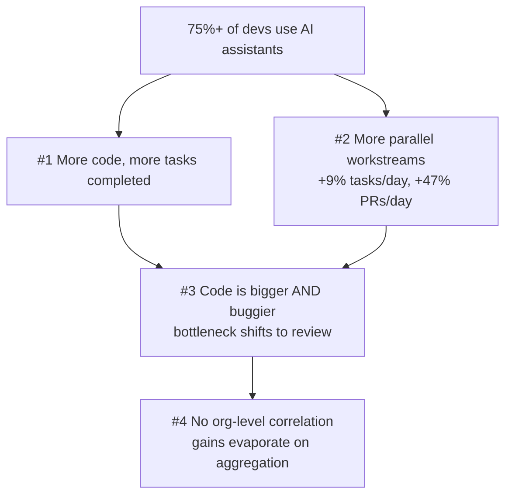

# The AI Productivity Paradox

Faros AI's finding, drawn from telemetry on **10,000+ developers across 1,255
teams**: individual AI adoption is high and individual output is up, yet **the
gains vanish when aggregated to the company level.** Developers *feel* faster and
*are* shipping more code — but delivery velocity and business outcomes don't move.
That gap is the paradox.

## The four findings

1. **More output per developer** — more code written, more tasks completed.
2. **More parallel workstreams** — high-adoption teams touch **9% more tasks** and
   **47% more pull requests** per day. Faros reframes this: context-switching used
   to be a red flag for cognitive overload, but the developer's role is shifting
   toward **orchestration and oversight** of AI-generated contributions, so higher
   switching is now expected, not pathological. (See
   [from coder to orchestrator](from-coder-to-orchestrator.md).)
3. **Bigger, buggier code shifts the bottleneck to review.** More AI output means
   more to inspect; the constraint moves downstream from writing to reviewing.
4. **No measurable organizational impact.** Across throughput, DORA metrics, and
   quality KPIs, **team-level gains do not scale when aggregated.** Downstream
   bottlenecks absorb the value, and inconsistent adoption across interdependent
   teams erases the local wins.

## Why it matters

The paradox is a direct warning against the perceived-vs-measured trap in
[calculating ROI](calculating-roi.md): individual velocity is not organizational
velocity. If AI makes writing cheap but review stays human and serial, the system
just relocates the constraint — [before / after AI bottlenecks](before-and-after-ai-bottlenecks.md).
The fix is not more adoption for its own sake but attacking the new bottleneck
(review, verification) and making adoption consistent across the teams that depend
on each other.

## Related

- [Calculating ROI](calculating-roi.md) — the measurement discipline this paradox demands.
- [Before AI / After AI](before-and-after-ai-bottlenecks.md) — where the constraint moves.
- [Rethinking Performance](rethinking-performance.md) — why individual output metrics mislead.

## References
- [AI coding assistants increase developer output, but not company productivity — Faros AI](https://www.faros.ai/blog/ai-software-engineering)
