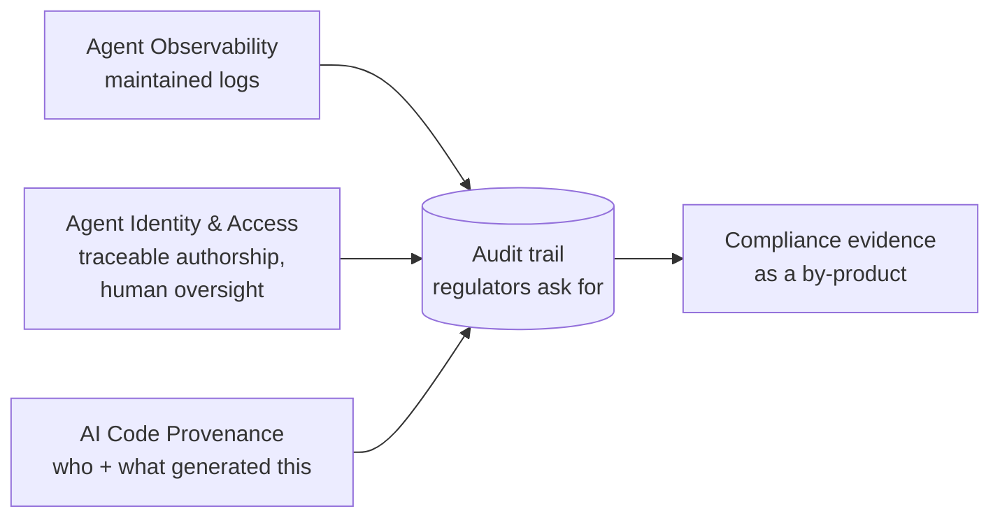

# AI Regulation & Compliance

Keeping AI-assisted and agent-driven development **inside legal and regulatory
bounds** — AI-specific law (led by the **EU AI Act**) plus older but newly
pressing questions of **IP, liability, and auditability** when significant code
is machine-written. The practical artifact is **traceability:** showing *what*
was generated, *on whose authority*, and *how it was verified.* Especially
load-bearing in regulated industries.

## The EU AI Act sets the frame — even outside Europe

- **Extraterritorial:** reaches anyone who develops, deploys, or sells an AI
  system used inside the EU — even built on a third party's hosted LLM API, even
  if the company isn't EU-headquartered.
- **Risk-classified:** heaviest obligations (maintained logs, technical docs,
  ongoing performance monitoring, demonstrable human oversight) land on
  **high-risk** uses — hiring, finance, healthcare.
- **Material penalties** (Art. 99, *directional not legal advice*): up to **€35M
  or 7%** global turnover (prohibited practices), **€15M or 3%** (most
  obligations incl. high-risk non-compliance), **€7.5M or 1.5%** (misleading
  info).

**The distinction that trips teams up:** the Act governs AI systems that make or
inform **consequential decisions about people.** A coding agent writing an
internal CRUD app is *not* high-risk by itself — but if that output **ships into
a hiring or credit pipeline, the deployed system inherits the obligations**, and
someone must produce the docs and logs after the fact.

## Why it matters: compliance as a by-product

In regulated industries the question isn't *whether* to adopt agents but **how
to do so demonstrably.** The good news is structural — an intent-driven, fully
logged pipeline produces much of the audit trail **almost as a by-product:**

- [Agent observability](agent-observability.md) + [agent identity](agent-identity-access.md)
  do **double duty as compliance evidence.**
- [AI code provenance](ai-code-provenance.md) answers "who and what generated
  this" directly.

## The honest caveat

- **Not a one-time conformity check** — post-market monitoring, incident
  reporting, ongoing accountability. A **continuing program**, not a gate you
  clear once.
- **Vendor incentive** — governance-platform / GRC vendors frame the bar as high
  and the answer as their product. **The durable move: build traceability into
  the pipeline first** (see [AI SDLC](ai-sdlc.md)) so evidence exists regardless
  of which auditor asks — rather than bolting on a dashboard and hoping the logs
  were there. Failure mode: **move fast without the trail, then can't answer who
  authorized what.**

## Related

- [Agent Observability](agent-observability.md) · [Agent Identity & Access](agent-identity-access.md)
  · [AI Code Provenance](ai-code-provenance.md) — the traceability that becomes
  compliance evidence.
- [Six Layers for AI Governance](six-layers-ai-governance.md) /
  [AI Governance by Design](ai-governance-by-design.md) — the governance frame
  this regulatory layer plugs into.

## References
- [AI Regulation & Compliance — Tessl Patterns](https://tessl.io/patterns/scaling-the-org/ai-regulation/)
