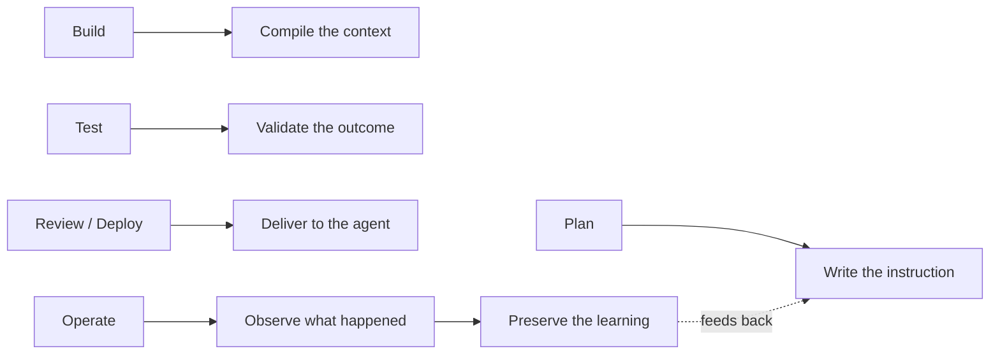

# The AI SDLC

The software lifecycle **re-implemented as agent-native infrastructure** — the
**pipeline spine** the rest of the platform plugs into. A spec enters one end;
reviewed, tested software comes out the other, with **agents moving the work**
through every stage and **humans defining intent and approving at gates.**

Bo Fuller (12-Factor AgentOps): *"DevOps gave us the SDLC. CDLC is the same
discipline applied to the context that drives coding agents."*

## Every phase gets an agent-native counterpart

Traditional SDLC moves *human-written* code through plan → build → test → review
→ deploy → operate. The AI SDLC wires the same stages so **agents do the moving**:
write the instruction → compile the context → validate the outcome → deliver to
the agent → observe what happened → **preserve the learning**.

Treated as platform, this is **not a methodology slide — it's a running system**
that turns one developer's [spec](spec-driven-development.md) into a repeatable
**delivery line**:

- The [eval service](evals-llm-as-a-judge.md) is its **quality gate**.
- [Sandboxes](execution-sandboxing.md) are where **construction runs**.
- [Observability](agent-observability.md) **traces the whole pass**.
- The [agent runtime](agent-runtime.md) is the **compute** it executes on.

## Why it matters

As autonomous [loops](loop-engineering.md) take over the build, the lifecycle
**compresses** — pioneering orgs describe sprints giving way to **"bolts,"**
delivery units where weeks become days, humans setting intent and validating at
stage gates. That makes the real bottleneck explicit: **no longer coding speed
but the clarity of intent and the reliability of verification.**

**Honest caveat — readiness:** agents are only as good as the **codified
knowledge and pipelines** they run on. Teams that skip clean repos and reliable
CI/CD *"risk automating chaos."* The AI SDLC is the investment that turns the
workflow patterns into something a **whole organization** can run — the
operational road to the [dark factory](dark-factory.md).

## Related

- [Spec-Driven Development](spec-driven-development.md) — the spec that enters the
  pipeline.
- [Loop Engineering](loop-engineering.md) / [Dark Factory](dark-factory.md) — the
  autonomy this lifecycle operationalizes.
- [Evals](evals-llm-as-a-judge.md) · [Execution Sandboxing](execution-sandboxing.md)
  · [Agent Observability](agent-observability.md) · [Agent Runtime](agent-runtime.md)
  — the platform pieces it wires together.

## References
- [The AI SDLC — Tessl Patterns](https://tessl.io/patterns/quality-security/ai-sdlc/)
