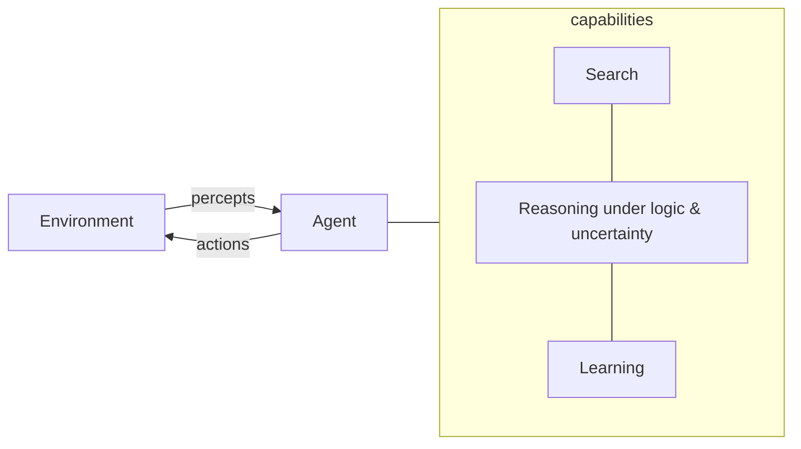

# Artificial Intelligence: A Modern Approach

*Stuart Russell and Peter Norvig — 4th edition (Pearson).* Universally shortened to
**AIMA**, this is the standard survey text for the whole of artificial intelligence,
adopted by well over a thousand universities. Its lasting contribution is a single
organizing idea that unifies an otherwise sprawling field: intelligence is best studied
as the design of **rational agents** — systems that perceive an environment and act to
maximize their expected performance. Every technique in the book, from graph search to
deep learning, is presented as a tool for building some part of such an agent.

## The central frame: rational agents

An **agent** maps percept histories to actions. What counts as the "right" action is
defined by a performance measure, and the agent is *rational* if it selects the action
expected to do best given what it knows. The book classifies agents by internal
architecture — simple reflex, model-based, goal-based, and utility-based — and
characterizes environments along axes (observable vs. partially observable,
deterministic vs. stochastic, single- vs. multi-agent, static vs. dynamic). This
taxonomy is why the survey coheres: each later part supplies the machinery an agent
needs as the environment gets harder.

## Structure of the book

The 4th edition moves in roughly this progression:

- **Foundations & agents** — what AI is, its history, and the agent/environment model.
- **Problem-solving by search** — uninformed and heuristic (A*, greedy) search, then
  search in complex environments: local search, nondeterministic and partially
  observable problems, adversarial search and games (minimax, alpha-beta, Monte Carlo
  tree search), and constraint satisfaction. See [search-and-planning](search-and-planning.md).
- **Knowledge, reasoning, and planning** — propositional and first-order logic,
  inference, knowledge representation, and automated (classical) planning. See
  [knowledge-representation-and-reasoning](knowledge-representation-and-reasoning.md).
- **Uncertain knowledge and reasoning** — probability, Bayesian networks, reasoning
  over time (hidden Markov models, Kalman filters), and decision-making under
  uncertainty (utility theory, Markov decision processes).
- **Machine learning** — learning from examples, probabilistic and deep learning, and
  **reinforcement learning**, where the agent theme comes full circle: an agent that
  learns a policy from reward. See [machine-learning](machine-learning.md) and
  [reinforcement-learning](reinforcement-learning.md).
- **Communicating, perceiving, and acting** — natural language processing, computer
  vision, and robotics, plus a closing treatment of philosophy, ethics, and safety.

## Why the 4th edition matters

The revision substantially expands the treatment of modern machine learning — deep
networks, probabilistic programming, and multi-agent systems — and adds a serious
discussion of the ethics and safety of increasingly capable systems. It keeps the
first-principles scaffolding (an agent that searches, reasons, and learns) while
folding in the techniques that now dominate practice, which is precisely why it remains
the reference students and practitioners reach for first.

## Related notes

- Concepts it anchors: [search-and-planning](search-and-planning.md),
  [knowledge-representation-and-reasoning](knowledge-representation-and-reasoning.md),
  [machine-learning](machine-learning.md), [reinforcement-learning](reinforcement-learning.md),
  [supervised-learning](supervised-learning.md).
- The probability chapters lean on [statistics](../statistics/index.md); search and
  logic complexity connect to [Introduction to Algorithms](../introduction-to-algorithms.md)
  and [mathematics](../math/index.md).

## References

- [Artificial Intelligence: A Modern Approach (4th ed.) — official site](https://aima.cs.berkeley.edu/)
