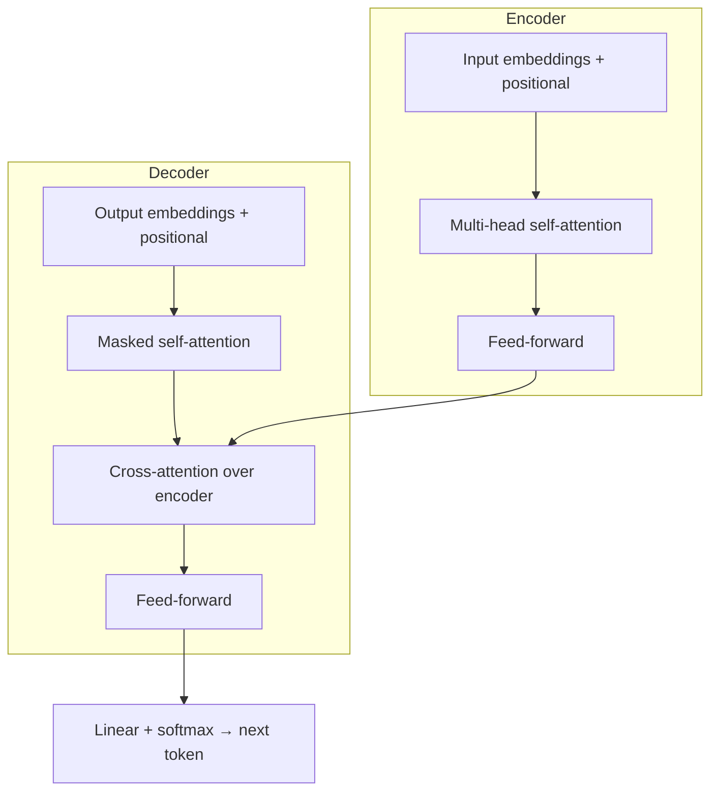

# Attention Is All You Need

*Attention Is All You Need* (Vaswani, Shazeer, Parmar, Uszkoreit, Jones, Gomez, Kaiser &
Polosukhin; NeurIPS 2017) is the paper that introduced the **Transformer**, the
architecture underlying essentially every modern [large language model](large-language-models.md)
and much of contemporary [deep learning](deep-learning.md). Its thesis is in the title:
the recurrence and convolution that dominated
[sequence models](sequence-models-and-rnns.md) can be discarded entirely, and a network
built *purely* from **attention** mechanisms both trains faster and reaches higher
quality on sequence transduction (the paper demonstrates machine translation).

## The problem it solved

Recurrent networks (RNNs, LSTMs) process a sequence one token at a time, carrying a
hidden state forward. That sequential dependency has two costs: it **cannot be
parallelized** across positions during training (step $t$ needs step $t-1$), and
long-range dependencies must survive many intermediate updates, where signal degrades.
The Transformer removes recurrence, so every position is processed simultaneously and any
position can attend directly to any other in a single step — a constant path length
between any two tokens regardless of distance.

## Self-attention

The core operation is **scaled dot-product attention**. Each token is projected into a
**query** $Q$, a **key** $K$, and a **value** $V$. Attention weights come from the
similarity of a query to every key, normalized by softmax, and are used to take a
weighted sum of values:

$$\text{Attention}(Q, K, V) = \text{softmax}\!\left(\frac{QK^\top}{\sqrt{d_k}}\right)V$$

The $\sqrt{d_k}$ scaling keeps the dot products from growing large enough to push the
softmax into vanishing-gradient regions. In **self-attention** the queries, keys, and
values all come from the same sequence, so each token computes a context-aware
representation by mixing in information from every other token, weighted by relevance.

## Multi-head attention and positional encoding

- **Multi-head attention** runs several attention operations in parallel, each with its
  own learned projections, then concatenates them. Different heads can specialize —
  attending to syntactic neighbors, coreference, position, and so on — giving the model
  multiple "representation subspaces" at once.
- Because attention is **permutation-invariant** (it has no inherent notion of order), the
  model adds **positional encodings** to the input embeddings. The paper uses fixed
  sinusoidal functions of the position, so the model can attend by relative offsets.

## The architecture

The Transformer is an **encoder–decoder** stack. Each layer interleaves a multi-head
attention sublayer with a position-wise feed-forward network, wrapping each in a
**residual connection** and **layer normalization**. The decoder adds *masked*
self-attention (so a position can only attend to earlier positions, preserving
autoregressive generation) plus cross-attention over the encoder's output.

## Why it mattered

The Transformer's key structural win is that it is **massively parallelizable** and its
compute scales predictably with data and model size — the property that made it the
substrate for the era of scale. Encoder-only descendants (BERT) power understanding
tasks; decoder-only descendants power the generative [models](../ai-platform/models.md) behind today's
LLMs and coding assistants. It is the architecture whose favorable
[scaling behavior](../harness-engineering/scaling-laws-agent-harnesses-efc.md) underwrites the entire modern
agent stack — the systems described in
[Building Effective Agents](../agentic-coding/building-effective-agents.md) and the prompting techniques
catalogued in [The Prompt Report](../ai-platform/the-prompt-report.md) all run on Transformer LLMs.

## References

- [Attention Is All You Need — Vaswani et al., 2017 (arXiv:1706.03762)](https://arxiv.org/abs/1706.03762)
