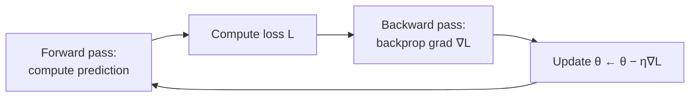

# Backpropagation and Gradient Descent

Training a [neural network](neural-networks.md) means finding the weights that minimize a
loss. Two ideas make this tractable at scale: **gradient descent**, which is *how* we move
the weights toward lower loss, and **backpropagation**, which is *how* we compute the
gradient that tells us which way is down. This is precisely where the calculus of
[mathematics](../math/index.md) and the machinery of
[linear optimization](../linear-optimization/index.md) meet
[machine learning](machine-learning.md).

## The loss surface

Fix a dataset and a network architecture. The parameters $\boldsymbol{\theta}$ (all weights
and biases) live in a very high-dimensional space, and the loss
$L(\boldsymbol{\theta})$ — say mean squared error or cross-entropy averaged over the data —
is a scalar-valued function over that space. Training is the optimization problem

$$ \boldsymbol{\theta}^\star = \arg\min_{\boldsymbol{\theta}} L(\boldsymbol{\theta}). $$

Unlike the tidy *convex* problems of classical [linear optimization](../linear-optimization/index.md),
a neural network's loss surface is *non-convex*: full of local minima, saddle points, and
plateaus. Remarkably, in the very high dimensions of deep models, most critical points turn
out to be saddles rather than bad local minima, and gradient methods find good solutions
anyway — one of the field's happy empirical surprises.

## Gradient descent

The gradient $\nabla_{\boldsymbol{\theta}} L$ points in the direction of *steepest
increase*. To decrease the loss, step in the opposite direction:

$$ \boldsymbol{\theta}_{t+1} = \boldsymbol{\theta}_t - \eta \, \nabla_{\boldsymbol{\theta}} L(\boldsymbol{\theta}_t) $$

The scalar $\eta$ is the **learning rate**. Too large and the steps overshoot and diverge;
too small and training crawls. It is the single most important knob.

Three variants differ in *how much data* each step's gradient is computed from:

- **Batch (full) gradient descent** — the true gradient over the entire dataset per step.
  Accurate but expensive and memory-bound.
- **Stochastic gradient descent (SGD)** — one example per step. Cheap and noisy; the noise
  can actually help escape saddles.
- **Mini-batch gradient descent** — a small batch (e.g. 32–512 examples) per step. The
  practical default: enough averaging to be stable, small enough to be fast and to fit in
  GPU memory. One pass over the data is an *epoch*.

## The chain rule and reverse-mode autodiff

A network is a *composition* of functions, layer after layer. To differentiate a
composition, calculus gives the **chain rule**: the derivative of the whole is the product
of the derivatives of the parts. **Backpropagation** is nothing more than the chain rule
applied systematically to the network's computation graph, evaluated in *reverse* — from
the loss back to the inputs. This is **reverse-mode automatic differentiation**.

Why reverse rather than forward? Because we have *one* scalar output (the loss) and
*millions* of parameters. Reverse-mode computes the gradient of that one output with respect
to *all* inputs in a single backward sweep whose cost is comparable to one forward pass.
Forward-mode would require one sweep per parameter — hopelessly expensive. This asymmetry is
the entire reason deep networks are trainable.

Mechanically: the forward pass caches each layer's intermediate values; the backward pass
propagates the *error signal* $\delta$ from the output backward, multiplying by each layer's
local Jacobian and its activation derivative to get $\partial L / \partial W^{(\ell)}$ for
every layer. Frameworks (PyTorch, JAX) do this automatically from the computation graph, so
practitioners rarely derive it by hand.

## Momentum and Adam

Plain SGD zig-zags in narrow valleys and stalls on plateaus. Two refinements dominate:

- **Momentum** accumulates a velocity — an exponentially decaying average of past
  gradients — so consistent directions build speed and oscillations cancel:
  $\mathbf{v}_{t+1} = \mu \mathbf{v}_t - \eta \nabla L$, then
  $\boldsymbol{\theta}_{t+1} = \boldsymbol{\theta}_t + \mathbf{v}_{t+1}$.
- **Adam** goes further, keeping running estimates of both the mean (first moment) and the
  variance (second moment) of the gradients, and *adapting the effective step size
  per-parameter*. It is robust to poorly scaled problems and is the de facto default
  optimizer for deep learning.

## Vanishing and exploding gradients

Because backprop *multiplies* many layer-local derivatives together, deep networks face a
numerical hazard. If those factors are consistently below 1, the product shrinks toward
zero — the **vanishing gradient** problem, where early layers barely learn. If consistently
above 1, it blows up — **exploding gradients**, where training diverges. Saturating
activations like sigmoid are a classic cause of vanishing gradients (their derivative is
near zero over most of their range).

The fixes are exactly the "algorithms" leg of the
[deep learning](deep-learning.md) revolution: non-saturating **ReLU** activations, careful
weight **initialization**, **batch/layer normalization**, **residual connections** (which
give gradients a shortcut path), and **gradient clipping** for the exploding case. These are
what made truly deep networks — including [CNNs](convolutional-neural-networks.md),
[RNNs](sequence-models-and-rnns.md), and
[transformers](transformers-and-attention.md) — actually trainable.

## Why it matters

Backprop + gradient descent is the *universal training algorithm* of modern AI. Nearly every
[deep learning](deep-learning.md) system — from image classifiers to
[large language models](large-language-models.md) to
[generative models](generative-models.md) — is trained by some variant of this loop. It
turns "learning" into a concrete, mechanizable optimization procedure, and it is the reason
end-to-end differentiable models became the dominant [../models.md](../ai-platform/models.md).

## References

- [Deep Learning](deep-learning-goodfellow.md) — Goodfellow, Bengio & Courville (Ch. 6.5 backprop, Ch. 8 optimization)
- [Pattern Recognition and Machine Learning](pattern-recognition-bishop.md) — Bishop (Ch. 5.3, error backpropagation)
- [Probabilistic Machine Learning](probabilistic-machine-learning-murphy.md) — Murphy
- [The Elements of Statistical Learning](elements-of-statistical-learning.md) — Hastie, Tibshirani & Friedman
