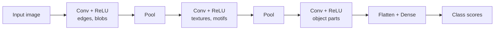

# Convolutional Neural Networks

A **convolutional neural network (CNN)** is a [neural network](neural-networks.md)
architecture specialized for data with a **grid-like topology** — most famously images
(a 2-D grid of pixels), but also audio spectrograms and time series (1-D). CNNs are the
architecture that made [deep learning](deep-learning.md) work for computer vision, and
their core idea — bake the structure of the problem into the network as an *inductive
bias* — recurs throughout modern AI.

## The problem with fully-connected nets on images

A dense (fully-connected) layer connects every input to every output. For a modest
224×224 RGB image that is ~150,000 inputs; a single hidden layer of the same size needs
~22 billion weights. That is computationally hopeless, hopelessly prone to overfitting
(see [generalization and regularization](generalization-and-regularization.md)), and it
throws away the single most useful fact about an image: **nearby pixels are related, and
a cat is a cat wherever it appears in the frame.** CNNs exploit exactly this.

## Three structural ideas

1. **Local receptive fields.** Each neuron looks only at a small spatial patch of the
   previous layer (say 3×3 or 5×5), not the whole image. Local structure — edges,
   corners, textures — lives in local neighborhoods.
2. **Weight sharing.** The *same* small set of weights (a **filter** or **kernel**) is
   slid across every position of the input. One filter that detects a vertical edge
   detects it everywhere. This collapses the parameter count from billions to a few
   hundred per filter and encodes **translation equivariance**: shift the input, and the
   feature map shifts the same way.
3. **Pooling / subsampling.** Periodically the spatial resolution is reduced (e.g.
   max-pooling takes the maximum over each 2×2 block), which shrinks computation, widens
   the effective receptive field of later layers, and buys a degree of **translation
   invariance** (small shifts stop mattering).

Together, locality + weight sharing are a strong, correct **inductive bias** for images:
we constrain the hypothesis space with real structure of the domain, so far less data is
needed to generalize. Contrast this with the largely bias-free
[transformer](transformers-and-attention.md), which must instead *learn* spatial
relationships from far more data.

## The convolution operation (college-level math)

A discrete 2-D convolution (in deep learning, technically cross-correlation) of an input
$I$ with a $k \times k$ kernel $K$ produces a **feature map** $S$:

$$S(i,j) = \sum_{m=0}^{k-1} \sum_{n=0}^{k-1} I(i+m,\; j+n)\, K(m,n) \; + \; b$$

The kernel weights $K$ and bias $b$ are learned by
[backpropagation and gradient descent](backpropagation-and-gradient-descent.md) — the
gradient flows through the convolution just like any other differentiable op. A layer
learns a *bank* of many filters, producing one feature map per filter (its output
channels). Key hyperparameters: **kernel size** $k$, **stride** (step size of the slide),
and **padding** (zeros added at the border to control output size). A nonlinearity
(usually ReLU) follows each convolution, exactly as in a standard
[deep network](deep-learning.md).

## Feature hierarchies

Stacking convolution → nonlinearity → pooling builds a **hierarchy of features**, which is
[representation learning](representation-learning-and-embeddings.md) in action:

Early layers respond to simple, local patterns (oriented edges, color gradients); middle
layers compose these into textures and motifs; deep layers respond to object parts and
whole objects. The network *discovers* this hierarchy from data rather than having it
hand-engineered — the defining shift from classical computer vision.

## The canonical example: AlexNet and the ImageNet moment

In 2012, **AlexNet** (Krizhevsky, Sutskever, Hinton) — an eight-layer CNN trained on two
GPUs — cut the top-5 error rate on the **ImageNet** benchmark from ~26% to ~16%, a leap
so large it effectively ended the classical-features era of computer vision overnight.
The recipe was not conceptually new (LeCun's LeNet applied CNNs to digit recognition in
the 1990s) but combined large labeled data, GPU compute, ReLU activations, and dropout
[regularization](generalization-and-regularization.md) at a scale that finally worked.
This is widely regarded as the spark of the modern deep-learning era, a
[scaling](../harness-engineering/scaling-laws-agent-harnesses-efc.md) lesson later echoed by
[large language models](large-language-models.md).

## Why it matters

CNNs demonstrated the central thesis of deep learning — **learn the features, don't
engineer them** — and showed that the right architectural inductive bias makes learning
tractable. They remain the workhorse of vision (classification, detection, segmentation,
medical imaging) and are increasingly hybridized with, or replaced by, attention-based
vision transformers for very large datasets. The idea that architecture encodes
assumptions connects to [linguistics](../linguistics/index.md) (structure in language),
[mathematics](../math/index.md) (convolution, linear algebra), and
[statistics](../statistics/index.md) (bias–variance tradeoff). CNN-based perception also
underpins many capabilities in modern [models](../ai-platform/models.md).

## References

- [Deep Learning (Goodfellow, Bengio, Courville)](deep-learning-goodfellow.md) —
  Chapter 9 covers convolutional networks in depth.
- Krizhevsky, Sutskever & Hinton, *ImageNet Classification with Deep Convolutional Neural
  Networks* (NeurIPS 2012) — the AlexNet paper.
- LeCun et al., *Gradient-Based Learning Applied to Document Recognition* (1998) — LeNet.
