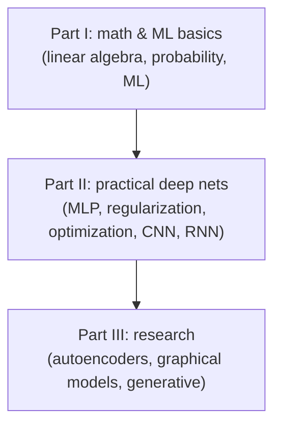

# Deep Learning (Goodfellow, Bengio, Courville)

*Ian Goodfellow, Yoshua Bengio, and Aaron Courville — MIT Press, 2016; freely readable
at deeplearningbook.org.* The first comprehensive, graduate-level textbook devoted to
deep learning, and still the canonical reference for the field's mathematical
foundations. It aims to take a reader from linear algebra and probability all the way to
the research frontier of the mid-2010s, and it does so in a deliberately layered
structure of three parts.

## Part I — Applied math and machine learning basics

The prerequisites, developed to exactly the depth the rest of the book needs: linear
algebra, probability and information theory, numerical computation (conditioning,
overflow/underflow, gradient-based optimization), and a self-contained chapter on
**machine learning basics**. That chapter frames the whole enterprise — capacity,
underfitting and overfitting, the bias–variance tradeoff, maximum likelihood, and why
we regularize — and grounds [machine-learning](machine-learning.md) and
[generalization-and-regularization](generalization-and-regularization.md).

## Part II — Modern practical deep networks

The core the working practitioner needs:

- **Deep feedforward networks** (MLPs) — the multilayer perceptron, chain-rule
  credit assignment, and the design of hidden units and output layers. See
  [neural-networks](neural-networks.md) and
  [backpropagation-and-gradient-descent](backpropagation-and-gradient-descent.md).
- **Regularization** — weight decay, dropout, early stopping, data augmentation,
  and parameter sharing as capacity control. See
  [generalization-and-regularization](generalization-and-regularization.md).
- **Optimization** — the difficulties specific to training deep models and the
  algorithms (SGD with momentum, adaptive methods, batch normalization) that make it
  work.
- **Convolutional networks** — the architecture built on local receptive fields,
  weight sharing, and pooling for grid-structured data. See
  [convolutional-neural-networks](convolutional-neural-networks.md).
- **Sequence modeling** — recurrent and recursive nets, gating (LSTM/GRU), and the
  gradient problems of long sequences. See [sequence-models-and-rnns](sequence-models-and-rnns.md).
- **Practical methodology** and **applications** across vision, speech, and NLP.

## Part III — Deep learning research

The more speculative, generative, and probabilistic frontier: linear factor models,
autoencoders, representation learning, structured probabilistic (graphical) models,
Monte Carlo methods, the partition-function problem, approximate inference, and finally
**deep generative models** — culminating in the treatment of generative adversarial
networks that Goodfellow himself introduced. See [generative-models](generative-models.md).

## Why it endures

The book predates the transformer era, so it is not the place to learn attention.
Its value is orthogonal to that: it explains *why* deep learning works — the interplay
of representation, optimization, and generalization — with a rigor that later, more
applied books assume rather than build. It remains the standard grounding text for the
mathematics beneath modern practice.

## Related notes

- Concepts it anchors: [deep-learning](deep-learning.md), [neural-networks](neural-networks.md),
  [backpropagation-and-gradient-descent](backpropagation-and-gradient-descent.md),
  [convolutional-neural-networks](convolutional-neural-networks.md),
  [sequence-models-and-rnns](sequence-models-and-rnns.md),
  [generative-models](generative-models.md),
  [generalization-and-regularization](generalization-and-regularization.md).
- Foundations draw on [mathematics](../math/index.md) and [statistics](../statistics/index.md).

## References

- [Deep Learning — deeplearningbook.org](https://www.deeplearningbook.org/)
