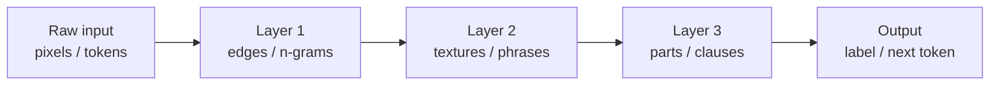

# Deep Learning

**Deep learning** is [machine learning](machine-learning.md) with
[neural networks](neural-networks.md) that are *many layers deep*. The word "deep" is
literal — it refers to the length of the chain of transformations between raw input and
output. That depth is not cosmetic: it is the mechanism by which the model learns a
*hierarchy of representations*, and it is the property that reorganized AI after 2012. This
note is the hub for the deep-learning cluster of concepts.

## What depth buys you: compositional representation

A shallow model maps inputs to outputs in one step and depends on hand-engineered features.
A deep network instead learns its own features, and it learns them *hierarchically*: early
layers capture simple, local structure; later layers compose those into progressively more
abstract concepts. In vision, edges → textures → object parts → objects. In language,
characters → morphemes → phrases → meaning.

This is [representation learning](representation-learning-and-embeddings.md): the model
*discovers* the features instead of being handed them. It also explains **why depth**
rather than mere width. The [universal approximation theorem](neural-networks.md) says one
wide hidden layer can approximate any function, but many functions of interest are
*compositional* — built from repeated, reused sub-structure — and a deep network can
represent them exponentially more compactly than a shallow one. Depth trades width for
reuse, and reuse is where the sample efficiency comes from.

## End-to-end learning

The older pipeline was staged: engineer features, then train a classifier on top. Deep
learning collapses this into **end-to-end learning** — a single differentiable function,
trained by [backpropagation and gradient descent](backpropagation-and-gradient-descent.md),
optimizes *every* stage jointly against the final objective. The feature extractor and the
predictor are learned together, so the features are exactly those that serve the task. This
is both the strength (no brittle hand-tuned front end) and the cost (the whole thing is a
data-hungry black box that demands [regularization](generalization-and-regularization.md)
to generalize).

## The ingredients of the 2012+ revolution

Neural networks are decades old; the ideas above are largely from the 1980s–90s. What
changed around 2012 (AlexNet's ImageNet win) was a *coincidence of three enablers*:

1. **Data.** Large labeled datasets (ImageNet, web-scale text corpora) gave the hungry
   models enough signal to learn from.
2. **Compute.** GPUs — built for dense [linear-algebra](../math/index.md) matrix
   multiplies — turned training deep networks from impractical into merely expensive. The
   core operation of a layer is a matrix multiply, and GPUs do those massively in parallel.
3. **Algorithms.** ReLU activations, better initialization, dropout, batch normalization,
   and robust optimizers (Adam) made deep networks *trainable* by fixing the
   vanishing-gradient and optimization problems that had stalled the earlier attempts.

None alone was sufficient; together they crossed a threshold. Everything after —
[CNNs](convolutional-neural-networks.md) for vision,
[RNNs](sequence-models-and-rnns.md) and then
[transformers](transformers-and-attention.md) for sequences,
[generative models](generative-models.md), and
[large language models](large-language-models.md) — rides on this same three-legged base.

## Scaling

A defining empirical finding is that deep networks *keep improving* as data, parameters,
and compute grow together, along smooth **scaling laws**. This turned model-building into
partly an engineering-and-economics exercise: predictably better results by spending more,
which is the engine behind today's foundation models. It also sharpens the
[generalization](generalization-and-regularization.md) puzzle — enormously
overparameterized networks generalize *better*, not worse, than classical theory predicts.

## Why it matters

Deep learning is the reason "AI" and "neural networks" became nearly synonymous in practice.
It is a general recipe — differentiable, composable, scalable — that has, with the same core
machinery, produced state-of-the-art results in vision, speech, language, protein folding,
and game-playing (including [reinforcement learning](reinforcement-learning.md) agents). It
is one, now-dominant, branch of the larger space of [../models.md](../models.md).

## References

- [Deep Learning](deep-learning-goodfellow.md) — Goodfellow, Bengio & Courville (the canonical text)
- [Probabilistic Machine Learning](probabilistic-machine-learning-murphy.md) — Murphy
- [Pattern Recognition and Machine Learning](pattern-recognition-bishop.md) — Bishop
- [Artificial Intelligence: A Modern Approach](aima.md) — Russell & Norvig
