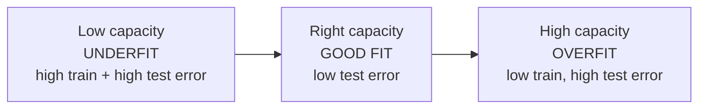

# Generalization and Regularization

The whole point of [machine learning](machine-learning.md) is **generalization**: performing
well on data you have never seen, not merely on the training set you fit. A model that aces its
training data but fails in the wild has learned nothing useful. This gap between *training
performance* and *true performance* is the central problem of the field, and **regularization**
is the collective name for the techniques that close it.

Recall from ML that we minimize **empirical risk** (average training loss) as a stand-in for the
uncomputable **true risk** (expected loss over the real distribution). Generalization theory
studies when the first is a good proxy for the second — and regularization is how we bias the
optimizer toward hypotheses that generalize.

## Underfitting, overfitting, and capacity

A model's **capacity** is how rich a set of functions it can represent (roughly, its effective
number of free parameters). Capacity governs a fundamental tension:

- **Underfitting** — capacity too low: the model can't even capture the training pattern. High
  error everywhere. A straight line through a quadratic trend.
- **Overfitting** — capacity too high relative to the data: the model fits the *noise* in the
  training set, memorizing idiosyncrasies that don't recur. Low training error, high test error.
  A degree-15 polynomial threading every noisy point.

The goal is the sweet spot between them, where the model captures signal but not noise.

## The bias–variance trade-off

The classical account decomposes a model's expected error on a new point into three parts:

$$\text{Expected error} = \underbrace{\text{Bias}^2}_{\text{wrong assumptions}} + \underbrace{\text{Variance}}_{\text{sensitivity to the sample}} + \underbrace{\text{Irreducible noise}}_{\text{unavoidable}}.$$

- **Bias** is error from the model being too simple to represent the truth — the underfitting
  contribution. High bias, low variance.
- **Variance** is how much the fitted model would swing if you drew a different training sample —
  the overfitting contribution. Low bias, high variance.
- **Irreducible noise** is inherent randomness in the data no model can remove.

Increasing capacity lowers bias but raises variance; decreasing it does the reverse. The classic
U-shaped test-error curve is the sum of a falling bias term and a rising variance term, minimized
in the middle. This decomposition is the theoretical spine of everything below.

## Regularization: constraining capacity

Regularization is any modification to a learning algorithm intended to reduce test error (usually
by reducing variance) — typically by penalizing or restricting model complexity.

- **L2 regularization (ridge / weight decay).** Add `λ‖θ‖²₂` to the loss, penalizing large
  weights. It shrinks all weights smoothly toward zero, discouraging any single feature from
  dominating. The knob `λ` trades training fit against simplicity. Equivalent to a Gaussian prior
  on the weights in the Bayesian view (see
  [probabilistic machine learning](probabilistic-machine-learning-murphy.md)).
- **L1 regularization (lasso).** Add `λ‖θ‖₁`. Its geometry drives many weights to *exactly zero*,
  producing **sparse** models that do implicit feature selection.
- **Dropout.** In [neural networks](neural-networks.md), randomly zero a fraction of units each
  training step. This prevents co-adaptation of neurons and approximates training an ensemble of
  subnetworks — a cheap, powerful variance-reducer (see
  [deep learning](deep-learning.md)).
- **Early stopping.** Halt [gradient-descent](backpropagation-and-gradient-descent.md) training
  when validation error starts rising, before the model has time to memorize noise. Simple and
  remarkably effective; it acts like an implicit complexity penalty.
- **Data augmentation** and **more data** — the most reliable regularizer of all is a larger,
  more varied training set, which shrinks variance directly.

## Estimating generalization: cross-validation

You cannot measure generalization on the training set, and the [test set](machine-learning.md)
must stay untouched until the end. **k-fold cross-validation** solves the "how do I tune without
peeking?" problem: split the training data into `k` folds, train on `k−1` and validate on the
held-out fold, rotate through all `k`, and average the validation errors. This gives a
lower-variance estimate of out-of-sample error and is the standard way to choose hyperparameters
like `λ` or model capacity, especially when data is limited.

## The modern wrinkle: double descent

The classical U-curve says error rises once capacity passes the interpolation point (where the
model fits training data exactly). Yet massively overparameterized [deep networks](deep-learning.md)
and [large language models](large-language-models.md) generalize *well* despite having far more
parameters than training examples — a puzzle for the classical story.

**Double descent** reconciles this. As capacity grows, test error first follows the classical
U (descend, then rise to a peak at the interpolation threshold), but then, as capacity grows
*further* into the heavily overparameterized regime, test error **descends again**. Among the
many zero-training-error solutions, optimizers like [SGD](backpropagation-and-gradient-descent.md)
exhibit an *implicit bias* toward smooth, low-norm solutions that happen to generalize. This is
why "just make the model bigger" — long taboo under the bias–variance view — became a legitimate
strategy, and it is central to why modern scaling works.

## Why it matters

Generalization is the difference between a model that *learned* and one that *memorized*, and it
is the yardstick for every ML system in production. Regularization is the practitioner's daily
toolkit for getting there, and the shift from the classical U-curve to double descent explains
the entire modern era of scaling up [neural networks](neural-networks.md) and
[transformers](transformers-and-attention.md). The mathematics behind it lives in
[statistics](../statistics/index.md), [mathematics](../math/index.md), and
[linear optimization](../linear-optimization/index.md).

## References

- [The Elements of Statistical Learning](elements-of-statistical-learning.md)
  (Hastie, Tibshirani, Friedman) — the definitive treatment of bias–variance, regularization,
  and cross-validation.
- [Pattern Recognition and Machine Learning](pattern-recognition-bishop.md) (Bishop) — capacity,
  overfitting, and the Bayesian view of regularization.
- [Deep Learning](deep-learning-goodfellow.md) (Goodfellow, Bengio, Courville) — Chapter 7,
  "Regularization for Deep Learning," covers dropout, early stopping, and weight decay.
- [Probabilistic Machine Learning](probabilistic-machine-learning-murphy.md) (Murphy) — the
  probabilistic framing of regularization as priors, and modern double-descent discussion.
