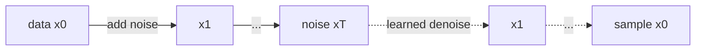

# Generative Models

A **generative model** learns the *distribution of the data itself*, $p(\mathbf{x})$ (or a
conditional $p(\mathbf{x}\mid\mathbf{y})$), so that it can **sample new data** that looks
like the training set — images, text, audio, molecules. This contrasts with a
**discriminative model**, which learns only the boundary $p(\mathbf{y}\mid\mathbf{x})$
needed to *label* an input. Generation is strictly harder: predicting "cat vs. dog" needs
far less than being able to *draw* a plausible cat. Generative modeling is a central branch
of [unsupervised learning](unsupervised-learning.md) and the engine behind modern
[large language models](large-language-models.md) and image synthesis.

## Discriminative vs. generative

- **Discriminative** ([supervised learning](supervised-learning.md)): model
  $p(\mathbf{y}\mid\mathbf{x})$. Answers "what is this?" Simpler, and usually better *if*
  labels are all you want.
- **Generative**: model $p(\mathbf{x})$ (and optionally the joint
  $p(\mathbf{x},\mathbf{y})$). Answers "what does data look like?" — enabling sampling,
  density estimation, imputation, and unsupervised [representation learning](representation-learning-and-embeddings.md).

The central difficulty is that $\mathbf{x}$ is extremely high-dimensional (an image is
millions of correlated pixels), so $p(\mathbf{x})$ is intractable to write down directly.
The four families below are four different strategies for making it tractable.

```mermaid
flowchart TD
  G[Generative model of p&#40;x&#41;]
  G --> AR[Autoregressive:\nfactor into a product\nof conditionals]
  G --> VAE[VAE:\nlatent variable +\nvariational bound]
  G --> GAN[GAN:\nadversarial sampler,\nno explicit density]
  G --> DIFF[Diffusion:\nreverse a noising\nprocess step by step]
```

## Autoregressive models

Factor the joint distribution exactly via the chain rule of probability, ordering the
dimensions and predicting each one from those before it:

$$ p(\mathbf{x}) = \prod_{i=1}^{n} p(x_i \mid x_1, \dots, x_{i-1}). $$

Each conditional is a classifier (often a [neural network](neural-networks.md)), so
training is just [supervised learning](supervised-learning.md) on "predict the next
element," and the likelihood is *exact* and tractable. Sampling is sequential — one element
at a time. This is exactly how [large language models](large-language-models.md) generate
text (next-token prediction), typically with a
[transformer](transformers-and-attention.md); PixelCNN and WaveNet apply the same idea to
images and audio. The trade-off is slow, inherently sequential sampling.

## Variational autoencoders (VAEs)

A VAE posits an unobserved **latent variable** $\mathbf{z}$ (a compact code) that generates
the data: draw $\mathbf{z} \sim p(\mathbf{z})$ from a simple prior (e.g. a Gaussian), then
decode $\mathbf{x} \sim p_\theta(\mathbf{x}\mid\mathbf{z})$. The true likelihood
$p_\theta(\mathbf{x}) = \int p_\theta(\mathbf{x}\mid\mathbf{z})\,p(\mathbf{z})\,d\mathbf{z}$
is intractable, so VAEs *maximize a lower bound* — the **Evidence Lower BOund (ELBO)**:

$$ \log p_\theta(\mathbf{x}) \ge \underbrace{\mathbb{E}_{q_\phi(\mathbf{z}\mid\mathbf{x})}\big[\log p_\theta(\mathbf{x}\mid\mathbf{z})\big]}_{\text{reconstruction}} - \underbrace{\mathrm{KL}\!\big(q_\phi(\mathbf{z}\mid\mathbf{x}) \,\|\, p(\mathbf{z})\big)}_{\text{regularizer}}. $$

An **encoder** $q_\phi(\mathbf{z}\mid\mathbf{x})$ (an inference network) approximates the
posterior; a **decoder** $p_\theta(\mathbf{x}\mid\mathbf{z})$ reconstructs. The first term
rewards faithful reconstruction; the KL term pulls the latent code toward the prior,
keeping the latent space smooth and sampleable. The whole thing is trained end-to-end by
[backpropagation and gradient descent](backpropagation-and-gradient-descent.md), using the
*reparameterization trick* to push gradients through the random sampling step. VAEs give a
useful learned [representation](representation-learning-and-embeddings.md) but tend to
produce somewhat blurry samples.

## Generative adversarial networks (GANs)

A GAN sidesteps writing down a density at all. It pits two networks against each other in a
**minimax game** — the point where generative modeling meets
[game theory](../economics/index.md):

- The **generator** $G$ maps random noise $\mathbf{z}$ to fake samples, trying to fool the
  critic.
- The **discriminator** $D$ tries to tell real training data from $G$'s fakes.

They optimize opposing objectives:

$$ \min_G \max_D \; \mathbb{E}_{\mathbf{x}\sim p_{\text{data}}}[\log D(\mathbf{x})] + \mathbb{E}_{\mathbf{z}}[\log(1 - D(G(\mathbf{z})))]. $$

At the game's equilibrium (a Nash equilibrium, in game-theory terms), $G$'s distribution
matches the data and $D$ can do no better than guessing. GANs produce sharp, realistic
samples, but the adversarial dynamics are notoriously unstable — mode collapse, oscillation,
and non-convergence are common failure modes, since the two players can chase each other
without settling.

## Diffusion models

Diffusion models define a fixed **forward process** that gradually corrupts data into pure
noise over many small steps (adding Gaussian noise), then *learn to reverse it*. A neural
network is trained to *denoise* — to predict, at each noise level, the noise that was added
(equivalently, the score $\nabla_{\mathbf{x}} \log p(\mathbf{x})$). To generate, start from
pure noise and run the learned reverse process step by step back to a clean sample.

Diffusion trades the sampling speed of GANs (it needs many denoising steps) for far more
*stable training* — a simple regression loss, no adversarial game — and state-of-the-art
sample quality. It powers modern image generators (Stable Diffusion, Imagen) and
increasingly audio and video.

## Why it matters

Generative models are how AI moved from *perceiving* to *creating*. The same probabilistic
principle — model $p(\mathbf{x})$, then sample — unifies text generation in
[LLMs](large-language-models.md), image and video synthesis, drug and material design, and
data augmentation. They also deepen [unsupervised learning](unsupervised-learning.md): to
generate data well, a model must implicitly *understand* its structure. They are a
distinctive corner of the [../models.md](../models.md) landscape, defined by what they
produce rather than merely what they predict.

## References

- [Deep Learning](deep-learning-goodfellow.md) — Goodfellow, Bengio & Courville (Ch. 20, deep generative models; Goodfellow introduced GANs)
- [Probabilistic Machine Learning](probabilistic-machine-learning-murphy.md) — Murphy (advanced volume covers VAEs, GANs, diffusion)
- [Pattern Recognition and Machine Learning](pattern-recognition-bishop.md) — Bishop (latent-variable models, EM, the variational framework)
- [Artificial Intelligence: A Modern Approach](aima.md) — Russell & Norvig
