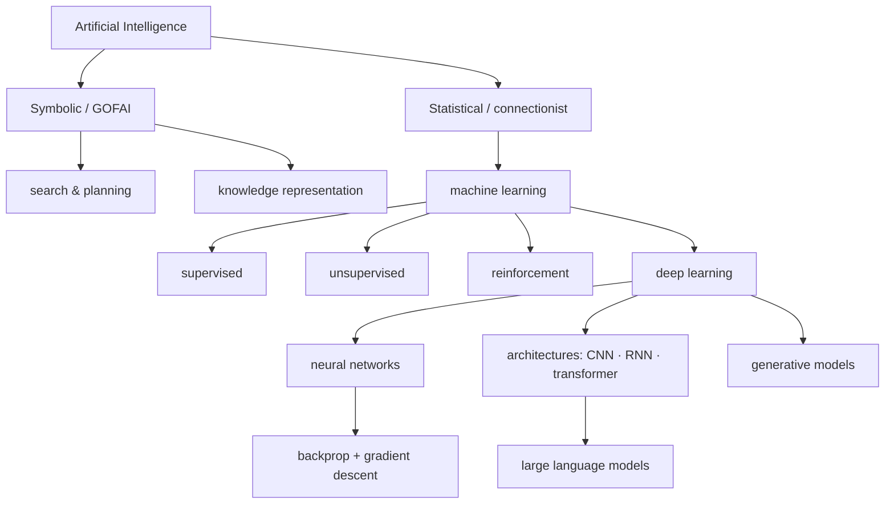

# Artificial Intelligence

The field of building systems that perform tasks we associate with intelligence —
perceiving, reasoning, learning, deciding, and generating. This folder is the
**college-level canon** of the field: the core ideas as `Concept` notes, anchored to the
canonical `Reference` texts, and cross-linked to the neighbouring fields AI is built out
of. It sits beneath HAL's large applied corpus on *using* today's models — agents,
harnesses, evals, context — which begins at [models](../models.md) and
[Building Effective Agents](../building-effective-agents.md).

## The shape of the field

AI has run on two paradigms. The **symbolic** tradition (GOFAI) encodes knowledge and
searches or reasons over it — [search and planning](search-and-planning.md) and
[knowledge representation and reasoning](knowledge-representation-and-reasoning.md). It is
transparent but brittle, and struggles with perception and ambiguity. The **statistical /
connectionist** tradition learns behaviour from data instead of hand-coding it — this is
[machine learning](machine-learning.md), and it now dominates.

Machine learning splits into [supervised](supervised-learning.md) (learn a map from
labelled examples), [unsupervised](unsupervised-learning.md) (find structure without
labels), and [reinforcement learning](reinforcement-learning.md) (learn from reward). The
one problem underneath all of them is [generalization](generalization-and-regularization.md)
— performing on data you have not seen — and it is fundamentally a
[statistics](../statistics/index.md) and [optimization](../linear-optimization/index.md)
problem resting on [mathematics](../math/index.md).

The **deep learning** stack is the current engine. [Neural networks](neural-networks.md)
compose simple units into [deep](deep-learning.md), layered function approximators;
[backpropagation and gradient descent](backpropagation-and-gradient-descent.md) train them;
and [representation learning](representation-learning-and-embeddings.md) is why they beat
hand-engineered features. Architecture encodes inductive bias:
[CNNs](convolutional-neural-networks.md) for grids/vision,
[RNNs](sequence-models-and-rnns.md) and then [transformers](transformers-and-attention.md)
for sequences, and [generative models](generative-models.md) for sampling new data. Scaled
transformers give [large language models](large-language-models.md) — the frontier that
this book's applied harness work sits on top of.

## Concepts

- [Search and Planning](search-and-planning.md) — state-space search: uninformed vs informed (A*), adversarial (minimax/alpha-beta), CSPs
- [Knowledge Representation and Reasoning](knowledge-representation-and-reasoning.md) — logic, ontologies, expert systems; symbolic inference and its brittleness
- [Machine Learning](machine-learning.md) — learning from data instead of rules: the three paradigms, loss, empirical-risk minimization, train/val/test
- [Supervised Learning](supervised-learning.md) — labelled input→output: linear/logistic regression, k-NN, SVMs, trees & ensembles, evaluation
- [Unsupervised Learning](unsupervised-learning.md) — structure without labels: clustering, PCA, t-SNE/UMAP, density estimation
- [Reinforcement Learning](reinforcement-learning.md) — learning from reward: MDPs, Bellman, DP/MC/TD, Q-learning, policy gradients, RLHF
- [Representation Learning and Embeddings](representation-learning-and-embeddings.md) — learned features, embeddings, latent spaces, the manifold hypothesis, transfer learning
- [Neural Networks](neural-networks.md) — perceptron → MLP: weights, activations, forward pass, universal approximation
- [Deep Learning](deep-learning.md) — what depth buys: hierarchical representation learning, end-to-end training, the 2012+ revolution
- [Backpropagation and Gradient Descent](backpropagation-and-gradient-descent.md) — the training loop: loss surfaces, SGD/momentum/Adam, reverse-mode autodiff, vanishing gradients
- [Convolutional Neural Networks](convolutional-neural-networks.md) — vision workhorse: convolution, weight sharing, pooling, inductive bias
- [Sequence Models and RNNs](sequence-models-and-rnns.md) — RNN/LSTM/GRU, vanishing gradients, encoder–decoder, why attention won
- [Transformers and Attention](transformers-and-attention.md) — self-attention (Q/K/V), multi-head, positional encoding, parallel scale
- [Large Language Models](large-language-models.md) — transformers at scale: tokenization, next-token pretraining, scaling laws, in-context learning, RLHF, alignment
- [Generative Models](generative-models.md) — modelling p(x): autoregressive, VAE, GAN, diffusion; discriminative vs generative
- [Generalization and Regularization](generalization-and-regularization.md) — bias-variance, overfitting, regularization, cross-validation, double descent

## Canonical works

- [Artificial Intelligence: A Modern Approach](aima.md) — Russell & Norvig; the standard AI survey, organized around rational agents
- [Deep Learning](deep-learning-goodfellow.md) — Goodfellow, Bengio & Courville; the canonical DL text
- [Pattern Recognition and Machine Learning](pattern-recognition-bishop.md) — Bishop; the Bayesian ML classic
- [The Elements of Statistical Learning](elements-of-statistical-learning.md) — Hastie, Tibshirani & Friedman; ML from a statistics viewpoint
- [Reinforcement Learning: An Introduction](reinforcement-learning-sutton-barto.md) — Sutton & Barto; the RL bible
- [Probabilistic Machine Learning](probabilistic-machine-learning-murphy.md) — Murphy; the modern probabilistic reference
- [Attention Is All You Need](attention-is-all-you-need.md) — Vaswani et al.; the Transformer paper

## Related fields

AI draws on [mathematics](../math/index.md) (linear algebra, calculus, probability),
[statistics](../statistics/index.md), [linear optimization](../linear-optimization/index.md),
[computer science](../computer-science/index.md) (algorithms, complexity),
[neuroscience](../neuroscience/index.md) (the original inspiration for neural nets),
[linguistics](../linguistics/index.md) (language models), and touches
[philosophy](../philosophy/index.md) (mind, knowledge) and
[economics](../economics/index.md) (decision theory, game theory). *(Some field hubs land
in later waves; those links resolve as each is built.)*
