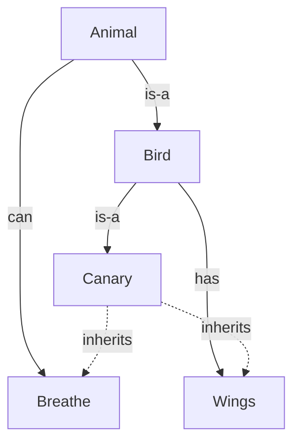

# Knowledge Representation and Reasoning

If [search and planning](search-and-planning.md) is about *finding* answers, **knowledge
representation and reasoning (KR&R)** is about *encoding what is known* so a machine can
derive new facts from it. It is the second pillar of symbolic AI: represent the world in a
formal language with clear semantics, then apply **inference** to reach conclusions that were
implicit in what you stored. The dream — never fully realized, but enormously influential — was
that intelligence could be built by writing down enough knowledge in the right formalism.

## Representing knowledge in logic

The most rigorous representations are logics, because a logic comes with a **syntax** (what
sentences are well-formed), a **semantics** (what makes them true), and a **proof theory**
(how to derive new sentences).

- **Propositional logic** deals with atomic facts joined by connectives (`∧` and, `∨` or,
  `¬` not, `→` implies). "It is raining → the ground is wet." It is decidable but coarse: it
  cannot talk about *objects*, *properties*, or *quantification*.
- **First-order logic (FOL)** adds **objects, predicates, functions, and quantifiers** (`∀`
  for all, `∃` there exists). Now you can say `∀x (Human(x) → Mortal(x))` and, given
  `Human(Socrates)`, *infer* `Mortal(Socrates)`. This expressive leap is why FOL is the
  reference point for KR. Its cost: full FOL inference is only *semi-decidable* — a valid
  entailment can always be found, but there is no general procedure that halts on every
  non-entailment.

**Entailment** (`KB ⊨ α`) is the key relation: α is entailed by a knowledge base if α is true
in every world where the KB is true. **Sound** inference derives only entailed sentences;
**complete** inference derives all of them. The central inference engine for FOL is
**resolution**, a refutation procedure: to prove `KB ⊨ α`, show that `KB ∧ ¬α` is
unsatisfiable. Simpler rules like **modus ponens** (from `P` and `P → Q`, conclude `Q`) drive
forward- and backward-chaining engines.

## Structured representations

Raw logic is powerful but unwieldy, so the field developed structured formalisms that trade
expressiveness for tractability and legibility:

- **Semantic networks** — graphs of concepts (nodes) linked by relations (edges), with
  inheritance along `is-a` / `has-a` links. "A canary *is-a* bird *is-a* animal," so a canary
  inherits "breathes."
- **Frames / slots** — objects with named attribute slots and default values, an ancestor of
  object-oriented modeling.
- **Ontologies** — formal, shared vocabularies defining classes, properties, and their
  relations, often written in **description logics** (a decidable FOL fragment) and serialized
  as OWL/RDF. Ontologies power the Semantic Web and are the conceptual cousin of the schemas
  and knowledge graphs modern agents use for memory.

## Rule-based and expert systems

The commercial high-water mark of symbolic AI was the **expert system**: a **knowledge base**
of `if-condition-then-action` production rules plus an **inference engine** that chains them.
Systems like MYCIN (medical diagnosis) and DENDRAL (chemistry) captured a specialist's
know-how as explicit rules. Their great virtue is **explainability** — the engine can print the
exact chain of rules that produced a conclusion, something [large language models](large-language-models.md)
still struggle to match.

## Brittleness and the symbolic–connectionist divide

Symbolic KR&R has a fundamental weakness: **brittleness**. Rules and logical facts must be
authored by hand, so the systems fail ungracefully at the edges of their knowledge (the
**knowledge-acquisition bottleneck**), handle noise and uncertainty poorly, and do not learn
from data. Probabilistic extensions (Bayesian networks; see
[probabilistic machine learning](probabilistic-machine-learning-murphy.md)) softened the
uncertainty problem, but the hand-authoring problem remained.

This defines the historic fault line in AI:

- **Symbolic (connectionist's foil)** — knowledge as explicit, human-readable structures;
  reasoning as inference; strengths in transparency and compositional generalization.
- **Connectionist** — knowledge as learned weights in [neural networks](neural-networks.md);
  "reasoning" as distributed pattern completion; strengths in perception, noise tolerance, and
  learning from raw data.

The field's arc ran from symbolic dominance, through the "AI winters" when symbolic promises
outran results, to today's connectionist ascendancy. But the divide is closing: **neuro-symbolic**
systems, retrieval-augmented generation, tool-using [agents](../agentic-coding/building-effective-agents.md),
and knowledge-graph-backed memory all bolt symbolic structure onto learned models — precisely
to recover the transparency and reliability that pure end-to-end learning lacks.

## Why it matters

KR&R is where AI confronts *meaning* head-on, and its questions — how to represent knowledge,
how to reason soundly, how to explain a conclusion — are exactly the questions a trustworthy
LLM system must answer today. The symbolic tradition's insistence on explicit semantics and
verifiable inference is a direct ancestor of modern demands for grounding, citation, and
auditability. For the learning paradigm it was set against, see
[machine learning](machine-learning.md); for its algorithmic sibling,
[search and planning](search-and-planning.md); and for the logical and set-theoretic
foundations, [mathematics](../math/index.md) and
[computer science](../computer-science/index.md).

## References

- [Artificial Intelligence: A Modern Approach](aima.md) (Russell & Norvig) — the standard
  reference for logical agents, first-order logic, inference, and knowledge-based systems.
