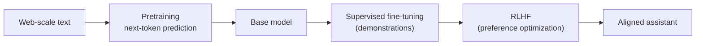

# Large Language Models

A **large language model (LLM)** is a [transformer](transformers-and-attention.md) —
almost always a decoder-only one — with billions of parameters, trained on internet-scale
text to predict the next token. That deceptively simple objective, scaled up far enough,
yields systems that translate, summarize, write code, reason through problems, and hold
conversations. LLMs are the **bridge between AI-the-field and the applied agent and
harness notes** that make up most of HAL: everything from
[building effective agents](../agentic-coding/building-effective-agents.md) to
[context engineering](../harness-engineering/context-engineering.md) presupposes the machinery described here.

## Tokenization

An LLM does not see characters or whole words; it sees **tokens** — subword units produced
by an algorithm like byte-pair encoding (BPE). A tokenizer learns a vocabulary (typically
30k–100k+ tokens) by greedily merging frequent character pairs, so common words become one
token while rare words split into pieces ("tokenization" → `token` + `ization`). Subword
tokenization is the sweet spot between a character vocabulary (short vocab, very long
sequences) and a word vocabulary (huge vocab, no way to spell unseen words). Every token
maps to a learned [embedding](representation-learning-and-embeddings.md) vector — this is
where the [transformer](transformers-and-attention.md) begins. Token counts also drive
cost and the context-window limits that [context engineering](../harness-engineering/context-engineering.md)
must manage.

## The pretraining objective

Pretraining is **self-supervised next-token prediction**. Given a sequence, the model
predicts each token from all preceding tokens (enforced by the transformer's causal mask),
and the loss is the **cross-entropy** between its predicted distribution and the actual
next token:

$$\mathcal{L} = -\sum_{t} \log P_\theta(x_t \mid x_1, \dots, x_{t-1})$$

Trained by [backpropagation and gradient descent](backpropagation-and-gradient-descent.md)
over trillions of tokens, the model is forced to compress the statistical structure of
language — and, incidentally, an enormous amount of world knowledge, since predicting text
well requires modeling what the text describes. No labels are needed; the data labels
itself, which is why the approach scales to the whole web. This is
[representation learning](representation-learning-and-embeddings.md) at extreme scale, and
the substrate for all the [models](../ai-platform/models.md) HAL discusses.

## Scaling laws and emergent abilities

Empirically, LLM loss falls as a smooth **power law** in model parameters, dataset size,
and training compute — the **scaling laws** (Kaplan et al.; Chinchilla). Bigger, better-fed
models are predictably better, which is why the field poured capital into scale. See
[scaling laws for agent harnesses](../harness-engineering/scaling-laws-agent-harnesses-efc.md) for how the same
logic extends beyond the model itself. Alongside the smooth curve come **emergent
abilities**: capabilities (multi-step arithmetic, chain-of-thought reasoning, instruction
following) that are near-absent in small models and appear relatively abruptly past some
scale. Whether emergence is a genuine phase change or an artifact of the metric is debated,
but the practical effect — new capabilities unlocking with scale — is real and shapes
[model selection](../ai-platform/models.md).

## In-context learning

The most striking LLM behavior is **in-context learning**: the model performs a new task
from examples or instructions placed *in the prompt*, with **no weight updates at all**.
Show a few input→output pairs (few-shot) and it infers the pattern; describe the task
(zero-shot) and it often just does it. The forward pass itself acts as a learning
algorithm over the context. This is the entire foundation of **prompt engineering** — see
[The Prompt Report](../ai-platform/the-prompt-report.md) — and of programmatic prompting frameworks
like [DSPy](../ai-platform/dspy.md). It is also why the *contents* of the context window are so
load-bearing, the premise of [context engineering](../harness-engineering/context-engineering.md) and of
memory systems like [MemGPT](../harness-engineering/memgpt.md).

## Fine-tuning and RLHF: from predictor to assistant

A raw pretrained model predicts plausible text; it is not yet a helpful, safe assistant.
Two post-training stages align it:

1. **Supervised fine-tuning (SFT).** Continue training on curated
   instruction→response demonstrations so the model adopts the assistant format.
2. **Reinforcement learning from human feedback (RLHF).** Humans rank alternative
   responses; those rankings train a **reward model**; the LLM is then optimized against
   that reward with a policy-gradient method (commonly PPO). This is applied
   [reinforcement learning](reinforcement-learning.md) — the LLM is the policy, the reward
   model scores its outputs, and it learns to produce responses humans prefer. Variants
   like DPO skip the explicit reward model and optimize preferences directly.

## Hallucination and alignment

Two problems follow directly from how LLMs work. **Hallucination** — confident,
fluent, false output — is not a bug bolted on but a consequence of the objective: the model
is trained to produce *probable-sounding* text, not *true* text, and it has no built-in
mechanism to know the boundary of its knowledge. Mitigations (retrieval grounding,
tool use, evals, verification) are much of what applied
[AI engineering](../ai-platform/ai-engineering-huyen.md) is about. **Alignment** — making a
capable model helpful, honest, and harmless — is the broader challenge that RLHF partially
addresses and that remains open as models grow more capable and are handed more autonomy in
[agentic systems](../agentic-coding/llm-powered-autonomous-agents.md).

## Why it matters

LLMs are where the field's foundations —
[neural networks](neural-networks.md), [deep learning](deep-learning.md),
[transformers](transformers-and-attention.md),
[representation learning](representation-learning-and-embeddings.md),
[reinforcement learning](reinforcement-learning.md) — converge into the technology that
drives current practice. Understanding tokenization, the pretraining objective, scaling,
in-context learning, and alignment is the prerequisite for reasoning clearly about the
[agents](../agentic-coding/building-effective-agents.md), harnesses, and workflows in the rest of HAL.
The field also reaches into [linguistics](../linguistics/index.md),
[mathematics](../math/index.md), and [statistics](../statistics/index.md).

## References

- [Attention Is All You Need (Vaswani et al., 2017)](attention-is-all-you-need.md) —
  the transformer that LLMs scale.
- [Deep Learning (Goodfellow, Bengio, Courville)](deep-learning-goodfellow.md) —
  underlying deep-network foundations.
- [AI Engineering (Chip Huyen)](../ai-platform/ai-engineering-huyen.md) — building applications on
  top of foundation models.
- Brown et al., *Language Models are Few-Shot Learners* (GPT-3, 2020) — in-context
  learning; Kaplan et al. / Hoffmann et al. (Chinchilla) — scaling laws; Ouyang et al.,
  *InstructGPT* (2022) — RLHF.
