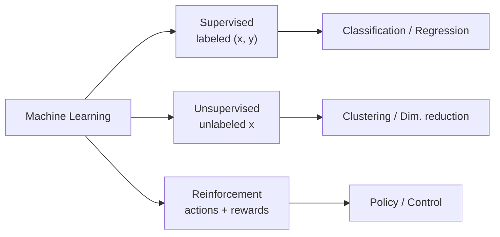

# Machine Learning

**Machine learning (ML)** is the paradigm shift that reorganized artificial intelligence:
instead of a human hand-coding the rules a program follows — the approach of
[knowledge representation and reasoning](knowledge-representation-and-reasoning.md) and
[search and planning](search-and-planning.md) — the program **learns the rules from data**.
Arthur Samuel's early framing still holds: ML gives computers the ability to improve at a task
with experience, without being explicitly programmed for it. Tom Mitchell's more precise
definition names three parts — a program learns from experience **E** with respect to a task
**T** and performance measure **P** if its performance at T, measured by P, improves with E.

The reason to learn rather than program is that for most interesting tasks — recognizing a
face, translating a sentence, ranking a search result — nobody can *write down* the rules.
The mapping from input to output is buried in data, and ML extracts it.

## The three learning paradigms

ML is conventionally split by the kind of feedback the learner receives:

- **[Supervised learning](supervised-learning.md)** — training data comes as input–output
  pairs `(x, y)`; the goal is to learn a function `f: x → y` that predicts labels on unseen
  inputs. Classification (discrete `y`) and regression (continuous `y`) live here.
- **[Unsupervised learning](unsupervised-learning.md)** — data has inputs but no labels; the
  goal is to find structure: clusters, low-dimensional representations, density. Much of
  [representation learning and embeddings](representation-learning-and-embeddings.md) and
  [generative models](generative-models.md) grows from here.
- **[Reinforcement learning](reinforcement-learning.md)** — an agent takes actions in an
  environment and receives scalar rewards; it learns a policy that maximizes long-run reward.
  Feedback is evaluative and delayed rather than a labeled target.

## The core machinery

Whatever the paradigm, most ML rests on a common skeleton.

**Features.** Raw inputs are encoded as a feature vector `x ∈ ℝ^d`. Classically these were
hand-engineered; the [deep learning](deep-learning.md) revolution was largely about *learning*
the features instead (see
[representation learning and embeddings](representation-learning-and-embeddings.md)).

**A model / hypothesis class.** A parameterized family of functions `f_θ` — linear models,
trees, [neural networks](neural-networks.md). Learning means choosing the parameters `θ`.

**A loss function.** A per-example measure of how wrong a prediction is: squared error
`(f_θ(x) − y)²` for regression, cross-entropy for classification. The loss operationalizes
"performance measure P."

**Empirical risk minimization (ERM).** We want low *true risk* — expected loss over the real
(unknown) data distribution:

$$R(\theta) = \mathbb{E}_{(x,y)\sim \mathcal{D}}\big[\,\ell(f_\theta(x), y)\,\big].$$

We can't compute that expectation, so we minimize the **empirical risk** — the average loss
over the training sample of size `n`:

$$\hat{R}(\theta) = \frac{1}{n}\sum_{i=1}^{n} \ell\big(f_\theta(x_i), y_i\big).$$

ERM is the workhorse principle: pick `θ` to make training loss small. The whole discipline of
[generalization and regularization](generalization-and-regularization.md) exists because low
*empirical* risk does not guarantee low *true* risk — the model can memorize the sample and
fail on new data. Optimization of `θ` is usually gradient-based; for differentiable models this
is [backpropagation and gradient descent](backpropagation-and-gradient-descent.md).

## The train / validation / test split

Because the target is generalization to *unseen* data, you must never judge a model on the data
it learned from. The standard protocol partitions the data three ways:

- **Training set** — used to fit `θ` (minimize empirical risk).
- **Validation set** — used to tune *hyperparameters* (model capacity, regularization strength,
  learning rate) and to select among models. Repeatedly peeking here leaks information, so this
  set slowly "wears out."
- **Test set** — touched **once**, at the very end, to get an honest estimate of true risk.

When data is scarce, **k-fold cross-validation** rotates the validation role across k splits to
use the data more efficiently (detailed in
[generalization and regularization](generalization-and-regularization.md)).

## A canonical example

Predict house price from square footage. Collect `(size, price)` pairs; choose a linear model
`price = θ₀ + θ₁·size`; use squared-error loss; minimize the average training error by gradient
descent to fit `θ₀, θ₁`; validate the choice of model (linear vs. polynomial) on held-out data;
report final error on the test set. Every richer system — a spam filter, an image classifier, a
[large language model](large-language-models.md) trained by next-token prediction — is this same
loop scaled up in data, parameters, and model class.

## The ML workflow

1. **Frame** the problem and pick a performance measure.
2. **Collect and split** data (train / validation / test).
3. **Engineer or learn features.**
4. **Choose a model** (hypothesis class) and loss.
5. **Train** — minimize empirical risk over the training set.
6. **Validate and tune** hyperparameters; guard against
   [overfitting](generalization-and-regularization.md).
7. **Test once** for an honest estimate; then **deploy and monitor**, since real-world
   distributions drift.

## Why it matters

ML is why AI works at all for perception, language, and control — the tasks symbolic AI could
not crack. It reframes "intelligence" from *authored logic* to *inferred statistical structure*,
which is both its power (it scales with data and compute) and its risk (it inherits the biases
and gaps of its data, and its reasoning is opaque). Understanding ERM, the loss, and the
data-splitting discipline is the foundation for everything downstream:
[supervised learning](supervised-learning.md),
[deep learning](deep-learning.md),
[transformers and attention](transformers-and-attention.md), and the
[large language models](large-language-models.md) that power modern
[agents](../agentic-coding/building-effective-agents.md). Its mathematical roots run through
[statistics](../statistics/index.md), [mathematics](../math/index.md), and
[linear optimization](../linear-optimization/index.md).

## References

- [The Elements of Statistical Learning](elements-of-statistical-learning.md)
  (Hastie, Tibshirani, Friedman) — the statistical foundations of supervised learning.
- [Pattern Recognition and Machine Learning](pattern-recognition-bishop.md) (Bishop) — the
  Bayesian and pattern-recognition view of the core machinery.
- [Probabilistic Machine Learning](probabilistic-machine-learning-murphy.md) (Murphy) — a
  comprehensive modern synthesis across all three paradigms.
- [Artificial Intelligence: A Modern Approach](aima.md) (Russell & Norvig) — ML in the context
  of the wider field.
