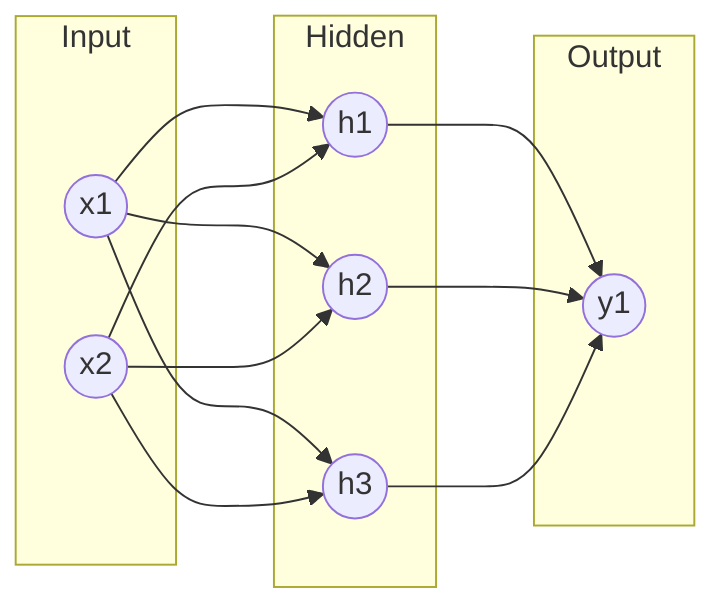

# Neural Networks

An **artificial neural network** is a parameterized function built by composing many
simple units — *neurons* — into layers. Each neuron computes a weighted sum of its inputs,
adds a bias, and passes the result through a nonlinear *activation function*. Stacked and
trained, these units approximate essentially any input-output mapping, which makes neural
networks the workhorse model class of modern [machine learning](machine-learning.md) and
the foundation of [deep learning](deep-learning.md).

## The neuron and its biological inspiration

The framing borrows loosely from the brain. A biological neuron integrates signals from
many synapses and "fires" once its input crosses a threshold. McCulloch and Pitts (1943)
abstracted this into a mathematical unit; Rosenblatt (1958) made it *learnable* as the
**perceptron**. The analogy is deliberately loose — real neurons are far richer — but the
connectionist program it launched (intelligence as emergent from many weighted
connections, not explicit symbolic rules) still defines the field. See
[neuroscience](../neuroscience/index.md) for the biology this abstracts, and contrast the
symbolic alternative in
[knowledge representation and reasoning](knowledge-representation-and-reasoning.md).

## The perceptron

A single perceptron takes an input vector $\mathbf{x} \in \mathbb{R}^n$, weights
$\mathbf{w}$, and bias $b$, and outputs

$$ y = \phi(\mathbf{w}^\top \mathbf{x} + b) $$

where $\phi$ is an activation. With a step activation the perceptron is a **linear
classifier**: the equation $\mathbf{w}^\top \mathbf{x} + b = 0$ defines a hyperplane
splitting the input space in two. The weighted sum is a [linear-algebra](../math/index.md)
dot product, and geometrically $\mathbf{w}$ is the normal to the decision boundary.

The perceptron's fatal limit, exposed by Minsky and Papert (1969), is that a single unit
can only separate *linearly separable* data — it cannot represent XOR. The escape is
depth: stack perceptrons.

## Multilayer perceptrons

A **multilayer perceptron (MLP)** arranges neurons in layers — an input layer, one or more
*hidden* layers, and an output layer — where every unit in one layer feeds every unit in
the next (a "fully connected" or "dense" network).

Layer $\ell$ computes, in vectorized form,

$$ \mathbf{a}^{(\ell)} = \phi\!\left( W^{(\ell)} \mathbf{a}^{(\ell-1)} + \mathbf{b}^{(\ell)} \right) $$

with $\mathbf{a}^{(0)} = \mathbf{x}$. Each $W^{(\ell)}$ is a weight matrix and
$\mathbf{b}^{(\ell)}$ a bias vector; these are the **parameters** learned from data. The
crucial point is the *nonlinearity* $\phi$: without it, a stack of linear layers collapses
to a single linear map ($W_2 W_1 \mathbf{x}$ is just another matrix), and depth buys
nothing. The nonlinearity is what lets successive layers build up increasingly abstract
[representations](representation-learning-and-embeddings.md).

## Activation functions

- **Sigmoid**: $\sigma(z) = 1/(1 + e^{-z})$, squashing to $(0,1)$. Historically popular,
  interpretable as a probability, but *saturates* — its gradient vanishes for large
  $|z|$, stalling learning.
- **Tanh**: $\tanh(z) \in (-1,1)$, a zero-centered cousin of sigmoid; still saturates.
- **ReLU**: $\max(0, z)$. Cheap, non-saturating for positive inputs, and the default that
  helped enable deep networks. Its gradient is simply 0 or 1, which keeps signals flowing
  in [backpropagation and gradient descent](backpropagation-and-gradient-descent.md).
  Variants (leaky ReLU, GELU) address its "dead unit" failure mode.

## The forward pass

*Inference* is a **forward pass**: feed $\mathbf{x}$ in, apply each layer's affine map plus
activation in turn, and read the output. For classification the final layer often uses a
*softmax* to produce a distribution over classes; for regression it is left linear. The
same forward computation, run in reverse via the chain rule, yields the gradients used to
train the weights (see [backpropagation and gradient descent](backpropagation-and-gradient-descent.md)).

## The universal approximation theorem

Why should such a simple recipe be powerful? The **universal approximation theorem**
(Cybenko 1989; Hornik 1991) states that a feedforward network with a *single* hidden layer
of finite width and a suitable nonlinear activation can approximate any continuous function
on a compact domain to arbitrary accuracy. In principle, one hidden layer is enough.

In practice the theorem is an *existence* result: it says nothing about how *wide* that
layer must be (potentially exponentially wide) or whether training will *find* the right
weights. This is exactly the gap that [deep learning](deep-learning.md) exploits — deep,
narrow networks represent many functions far more compactly than shallow, wide ones, which
is why depth, not just width, is the lever the field pulls. It also raises the central
tension of [generalization and regularization](generalization-and-regularization.md):
a model flexible enough to fit anything can overfit everything.

## Why it matters

Neural networks are a single, differentiable, composable model family that scales with data
and compute. Convolutional networks
([convolutional neural networks](convolutional-neural-networks.md)),
recurrent networks ([sequence models and RNNs](sequence-models-and-rnns.md)), and
[transformers](transformers-and-attention.md) are all specializations of this base idea,
and modern [large language models](large-language-models.md) are enormous instances of it.
They are one entry in the broader catalog of [../models.md](../ai-platform/models.md).

## References

- [Deep Learning](deep-learning-goodfellow.md) — Goodfellow, Bengio & Courville (Ch. 6, feedforward networks)
- [Pattern Recognition and Machine Learning](pattern-recognition-bishop.md) — Bishop (Ch. 5, neural networks)
- [Probabilistic Machine Learning](probabilistic-machine-learning-murphy.md) — Murphy
- [Artificial Intelligence: A Modern Approach](aima.md) — Russell & Norvig
