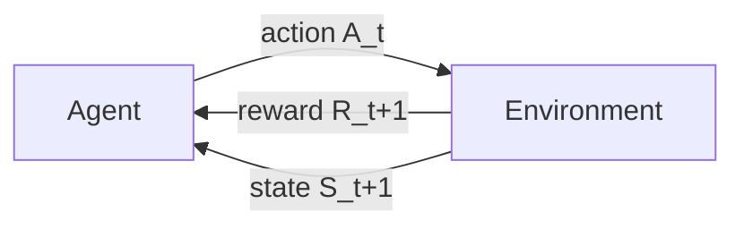

# Reinforcement Learning: An Introduction (Sutton & Barto)

Richard S. Sutton and Andrew G. Barto's *Reinforcement Learning: An Introduction*
(2nd edition, MIT Press, 2018) is the canonical textbook of the field — "the RL bible."
It develops [reinforcement learning](reinforcement-learning.md) from first principles as
the study of an **agent** that learns to act by interacting with an **environment**,
receiving a scalar **reward** signal, and adjusting behavior to maximize cumulative
reward over time. Unlike [supervised learning](supervised-learning.md), there is no
labeled correct action; unlike [unsupervised learning](unsupervised-learning.md), the
goal is not to find hidden structure but to maximize a numerical objective. The learner
must *discover* which actions pay off through trial and error, and cope with the fact
that actions influence not only immediate reward but all subsequent states.

## The core problem: the RL loop

At each timestep $t$ the agent observes state $S_t$, takes action $A_t$, and receives
reward $R_{t+1}$ and next state $S_{t+1}$. Its goal is to learn a **policy**
$\pi(a \mid s)$ that maximizes the expected **return** — the discounted sum of future
rewards $G_t = \sum_{k=0}^{\infty} \gamma^k R_{t+k+1}$, where the discount factor
$\gamma \in [0,1)$ trades off immediate against future reward.

## Markov Decision Processes

The book formalizes the environment as a **Markov Decision Process (MDP)**: a tuple of
states, actions, transition probabilities $p(s' \mid s, a)$, and rewards, with the
**Markov property** — the future depends only on the current state, not the full history.
Two functions organize everything:

- The **state-value function** $v_\pi(s)$ — expected return starting in $s$ and following
  $\pi$.
- The **action-value function** $q_\pi(s, a)$ — expected return after taking $a$ in $s$,
  then following $\pi$.

Both satisfy the **Bellman equations**, which express a value recursively in terms of the
values of successor states. The **Bellman optimality equation** characterizes the optimal
value function $v_*$, from which an optimal policy is read off greedily. MDPs and the
value/return framing are the same decision-theoretic machinery that underlies dynamic
optimization in [economics](../economics/index.md) — the Bellman equation is Richard
Bellman's, from optimal control.

## The solution methods, in order

The book's arc is a progression of ways to solve or approximate the Bellman equations:

1. **Dynamic programming (DP)** — *policy iteration* and *value iteration*. Exact methods
   that require a full model of the MDP ($p$ and rewards known). They alternate **policy
   evaluation** (compute $v_\pi$) with **policy improvement** (act greedily w.r.t. it),
   converging to $v_*$. DP is the theoretical ideal but needs the model and sweeps the
   whole state space.
2. **Monte Carlo (MC) methods** — learn from complete sampled *episodes* of experience, no
   model needed. Estimate values by averaging observed returns. Model-free, but must wait
   until an episode ends to update.
3. **Temporal-difference (TD) learning** — the field's central idea, combining DP's
   *bootstrapping* (updating an estimate from other estimates) with MC's *sampling*. TD
   updates after every step using the **TD error** $\delta_t = R_{t+1} + \gamma V(S_{t+1})
   - V(S_t)$. This yields **SARSA** (on-policy) and **Q-learning** (off-policy), the
   workhorses of tabular RL. `TD(λ)` and eligibility traces unify MC and TD along a
   spectrum.

## Function approximation and deep RL

When the state space is too large to tabulate (images, continuous control), values and
policies are represented by **function approximators** — linear features or
[neural networks](neural-networks.md), trained by
[gradient descent](backpropagation-and-gradient-descent.md). This is the bridge from
tabular RL to modern **deep reinforcement learning**. The book treats the subtleties of
combining function approximation, bootstrapping, and off-policy learning (the "deadly
triad" that can destabilize training).

## Policy gradient methods

Rather than learn values and derive a policy, **policy-gradient** methods parameterize the
policy $\pi_\theta$ directly and ascend the gradient of expected return (the **policy
gradient theorem**). **REINFORCE** is the basic Monte Carlo version; **actor-critic**
methods learn a value function (the *critic*) to reduce the variance of the policy
(*actor*) updates. These scale to continuous action spaces and are the foundation of the
algorithms behind game-playing and robotics agents, and of RLHF for
[large language models](large-language-models.md).

## Why it matters

RL is the formal theory of *sequential decision-making under uncertainty*, and its
concepts — reward, value, policy, exploration vs. exploitation — recur far beyond ML:
in control, operations research, neuroscience, and the design of autonomous
[agents](../agentic-coding/building-effective-agents.md). It is one of the three canonical paradigms of
[machine learning](machine-learning.md), and the reference frame for reasoning about any
system that learns to act toward a goal.

## References

- [Reinforcement Learning: An Introduction, 2nd ed. — Sutton & Barto](http://incompleteideas.net/book/the-book-2nd.html)
  (full text free online).
