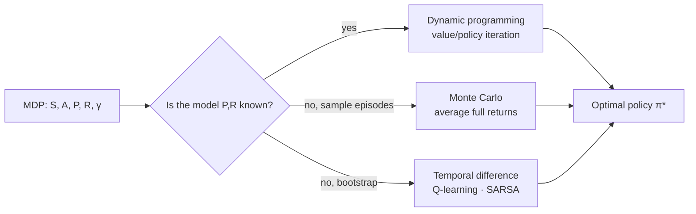

# Reinforcement Learning

**Reinforcement learning (RL)** is the study of an *agent* that learns to act by
interacting with an *environment* and receiving scalar *reward*. There are no labeled
right answers — only a reward signal that may be sparse and delayed. The agent must
discover, by trial and error, a behavior that maximizes cumulative reward over time. This
makes RL the third major branch of [machine learning](machine-learning.md), distinct from
[supervised](supervised-learning.md) and [unsupervised](unsupervised-learning.md)
learning, and it inherits the sequential-decision framing at the heart of
[search and planning](search-and-planning.md).

## The Markov Decision Process

RL problems are formalized as a **Markov Decision Process (MDP)**, a tuple
$(\mathcal{S}, \mathcal{A}, P, R, \gamma)$:

- $\mathcal{S}$ — states; $\mathcal{A}$ — actions.
- $P(s' \mid s, a)$ — transition dynamics (the **Markov property**: the next state depends
  only on the current state and action, not the full history).
- $R(s, a)$ — reward.
- $\gamma \in [0,1)$ — a **discount factor** that makes far-future reward worth less and
  keeps infinite-horizon sums finite.

The agent's behavior is a **policy** $\pi(a \mid s)$. Its goal is to maximize the expected
discounted return $G_t = \sum_{k \ge 0} \gamma^k R_{t+k}$.

## Value functions and the Bellman equations

Two **value functions** measure long-run desirability:

- **State value** $V^\pi(s) = \mathbb{E}_\pi[G_t \mid S_t = s]$.
- **Action value** $Q^\pi(s, a) = \mathbb{E}_\pi[G_t \mid S_t = s, A_t = a]$.

Both satisfy a recursive consistency condition, the **Bellman equation** — the central
identity of RL:

$$V^\pi(s) = \sum_a \pi(a \mid s) \sum_{s'} P(s' \mid s, a)\big[R(s,a) + \gamma V^\pi(s')\big].$$

The **Bellman optimality equation** replaces the average over actions with a max, and its
fixed point is the optimal value $V^*$; acting greedily with respect to $Q^*$ gives an
optimal policy. This dynamic-programming structure ties directly to the
[optimization](../linear-optimization/index.md) and [algorithms](../computer-science/introduction-to-algorithms.md)
of sequential decision-making.

## Three families of solution methods

- **Dynamic programming (DP)** — when $P$ and $R$ are known, *value iteration* and
  *policy iteration* solve the Bellman equations by sweeping over all states. Exact but
  requires a full model and a tractable state space.
- **Monte Carlo (MC)** — no model needed; estimate values by averaging *complete* observed
  returns from sampled episodes. Unbiased but high variance and needs episodes to end.
- **Temporal-difference (TD)** — the RL breakthrough: learn from *incomplete* episodes by
  **bootstrapping** — updating an estimate toward a nearby estimate. The TD update
  $V(s) \leftarrow V(s) + \alpha[\,r + \gamma V(s') - V(s)\,]$ uses the TD error (the
  bracketed term) as a learning signal. It blends MC's model-freedom with DP's efficiency.

## Q-learning and policy gradients

- **Q-learning** — an *off-policy* TD control method that learns $Q^*$ directly:
  $Q(s,a) \leftarrow Q(s,a) + \alpha[\,r + \gamma \max_{a'} Q(s', a') - Q(s,a)\,]$.
  Combined with a [neural network](neural-networks.md) function approximator it becomes
  **Deep Q-Networks (DQN)**, which learned to play Atari from pixels.
- **Policy gradients** — instead of learning values then acting greedily, directly
  parameterize the policy $\pi_\theta$ and ascend the gradient of expected return. The
  **REINFORCE** estimator is
  $\nabla_\theta J = \mathbb{E}[\,\nabla_\theta \log \pi_\theta(a \mid s)\, G_t\,]$, trained by
  [gradient ascent](backpropagation-and-gradient-descent.md). **Actor–critic** methods pair
  a policy (actor) with a learned value function (critic) to cut variance; PPO is the
  workhorse variant.

## Exploration vs exploitation

An agent must **exploit** what it knows to earn reward yet **explore** to discover
whether something better exists. Balancing the two is fundamental: $\varepsilon$-greedy
(act randomly with probability $\varepsilon$), optimism under uncertainty, and
upper-confidence-bound methods are standard schemes — the same tension studied in the
multi-armed bandit and in the [economics](../economics/index.md) of decision-making under
uncertainty.

## Canonical example and why it matters

A classic setting is a robot in a **grid world**: states are cells, actions are moves, a
goal cell gives +1, and the agent learns a policy that navigates there while avoiding
penalties — solvable by Q-learning without knowing the maze in advance. Scaled up, the
same principles produced superhuman game play (AlphaGo, Atari) and robotic control.

Crucially, RL is how large models are aligned to human preference. **RLHF (Reinforcement
Learning from Human Feedback)** trains a reward model from human comparisons of outputs,
then fine-tunes a policy — typically with PPO — to maximize that reward. This is the step
that turns a raw next-token predictor into a helpful assistant; see
[large language models](large-language-models.md).

## References

- [Reinforcement Learning: An Introduction](reinforcement-learning-sutton-barto.md) — the
  definitive text on MDPs, Bellman equations, TD learning, Q-learning, and policy gradients.
- [Artificial Intelligence: A Modern Approach](aima.md) — MDPs and sequential decision-making.
- [Deep Learning](deep-learning-goodfellow.md) — function approximation for deep RL.
