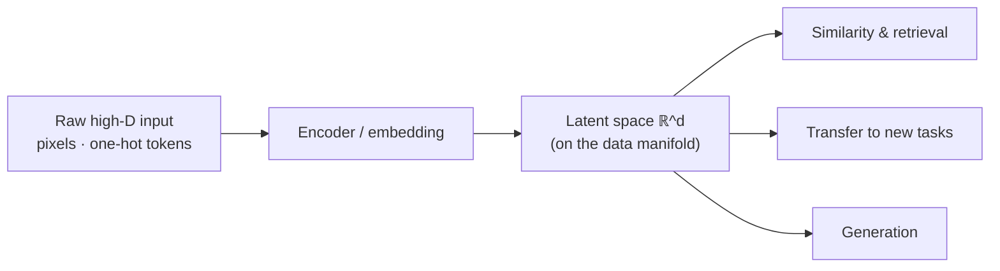

# Representation Learning and Embeddings

**Representation learning** is the study of how to *learn* the features a model works
with, instead of hand-crafting them. Classical [machine learning](machine-learning.md)
spent most of its effort on **feature engineering** — a domain expert deciding which
measurements of the raw input to feed the model. Representation learning replaces that
with features discovered automatically from data, and it is the reason
[deep learning](deep-learning.md) overtook the hand-engineered pipelines that preceded it.

## Embeddings: dense vectors that carry meaning

An **embedding** maps a discrete or high-dimensional object — a word, a user, an image, a
graph node — to a dense, low-dimensional vector $\mathbb{R}^d$ such that *geometry encodes
semantics*: similar objects land near each other, and directions in the space can carry
meaning. Instead of a sparse one-hot vector (one dimension per vocabulary item, no notion
of similarity), an embedding places "king" and "queen" close together because they are
used in similar contexts.

### word2vec and GloVe

Two landmark word embeddings made this concrete:

- **word2vec** — trains a shallow [neural network](neural-networks.md) on a simple
  self-supervised task: predict a word from its neighbors (CBOW) or predict the neighbors
  from a word (skip-gram). No labels are needed — the surrounding text *is* the supervision.
  The learned hidden weights are the embeddings.
- **GloVe** — factorizes a global word–word co-occurrence matrix so that the dot product
  of two word vectors approximates the log of how often they co-occur. It reaches a similar
  space from [linear-algebra](../math/index.md) / matrix-factorization first principles.

Both yield the famous linear analogies:
$\text{vec}(\text{king}) - \text{vec}(\text{man}) + \text{vec}(\text{woman}) \approx \text{vec}(\text{queen})$
— relational structure emerging as vector arithmetic. This is the direct ancestor of the
token embeddings inside [transformers](transformers-and-attention.md) and
[large language models](large-language-models.md).

## Latent spaces

The internal vector space a model organizes data into is its **latent space**. It arises
throughout ML: the bottleneck of an autoencoder, the code of a variational autoencoder, or
the hidden activations of any deep network are all latent representations. A well-shaped
latent space is *smooth and disentangled* — nearby points decode to similar outputs, and
moving along an axis changes one interpretable factor — which is exactly what makes it
useful for [generative models](generative-models.md) and
[unsupervised learning](unsupervised-learning.md).

## The manifold hypothesis

Why does compressing to low dimensions work at all? The **manifold hypothesis** holds that
real high-dimensional data (natural images, speech, text) concentrates near a
low-dimensional **manifold** embedded in the ambient space — the space of plausible faces
is a tiny, curved sheet inside the space of all pixel arrays. A good representation is a
coordinate system *on that manifold*: it unrolls the curved surface so that Euclidean
distance in the learned space matches semantic distance. This reframes representation
learning geometrically and connects it to the dimensionality-reduction methods (PCA, UMAP)
of [unsupervised learning](unsupervised-learning.md) and the
[statistics](../statistics/index.md) of high-dimensional data.

## Transfer learning and pretraining

The biggest payoff of learned representations is **reuse**. In **pretraining**, a large
model learns general-purpose representations from vast unlabeled data via a
self-supervised objective (predict the next token, fill in a masked word, contrast image
crops). **Transfer learning** then adapts those representations to a downstream task with
far less labeled data — fine-tuning the weights or just training a small head on top of
frozen embeddings. This *pretrain-then-adapt* recipe is why one foundation model can seed
thousands of applications, and it is the economic engine behind
[large language models](large-language-models.md) — see the discussion of matching
[models](../models.md) to tasks.

## Why learned representations beat hand-engineered features

- **They scale with data.** Hand-crafted features plateau; learned ones keep improving as
  data and model size grow.
- **They capture structure humans miss.** Gradient-based learning finds features optimized
  end-to-end for the objective, not for human intuition.
- **They transfer.** One learned representation serves many tasks; a hand-tuned feature set
  rarely does.
- **They compose.** Deep networks learn a *hierarchy* — edges → textures → parts → objects —
  each layer a representation built on the last, which no manual pipeline matches.

## References

- [Deep Learning](deep-learning-goodfellow.md) — its central thesis is representation
  learning; covers embeddings, the manifold hypothesis, and pretraining directly.
- [Probabilistic Machine Learning](probabilistic-machine-learning-murphy.md) — latent-variable
  models and learned representations.
- [Attention Is All You Need](attention-is-all-you-need.md) — the architecture whose
  learned token and positional representations power modern language models.
- [Pattern Recognition and Machine Learning](pattern-recognition-bishop.md) — feature spaces,
  kernels, and latent-variable foundations.
