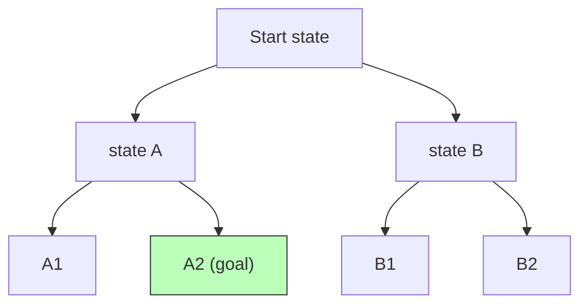

# Search and Planning

Before machine learning dominated the field, "artificial intelligence" largely meant
**search**: cast a problem as the exploration of a space of states, and find a path from
where you are to where you want to be. This is the heart of **GOFAI** ("Good Old-Fashioned
AI") — the symbolic, algorithmic paradigm that precedes and complements
[machine learning](machine-learning.md). Search is still everywhere modern AI works: a
game engine, a route planner, a theorem prover, a compiler's register allocator, and the
planning layer of an LLM [agent](../agentic-coding/building-effective-agents.md) are all search at heart.

## The state-space formulation

Almost any goal-directed problem can be framed as a **state-space search** with five parts:

- **States** — configurations of the world (a board position, a partial route, an assignment of values).
- **Initial state** — where you start.
- **Actions / successor function** — given a state, what moves are legal and what states they lead to.
- **Goal test** — a predicate that recognizes a solution.
- **Path cost** — a number to minimize (steps, distance, money).

Solving means finding a sequence of actions from the initial state to a goal. Conceptually
you explore a **search tree** (or graph, if you avoid revisiting states) whose root is the
start and whose branches are actions.

## Uninformed search: no domain knowledge

Uninformed (blind) strategies know only the problem definition, not how "close" a state is
to the goal. They differ only in the order they expand nodes:

- **Breadth-first search (BFS)** — expand shallowest nodes first, using a FIFO queue. Finds
  the shallowest goal, so it is **complete** and **optimal when step costs are equal**. Cost:
  time and space both O(b^d) — the branching factor `b` raised to the solution depth `d`. The
  exponential memory is usually the killer.
- **Depth-first search (DFS)** — expand deepest nodes first, using a stack. Memory is only
  O(b·m) for maximum depth `m` — its one virtue — but it is neither complete (can loop) nor
  optimal.
- **Uniform-cost search (UCS)** — expand the node with lowest *path cost g(n)* first, using a
  priority queue. This is **Dijkstra's shortest-path algorithm** in AI clothing (see
  [Introduction to Algorithms](../computer-science/introduction-to-algorithms.md)); it is complete and optimal
  for non-negative costs, at the price of exploring cost-cheap regions broadly.

## Informed search: heuristics

The exponential blowup of blind search is tamed by a **heuristic function** `h(n)` — a
cheap estimate of the cost from node `n` to the goal. Domain knowledge, injected as `h`,
guides the frontier toward promising regions.

- **Greedy best-first** expands the node with smallest `h(n)`. Fast but myopic: it ignores the
  cost already paid, so it is not optimal.
- **A\*** — the workhorse — orders the frontier by

  $$f(n) = g(n) + h(n)$$

  the cost so far *plus* the estimated cost to go. A\* is **optimal and complete** provided `h`
  is **admissible** (never overestimates the true remaining cost) — for graph search, provided
  `h` is also **consistent** (satisfies the triangle inequality `h(n) ≤ cost(n,n') + h(n')`).
  Intuitively, an admissible heuristic is optimistic, so A\* never prematurely discards a path
  that could turn out cheapest. The straight-line distance is the classic admissible heuristic
  for road navigation. A **more informed** (larger but still admissible) heuristic expands
  strictly fewer nodes, which is why heuristic design is where the engineering happens.

## Adversarial search: games

When another agent acts *against* you, the state space becomes a game tree of alternating
moves. **Minimax** assumes both players play optimally: you (MAX) maximize a terminal-state
utility while the opponent (MIN) minimizes it. You back values up from the leaves — MAX
nodes take the max of their children, MIN nodes the min — and act on the root's best branch.

Full minimax is O(b^m) and hopeless for real games, so **alpha-beta pruning** discards
branches that cannot affect the result: track α (best MAX can guarantee) and β (best MIN can
guarantee), and prune a subtree the moment α ≥ β. With good move ordering, alpha-beta roughly
halves the effective depth's exponent — O(b^{m/2}) — doubling the reachable search depth for
free. This is the classical backbone of chess engines; modern systems fuse it with learned
evaluation functions ([neural networks](neural-networks.md)) and Monte Carlo tree search.

## Constraint satisfaction

A **constraint satisfaction problem (CSP)** is a special, highly structured search: assign
values from finite domains to variables such that a set of constraints holds — map coloring,
Sudoku, scheduling, register allocation. Rather than blind expansion, CSP solvers exploit
structure with **backtracking search** plus:

- **Constraint propagation** (e.g. arc consistency / AC-3), which prunes domain values that
  can never participate in a solution before search even branches.
- **Heuristics** like *minimum-remaining-values* (assign the most constrained variable next)
  and *least-constraining-value*.

CSPs sit at the boundary of search and [knowledge representation and reasoning](knowledge-representation-and-reasoning.md):
the constraints are a declarative logical model, and solving them is inference over that model.

## Why it matters

Search is the algorithmic foundation the whole field is built on, and it never went away.
[Reinforcement learning](reinforcement-learning.md) is, in one reading, learning to search a
state space when the successor function and rewards are unknown; A\*-style value estimates
reappear there as value functions. Planning modules in autonomous systems and the
task-decomposition loops of LLM agents ([building effective agents](../agentic-coding/building-effective-agents.md))
are search over action sequences. Understanding completeness, optimality, and the cost of a
good heuristic gives you the vocabulary to reason about *any* of these systems. For the
broader map of how symbolic AI relates to the learning paradigms, see
[models](../ai-platform/models.md) and cross-field foundations in
[computer science](../computer-science/index.md), [mathematics](../math/index.md), and
[linear optimization](../linear-optimization/index.md).

## References

- [Artificial Intelligence: A Modern Approach](aima.md) (Russell & Norvig) — the canonical
  treatment of state-space search, informed search, adversarial search, and CSPs.
- [Introduction to Algorithms](../computer-science/introduction-to-algorithms.md) — BFS, DFS, Dijkstra, and the
  graph-algorithm underpinnings of uninformed and uniform-cost search.
