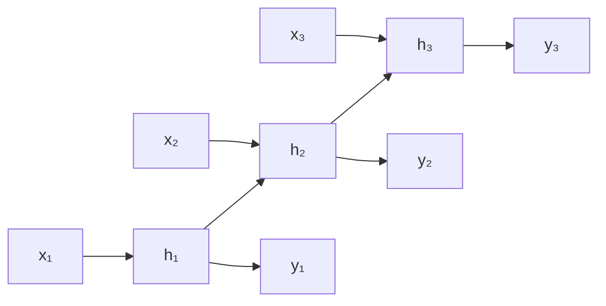
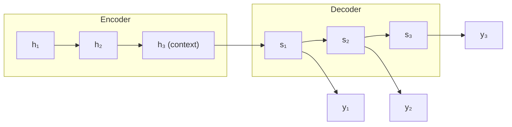

# Sequence Models and RNNs

Many problems are about **sequences**: text (a sequence of words), speech, DNA,
sensor streams, stock prices. Their defining feature is that **order matters and length
varies** — "dog bites man" ≠ "man bites dog", and sentences are not all the same length.
A plain [feed-forward neural network](neural-networks.md) expects a fixed-size input and
treats each input independently, so it is a poor fit. **Recurrent neural networks (RNNs)**
were the first [deep learning](deep-learning.md) architecture built to handle sequences
natively, and understanding them — and their limits — is the cleanest way to motivate the
[transformer](transformers-and-attention.md).

## The recurrent idea

An RNN processes a sequence one element at a time while maintaining a **hidden state**
$h_t$ — a vector that summarizes everything seen so far. At each step it combines the new
input $x_t$ with the previous state $h_{t-1}$:

$$h_t = \tanh\!\big(W_{hh}\, h_{t-1} + W_{xh}\, x_t + b\big), \qquad y_t = W_{hy}\, h_t$$

Crucially the weight matrices $W$ are **shared across all timesteps** — the same
transition function is applied at every position, which is what lets one network handle a
sequence of any length. The hidden state is a running memory; the network is, in effect,
a deep [neural network](neural-networks.md) unrolled through time.

Training uses **backpropagation through time (BPTT)**: unroll the network across the
sequence and apply ordinary [backpropagation and gradient
descent](backpropagation-and-gradient-descent.md) to the unrolled graph.

## The vanishing (and exploding) gradient problem

Here is the fatal flaw. To learn a dependency between step $t$ and a much earlier step
$t-k$, the gradient must propagate back through $k$ applications of the recurrence. That
means multiplying by the same recurrent weight (and $\tanh$ derivative) roughly $k$ times.
If the relevant factor is $<1$ the gradient **vanishes exponentially** toward zero; if
$>1$ it **explodes**. Exploding gradients can be patched with clipping, but vanishing
gradients mean a vanilla RNN effectively cannot learn **long-range dependencies** — it
forgets the start of a long paragraph by the time it reaches the end.

## LSTM and GRU: gating to preserve memory

The **Long Short-Term Memory (LSTM)** cell (Hochreiter & Schmidhuber, 1997) fixes this
with an explicit **cell state** $C_t$ — a memory conveyor belt with mostly additive
updates, so gradients can flow across many steps without repeatedly shrinking. Learned
**gates** (sigmoid-valued, ∈ [0,1]) regulate the flow:

- **Forget gate** — how much of the old cell state to erase.
- **Input gate** — how much new candidate information to write.
- **Output gate** — how much of the cell state to expose as the hidden state.

The **Gated Recurrent Unit (GRU)** is a simpler two-gate variant (reset + update) that
merges cell and hidden state; it is cheaper and often performs comparably. Gated RNNs made
sequence learning practically useful — for a decade they were the default for machine
translation, speech recognition, and language modeling.

## Encoder–decoder (seq2seq)

For mapping one sequence to another of different length (translation, summarization), the
**encoder–decoder** pattern chains two RNNs: an **encoder** consumes the input and
compresses it into a fixed-size **context vector** (its final hidden state); a **decoder**
generates the output sequence conditioned on that vector.

The **bottleneck** is obvious: cramming an entire sentence into one fixed vector loses
information, badly for long inputs.

## Why RNNs gave way to attention

Two problems doomed RNNs for large-scale language work:

1. **The bottleneck** — one context vector cannot faithfully carry a long sequence.
2. **Inherently sequential computation** — step $t$ needs step $t-1$, so an RNN *cannot
   be parallelized across the sequence*. On modern GPUs this is a crippling waste.

**Attention** was introduced as a patch: let the decoder look back at *all* encoder
states and learn which to focus on, dissolving the bottleneck. The 2017 insight of
[*Attention Is All You Need*](attention-is-all-you-need.md) was that if attention is so
useful, you can **discard recurrence entirely** — the [transformer](transformers-and-attention.md)
processes all positions in parallel and models arbitrarily long dependencies directly.
That change unlocked the scale behind [large language models](large-language-models.md).

## Why it matters

RNNs, LSTMs, and the encoder–decoder pattern defined a decade of applied NLP and speech,
and their conceptual scaffolding — hidden state as memory, sequential dependency, the
attention fix for the bottleneck — is exactly what makes the transformer legible. They
sit at the intersection of [linguistics](../linguistics/index.md),
[statistics](../statistics/index.md) (sequential probabilistic models), and
[mathematics](../math/index.md) (dynamical systems, matrix products), and they remain
useful where data is scarce or latency/streaming constraints favor a compact recurrent
state.

## References

- [Deep Learning (Goodfellow, Bengio, Courville)](deep-learning-goodfellow.md) —
  Chapter 10 on sequence modeling with recurrent and recursive nets.
- Hochreiter & Schmidhuber, *Long Short-Term Memory* (1997).
- Cho et al., *Learning Phrase Representations using RNN Encoder–Decoder* (2014) — GRU
  and seq2seq.
- Bahdanau, Cho & Bengio, *Neural Machine Translation by Jointly Learning to Align and
  Translate* (2015) — attention as the fix for the bottleneck.
