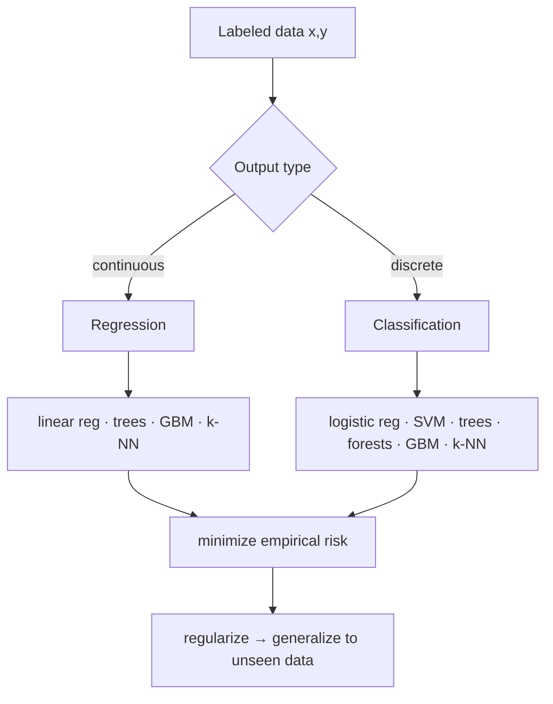

# Supervised Learning

**Supervised learning** learns a function that maps inputs to outputs from a dataset
of *labeled* examples. Given training pairs $\{(x_i, y_i)\}_{i=1}^{n}$ drawn from an
unknown joint distribution $p(x, y)$, the goal is to produce a predictor
$f: \mathcal{X} \to \mathcal{Y}$ that generalizes — that predicts $y$ well on inputs it
has never seen. It is the most mature branch of [machine learning](machine-learning.md)
and the workhorse behind most deployed models; contrast it with
[unsupervised learning](unsupervised-learning.md) (no labels) and
[reinforcement learning](reinforcement-learning.md) (labels replaced by delayed reward).

## Two problem shapes: regression and classification

The type of $\mathcal{Y}$ splits the field:

- **Regression** — $y$ is continuous ($\mathbb{R}$). Predict a house price, a temperature.
- **Classification** — $y$ is a discrete label. Spam/not-spam (binary), or one of $K$
  digits (multiclass).

Both are instances of the same optimization: choose $f$ from a hypothesis class to
minimize expected loss $\mathbb{E}_{(x,y)}[L(f(x), y)]$. We cannot compute that
expectation, so we minimize the **empirical risk** on the training set — the average
loss over observed data — and control the gap to the true risk with
[regularization](generalization-and-regularization.md).

## Core algorithms

### Linear and logistic regression

**Linear regression** fits $\hat{y} = w^\top x + b$ by minimizing squared error
$\sum_i (y_i - w^\top x_i)^2$. The solution has a closed form (the normal equations,
solvable with the [linear algebra](../math/index.md) of the pseudo-inverse) or is found
by [gradient descent](backpropagation-and-gradient-descent.md).

**Logistic regression** adapts the linear model to binary classification by squashing
the score through the sigmoid $\sigma(z) = 1/(1 + e^{-z})$, interpreting the output as
$P(y=1 \mid x)$. It is trained by minimizing **cross-entropy** (negative log-likelihood),
which is convex — a single global optimum. Softmax generalizes it to $K$ classes. These
two models are the conceptual seed of a single-layer [neural network](neural-networks.md).

### k-Nearest Neighbors

**k-NN** is *non-parametric* and *lazy*: it stores the training set and, to classify a
new $x$, votes among its $k$ closest training points (by Euclidean or other distance).
No training phase, but prediction cost grows with the data and accuracy degrades in high
dimensions (the curse of dimensionality) — a motivation for
[learned representations](representation-learning-and-embeddings.md).

### Support Vector Machines

An **SVM** finds the separating hyperplane that *maximizes the margin* — the distance to
the nearest training points (the **support vectors**). This is a constrained
[convex optimization](../linear-optimization/index.md) problem: minimize
$\tfrac{1}{2}\lVert w \rVert^2$ subject to $y_i(w^\top x_i + b) \ge 1$ (soft-margin
slack variables relax it for non-separable data). The **kernel trick** replaces inner
products $x_i^\top x_j$ with a kernel $K(x_i, x_j)$, implicitly mapping data into a
high-dimensional feature space so a linear boundary there is nonlinear in the original
space — without ever computing the mapping.

### Decision trees and ensembles

A **decision tree** recursively splits the feature space on the feature/threshold that
most reduces impurity (Gini index or entropy), yielding an interpretable set of if-then
rules. Single trees overfit, so ensembles combine many:

- **Random forests** — bagging: train many trees on bootstrap resamples with random
  feature subsets, then average. Variance drops; bias barely rises.
- **Gradient boosting** — fit trees *sequentially*, each new tree modeling the residual
  errors (negative gradient of the loss) of the current ensemble. Powerful on tabular
  data (XGBoost, LightGBM). This is functional gradient descent in model space, a bridge
  to [backpropagation and gradient descent](backpropagation-and-gradient-descent.md).

## Loss functions

The **loss** $L(\hat{y}, y)$ defines what "good" means and is what optimization actually
minimizes. Choose it to match the task:

- **Squared error** $(\hat{y} - y)^2$ — regression; penalizes large errors quadratically.
- **Absolute error** $|\hat{y} - y|$ — regression; robust to outliers.
- **Cross-entropy** $-\sum_k y_k \log \hat{p}_k$ — classification; the maximum-likelihood
  loss for probabilistic outputs, rooted in [statistics](../statistics/index.md).
- **Hinge loss** $\max(0, 1 - y\,\hat{y})$ — the SVM's margin objective.

## Evaluating a classifier

Accuracy alone misleads under class imbalance (99% accuracy is trivial if 99% of cases
are negative). Richer metrics come from the confusion matrix:

- **Precision** = TP / (TP + FP) — of predicted positives, how many were right.
- **Recall** (sensitivity) = TP / (TP + FN) — of actual positives, how many were caught.
- **F1** — harmonic mean of precision and recall, a single balanced number.
- **ROC curve** — plots true-positive rate against false-positive rate as the decision
  threshold sweeps; **AUC** (area under it) summarizes ranking quality independent of any
  single threshold. Always estimate these on a held-out set (cross-validation), never on
  training data — see [generalization and regularization](generalization-and-regularization.md).

## Why it matters

Supervised learning turns "examples of the right answer" into an automated predictor,
and nearly every high-value ML system — fraud detection, medical triage, the classifiers
inside [deep learning](deep-learning.md) pipelines — is supervised at its core. Its
theory (bias–variance, empirical risk minimization, [statistics](../statistics/index.md))
also grounds how we reason about the whole field.

## References

- [Artificial Intelligence: A Modern Approach](aima.md) — learning from examples.
- [The Elements of Statistical Learning](elements-of-statistical-learning.md) — the
  definitive treatment of regression, classification, SVMs, trees, and ensembles.
- [Pattern Recognition and Machine Learning](pattern-recognition-bishop.md) — linear
  models, kernels, and a probabilistic view of loss functions.
- [Probabilistic Machine Learning](probabilistic-machine-learning-murphy.md) — losses
  as likelihoods and evaluation under uncertainty.
