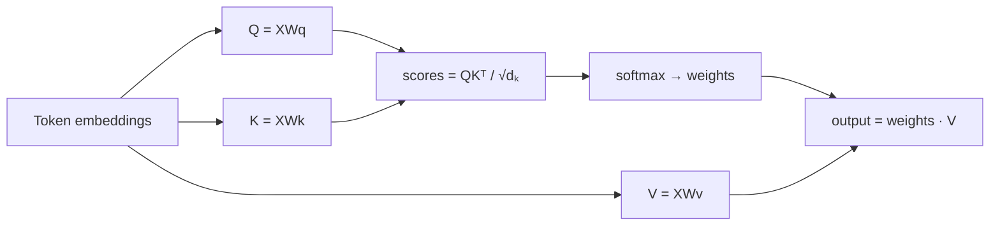
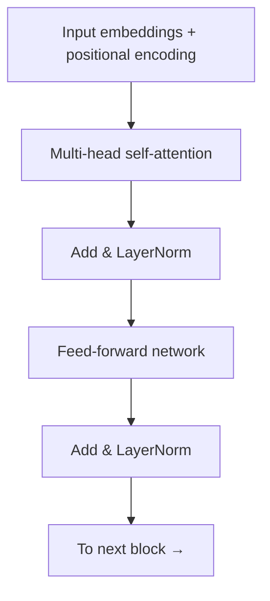

# Transformers and Attention

The **transformer** is the neural network architecture behind essentially all modern
[large language models](large-language-models.md) and much of frontier AI. Introduced in
the 2017 paper [*Attention Is All You Need*](attention-is-all-you-need.md), it replaced
the recurrence of [RNNs](sequence-models-and-rnns.md) with a single mechanism —
**self-attention** — that lets every position in a sequence directly attend to every
other, in parallel. That one change unlocked the scale that produced today's
[models](../ai-platform/models.md).

## The core problem attention solves

To understand a word, you need context from other words, sometimes far away: in "the
*animal* didn't cross the street because *it* was tired", resolving "it" requires linking
it to "animal". [RNNs](sequence-models-and-rnns.md) carry such context in a hidden state
that is squeezed through every intermediate step, so distant links are weak and
computation is inherently sequential. **Attention** instead computes, for each position, a
direct weighted combination of *all* positions — the path length between any two tokens is
constant (one hop), and every position is computed simultaneously.

## Scaled dot-product attention (the math)

Each input token's embedding (see [representation learning and
embeddings](representation-learning-and-embeddings.md)) is projected by learned matrices
into three vectors:

- **Query** $q$ — what this token is looking for.
- **Key** $k$ — what this token offers to others.
- **Value** $v$ — the information this token will actually contribute.

A token's query is compared against every token's key by dot product; the scores are
scaled, softmaxed into weights that sum to 1, and used to average the values. Stacking all
tokens' vectors into matrices $Q, K, V$:

$$\text{Attention}(Q, K, V) = \text{softmax}\!\left(\frac{Q K^{\top}}{\sqrt{d_k}}\right) V$$

The $\sqrt{d_k}$ scaling keeps dot products from growing large with dimension $d_k$ (which
would push softmax into vanishing-gradient saturation). The output for each token is a
context-aware mixture of the whole sequence's values, weighted by learned relevance. In
**self-attention**, $Q$, $K$, $V$ all come from the same sequence; in cross-attention
(decoder attending to encoder), queries and keys/values come from different sequences.

## Multi-head attention

One attention function captures one kind of relationship. **Multi-head attention** runs
$h$ attention computations in parallel, each with its own smaller $Q/K/V$ projections, then
concatenates and re-projects the results. Different heads specialize — one may track
syntactic agreement, another coreference, another positional adjacency — giving the model
multiple "representation subspaces" to attend in at once. This is a cheap, powerful form of
ensembling built into a single layer.

## Positional encoding

Attention is **permutation-invariant** — it treats the input as a *set*, with no built-in
notion of order (unlike an [RNN](sequence-models-and-rnns.md), whose order is baked into
the sequential processing). Since order is essential for language, the transformer adds a
**positional encoding** to each token embedding: the original paper used fixed sinusoids of
varying frequencies, $PE_{(pos,2i)} = \sin(pos/10000^{2i/d})$, so the model can infer
relative and absolute positions; modern variants learn positions or use rotary/relative
schemes. Order is thus injected as data rather than architecture.

## The transformer block

The full architecture stacks identical blocks. Each block is:

1. **Multi-head self-attention** (mixes information *across* tokens),
2. **Position-wise feed-forward network** — a small MLP applied to each token
   independently (transforms information *within* a token),

with a **residual connection** and **layer normalization** around each sub-layer. Residual
connections keep gradients flowing through deep stacks (the same
[backpropagation](backpropagation-and-gradient-descent.md) trick that lets very deep
[networks](deep-learning.md) train). The original design is an **encoder–decoder** (encoder
for the source, decoder that cross-attends to it) for translation; the two dominant modern
variants specialize it:

- **Encoder-only** (e.g. BERT) — bidirectional, for understanding/embedding tasks.
- **Decoder-only** (e.g. the GPT family and most [LLMs](large-language-models.md)) —
  **causally masked** self-attention (a token may attend only to earlier tokens), trained
  to predict the next token.

## Why it parallelizes and scales

Because self-attention computes all positions at once as dense matrix multiplications
($QK^{\top}$, softmax, weighting $V$), the entire sequence is processed in parallel on
GPUs/TPUs — no sequential dependency to serialize. This made it feasible to train on
internet-scale corpora, and the architecture proved to keep improving predictably as
parameters, data, and compute grow (see [scaling
laws](../harness-engineering/scaling-laws-agent-harnesses-efc.md)). The one cost is that attention is
**quadratic** in sequence length ($O(n^2)$ in time and memory, since every token attends to
every token), which drives the whole research program on long-context and efficient-attention
methods relevant to [context engineering](../harness-engineering/context-engineering.md).

## Why it matters

The transformer is the substrate of the current AI era. Everything downstream in HAL —
[LLMs](large-language-models.md), [agents](../agentic-coding/building-effective-agents.md),
[autonomous agents](../agentic-coding/llm-powered-autonomous-agents.md),
[prompting](../ai-platform/the-prompt-report.md), [DSPy](../ai-platform/dspy.md), and
[AI engineering](../ai-platform/ai-engineering-huyen.md) practice — assumes a transformer underneath.
Its ideas draw on [linguistics](../linguistics/index.md) (structure and reference in
language), [mathematics](../math/index.md) (linear algebra, softmax), and
[statistics](../statistics/index.md) (probabilistic sequence modeling).

## References

- [Attention Is All You Need (Vaswani et al., 2017)](attention-is-all-you-need.md) —
  the paper that introduced the transformer.
- [Deep Learning (Goodfellow, Bengio, Courville)](deep-learning-goodfellow.md) —
  foundations of the deep networks and attention builds on.
