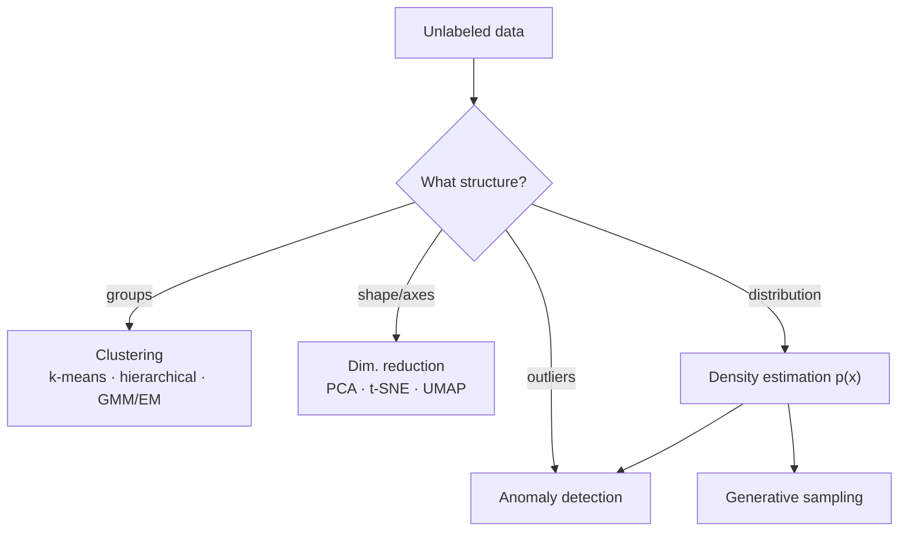

# Unsupervised Learning

**Unsupervised learning** finds structure in data that carries *no labels*. Given only
inputs $\{x_i\}_{i=1}^{n}$ — no target $y$ — the aim is to discover how the data is
organized: which points group together, what lower-dimensional shape they lie on, what
distribution generated them, and which points are anomalous. It complements
[supervised learning](supervised-learning.md) (which needs labels, the expensive part)
and underpins [representation learning](representation-learning-and-embeddings.md) and
[generative models](generative-models.md). It is a major branch of
[machine learning](machine-learning.md).

The unifying idea is **modeling $p(x)$ or its geometry** rather than a conditional
$p(y \mid x)$. Everything below is a different lens on that.

## Clustering

Partition data into groups so points within a group are more similar than across groups.

- **k-means** — pick $k$; alternate two steps until convergence: (1) assign each point to
  its nearest centroid, (2) move each centroid to the mean of its assigned points. This
  minimizes within-cluster squared distance $\sum_j \sum_{x \in C_j} \lVert x - \mu_j \rVert^2$.
  Fast, but assumes roughly spherical, equal-size clusters and needs $k$ chosen in advance.
- **Hierarchical clustering** — build a tree (dendrogram) by repeatedly merging the two
  closest clusters (agglomerative) or splitting (divisive). No fixed $k$; you cut the
  tree at the height you want.
- **Gaussian Mixture Models (GMM)** — model the data as a weighted sum of $K$ Gaussians,
  $p(x) = \sum_k \pi_k \,\mathcal{N}(x \mid \mu_k, \Sigma_k)$. Unlike k-means it gives
  *soft* assignments (a probability of belonging to each cluster) and can fit elliptical
  clusters.

### The EM algorithm

GMMs are fit by **Expectation–Maximization**, which handles the chicken-and-egg problem
of latent cluster memberships:

- **E-step** — given current parameters, compute the *responsibility* $\gamma_{ik}$: the
  posterior probability that point $i$ came from component $k$.
- **M-step** — given those soft assignments, re-estimate $\pi_k, \mu_k, \Sigma_k$ by
  weighted maximum likelihood.

EM provably never decreases the data likelihood and converges to a local optimum. k-means
is the "hard-assignment" limit of EM on a GMM with fixed spherical covariance — a fact
that ties the two together and rests on the [statistics](../statistics/index.md) of
maximum likelihood.

## Dimensionality reduction

High-dimensional data is sparse, noisy, and hard to visualize. Reduce it while preserving
what matters.

- **PCA (Principal Component Analysis)** — find the orthogonal directions of maximum
  variance. These are the top eigenvectors of the data covariance matrix (equivalently,
  the leading singular vectors from the SVD). Projecting onto the first $d$ components
  gives the best rank-$d$ linear approximation in squared error. Pure
  [linear algebra](../math/index.md) and a [linear-optimization](../linear-optimization/index.md)
  problem (variance maximization under an orthonormality constraint).
- **t-SNE / UMAP** — nonlinear methods for *visualization*. They build a graph of local
  neighborhoods in high-D and lay points out in 2-D/3-D so that nearby points stay nearby.
  Excellent for seeing cluster structure; distances and cluster sizes in the plot are not
  quantitatively meaningful.

## Density estimation

Estimate the probability distribution $p(x)$ the data was drawn from — parametrically
(fit a Gaussian, a GMM) or non-parametrically (kernel density estimation places a small
bump on each data point and sums them). A good density model is directly a
[generative model](generative-models.md): sample from $p(x)$ to synthesize new data.

## Anomaly detection

Flag points that don't fit the learned structure — low density under $p(x)$, far from all
centroids, or large reconstruction error after PCA/autoencoding. Used for fraud, fault
detection, and monitoring. It is unsupervised precisely because anomalies are rare and
mostly unlabeled.

## Why it matters

Labels are expensive; raw data is cheap and abundant. Unsupervised learning extracts
value from that abundance — compressing, visualizing, discovering segments, and learning
the [representations](representation-learning-and-embeddings.md) that modern
[deep learning](deep-learning.md) and self-supervised pretraining depend on. It is how a
system finds structure nobody told it to look for.

## References

- [Pattern Recognition and Machine Learning](pattern-recognition-bishop.md) — mixture
  models, EM, and PCA in a fully probabilistic framing.
- [The Elements of Statistical Learning](elements-of-statistical-learning.md) — clustering,
  principal components, and unsupervised methods.
- [Probabilistic Machine Learning](probabilistic-machine-learning-murphy.md) — density
  estimation and latent-variable models.
- [Deep Learning](deep-learning-goodfellow.md) — the manifold view and representation
  learning that grows out of unsupervised methods.
