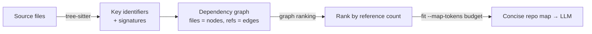

# Aider Repository Map

Aider gives the LLM a **concise map of the whole git repository** — the most
important classes and functions with their type signatures — rather than dumping
files or embedding chunks. The map lets the model reason about the codebase as a
whole while adding files to the chat only when it actually needs to edit them.

## How it's built

- Aider parses the repo with **tree-sitter** to extract the key *identifiers*
  (classes, methods, functions) and their signatures — an AST-level view, not raw
  text or embeddings.
- It builds a **dependency graph**: each source file is a node, and edges connect
  files that reference one another.
- A **graph-ranking algorithm** (PageRank-style) scores identifiers by how often
  they're referenced by the rest of the code, so the map surfaces the symbols that
  matter most and drops the incidental ones.

## Fitting the token budget

For large repos even the map can exceed the context window, so Aider sends only
the **most relevant portions**. The `--map-tokens` switch sets the budget
(default 1k tokens); Aider sizes the map dynamically against the current chat
state, expanding it when no files are added and it needs the widest possible view
of the repo, contracting once relevant files are in play.

This is a middle path between the two poles in [memory
engineering](memory-engineering.md): not a stale embedding index and not blind
file reads, but an **AST-derived, ranked structural summary** kept within a token
budget. It complements [Cline's discovery
approach](why-cline-doesnt-index-your-codebase.md) — where Cline follows imports
live, Aider precomputes a ranked map of the whole graph.

## Related

- [Why Cline Doesn't Index Your Codebase](why-cline-doesnt-index-your-codebase.md) — the no-index counterpart.
- [Memory Engineering](memory-engineering.md) — the code's AST as a memory substrate.
- [Context Engineering](context-engineering.md) — packing the most relevant context into the window.

## References
- [Repository map — Aider](https://aider.chat/docs/repomap.html)
