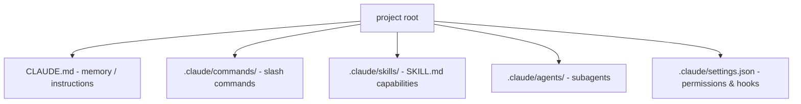

# Anatomy of the .claude/ Folder

Avi Chawla's guide (Daily Dose of DS, 2026) treats the `.claude/` folder as the
**control center** for how Claude Code behaves in a project. Most users see the
folder appear and never open it — a missed opportunity, because it holds the
instructions, custom commands, permission rules, and cross-session memory that
let you configure the agent to work exactly the way your team needs.

## The pieces and where they live

- **CLAUDE.md** — the memory / instruction file. Loaded into context every
  session, it is where standing instructions, conventions, and project context
  go. It exists at multiple scopes (project, user-global) that layer together.
  This is the same mechanism HAL's own schema file uses. Related:
  [rise of AGENTS.md](rise-of-agents-md.md),
  [writing a great AGENTS.md](writing-a-great-agents-md.md).
- **commands/** — custom **slash commands**. Each is a markdown file whose body
  is a reusable prompt; the filename becomes the command name (invoked like
  `/project:fix-issue`). Arguments are passed in with `$ARGUMENTS`, so
  `/project:fix-issue 234` feeds issue 234's content into the prompt. See
  [Claude Code commands](claude-code-commands-26.md).
- **skills/** — packaged capabilities, each defined by a `SKILL.md`. Skills use
  progressive disclosure: only the name/description is loaded until the skill is
  actually needed, then its full instructions (and any bundled files) come into
  context. See [Claude skills (Willison)](claude-skills-willison.md).
- **agents/** — **subagents**: specialized agents that run in their own separate
  context window, so a delegated task doesn't pollute the main conversation.
  Useful for focused work (search, review) whose intermediate output you don't
  want back in the main thread.
- **settings.json** — configuration: **permissions** (allow/deny rules for tools
  and commands) and **hooks** (automated behaviors the harness runs on events
  like tool use or session stop). See
  [MCP configuration reference](mcp-configuration-reference.md).

## Why it matters

Understanding the folder turns Claude Code from a black box into a configurable
harness: standing instructions in CLAUDE.md, repeatable workflows as commands,
reusable capabilities as skills, context isolation via subagents, and guardrails
via permissions and hooks. This is the practical, file-level view of the ideas in
[agent harness engineering](agent-harness-engineering.md) and
[context engineering](context-engineering.md); the skills and subagents pieces
connect to [building effective agents](building-effective-agents.md).

## References

- [Anatomy of the .claude/ Folder — Avi Chawla, Daily Dose of DS](https://www.dailydoseofds.com/p/anatomy-of-the-claude-folder)
