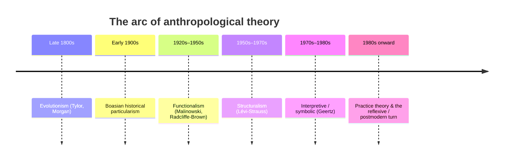

# Anthropological Theory

Anthropological theory is the succession of frameworks the discipline has used to explain
what culture is and how to study it. Unlike a science that discards old theories, anthropology
carries its history with it: each major school arose partly as a rebellion against the one
before, and the arguments of a century ago still shape how fieldwork is done and written
today. The arc below is the standard survey — evolutionism, historical particularism,
functionalism, structuralism, interpretive anthropology, and the practice/reflexive turn.

## Evolutionism

The first professional anthropologists — E. B. Tylor and Lewis Henry Morgan — arranged
societies on a single ladder from "savagery" through "barbarism" to "civilization,"
assuming all peoples pass through the same stages and that European society sat at the top.
This **unilineal evolutionism** was armchair theory built from missionaries' and travelers'
reports, and it was deeply ethnocentric (see [the-culture-concept](the-culture-concept.md)).
Its lasting contribution was the idea that cultures can be compared systematically; its fatal
flaw was ranking them.

## Boasian historical particularism

Franz Boas, the founder of American anthropology, demolished evolutionism. He insisted that
each culture is the product of its own particular history, not a rung on a universal ladder,
and that traits must be understood in their own context — the birth of methodological
**cultural relativism** and of the four-field approach in
[what-is-anthropology](what-is-anthropology.md). Boas demanded rigorous, firsthand data over
grand speculation, and trained a generation (including Mead and Ruth Benedict) who spread
these commitments. See [mead-coming-of-age-in-samoa](mead-coming-of-age-in-samoa.md).

## Functionalism

In Britain, functionalism asked not where a custom came from but what it *does* — how it
contributes to the working of the society as a whole. Two variants:

- **Malinowski's** biological functionalism: institutions exist to meet human needs, and the
  ethnographer discovers their function through immersive fieldwork. See
  [malinowski-argonauts-of-the-western-pacific](malinowski-argonauts-of-the-western-pacific.md)
  and [ethnography-and-fieldwork](ethnography-and-fieldwork.md).
- **Radcliffe-Brown's** structural functionalism: customs function to maintain the *social
  structure* — the enduring web of relations among people — echoing Durkheim's view of
  society as an integrated system (see [../sociology/sociological-theory.md](../sociology/sociological-theory.md)).

Functionalism gave anthropology its fieldwork standard but struggled to explain conflict and
change, tending to portray societies as timeless, self-balancing wholes.

## Structuralism

Claude Lévi-Strauss shifted attention from what culture *does* to the hidden mental
architecture that *generates* it. Drawing on structural linguistics, he argued that beneath
the surface variety of myths, kinship systems, and classifications lies a universal human
mind that thinks in **binary oppositions** (raw/cooked, nature/culture, us/them) and orders
the world by contrast and mediation. The "savage mind" is not primitive but a different, fully
logical mode of classification. See [levi-strauss-savage-mind](levi-strauss-savage-mind.md).
Structuralism was powerful and abstract; critics faulted it for being unfalsifiable and for
draining out history, individuals, and power.

## Interpretive / symbolic anthropology

Clifford Geertz led the reaction against structuralism's search for universal laws. Culture,
he argued, is not a mechanism or a hidden code but a system of **public symbols and meanings**,
and the anthropologist's task is interpretation — **thick description** — not explanation. The
goal is to read a culture the way one reads a text, recovering what practices mean to those who
live them. See [geertz-interpretation-of-cultures](geertz-interpretation-of-cultures.md). This
moved anthropology closer to the humanities and to the interpretive side of
[../philosophy/epistemology.md](../philosophy/epistemology.md).

## Practice theory and the reflexive turn

Two overlapping moves define the recent era.

- **Practice theory** (Pierre Bourdieu, Sherry Ortner, and others) tried to break the
  standoff between structure and individual agency — the same problem sociology calls
  [structure and agency](../sociology/social-structure-and-agency.md). Bourdieu's **habitus**
  is a set of dispositions, laid down by one's social position, that generates action which in
  turn reproduces the structures — neither pure freedom nor pure determination.
- **The reflexive / postmodern turn** (the *Writing Culture* critique of the 1980s) turned the
  lens on anthropology itself. It exposed the discipline's colonial roots, questioned the
  ethnographer's authority to speak for others, and treated ethnographies as constructed,
  partial texts rather than transparent reports — the **crisis of representation** discussed
  in [ethnography-and-fieldwork](ethnography-and-fieldwork.md). Power, history, and the
  politics of knowledge became central.

## Why it matters

Knowing the arc lets you hear which assumptions a piece of anthropology carries: whether it
treats culture as a stage of progress, a functioning whole, a mental code, a web of meaning,
or a contested practice shaped by power. Mature work rarely commits to one school; it borrows
across them, aware that each corrects a blind spot in the last. The trajectory — from
confident classification toward self-aware interpretation — mirrors the broader movement in
the human sciences charted in [../sociology/sociological-theory.md](../sociology/sociological-theory.md).

## References

- [The Savage Mind](levi-strauss-savage-mind.md) — Lévi-Strauss's structuralist account of
  the universal ordering mind.
- [The Interpretation of Cultures](geertz-interpretation-of-cultures.md) — Geertz's
  interpretive alternative built on thick description.
- [Argonauts of the Western Pacific](malinowski-argonauts-of-the-western-pacific.md) —
  Malinowski's functionalism and fieldwork standard.
- [Coming of Age in Samoa](mead-coming-of-age-in-samoa.md) — Boasian anthropology applied to
  the nature-versus-culture question.
