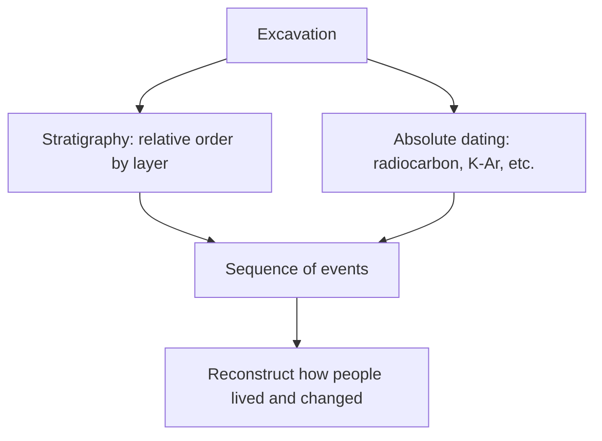

# Archaeology and Material Culture

Archaeology is the subfield that reconstructs the human past from **things** — the
tools, food remains, buildings, burials, and refuse that people leave behind. Because
most of human history is undocumented by writing, and even documented periods leave
gaps, the material record is often the only witness we have. Archaeology's governing
premise is that objects are not mute: patterned physical evidence, read carefully,
reveals how past people lived, organized themselves, and changed over time. It is the
deep-time complement to written history (see [../history/index.md](../history/index.md))
and shares its earliest chapters with
[human-evolution-and-biological-anthropology](human-evolution-and-biological-anthropology.md).

## Material culture and the archaeological record

**Material culture** is the totality of physical objects a society makes and uses. The
**archaeological record** is what survives of it — biased by preservation (stone and
bone last; wood, fiber, and flesh usually do not), by deposition, and by later
disturbance. A central skill is **context**: an artifact's meaning comes less from the
object itself than from *where and with what* it was found. The same premise that objects
encode culture connects archaeology to [the-culture-concept](the-culture-concept.md) —
material things are one of the ways culture is made durable and transmitted.

## Stratigraphy and dating

Two methods let archaeologists put the record in order:

- **Stratigraphy** establishes *relative* sequence via the law of superposition: in
  undisturbed deposits, lower layers are older than the layers above them. Digging down
  is reading backward in time.
- **Absolute dating** assigns calendar ages. **Radiocarbon (¹⁴C) dating** measures the
  decay of carbon-14 in organic material (effective to ~50,000 years); other techniques —
  dendrochronology (tree rings), potassium-argon, luminescence — extend and cross-check
  the chronology.

## The Neolithic revolution

Around 12,000–10,000 years ago, in several regions independently, humans transitioned
from foraging to **farming** — the domestication of plants and animals, often called the
**Neolithic revolution**. Its consequences are visible in the material record: permanent
settlements, storage facilities, pottery, denser populations, and new patterns of
property and labor. Agriculture produced storable surplus, and surplus made possible
social differentiation, specialization, and inequality — setting the stage for the first
cities and states.

## States and civilizations

Where surplus, population, and organization concentrated, **states** emerged:
centralized, hierarchical societies with rulers, administration, monumental
architecture, craft specialization, and often writing. Archaeology reads their rise from
material signatures — monumental construction, standardized goods, elite burials,
fortifications, and evidence of trade and tribute. This provides the empirical backbone
for how complex, stratified political orders arose (see
[political-and-legal-anthropology](political-and-legal-anthropology.md)) and hands the
narrative to written history (see [../history/index.md](../history/index.md)) once texts
appear.

## What objects reveal about people

The interpretive payoff is that mundane things answer human questions. Butchered bones
and charred seeds reconstruct diet and subsistence; the sourcing of obsidian or shell
maps trade networks over great distances; grave goods index status, belief, and
ritual (see [ritual-symbolism-and-religion](ritual-symbolism-and-religion.md)); the
distribution of house sizes measures inequality. Read in context, artifacts recover
social structure, economy, and worldview from people who left no words.

## Why it matters

Archaeology extends the human story back beyond writing and holds broad claims about
human nature and social change to hard physical evidence. It is where anthropology's
concern with culture meets the discipline of the material trace, and it supplies the
long baseline against which historical and contemporary societies can be understood.

## References

- Concept note — synthesized from the archaeological literature; no single source.
  Cross-linked to
  [human-evolution-and-biological-anthropology](human-evolution-and-biological-anthropology.md)
  and [../history/index.md](../history/index.md).
