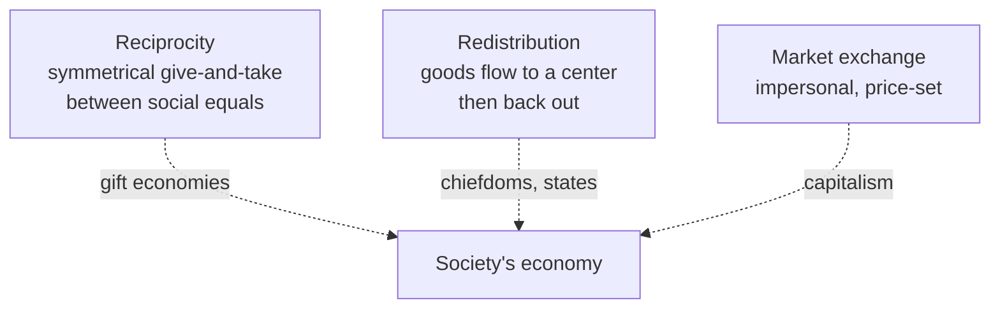

# Economic Anthropology

Economic anthropology studies how human societies produce, distribute, and give
value to goods — with particular attention to arrangements that look nothing like
a market. Its founding insight is that "the economy" is not a self-contained,
universal sphere of rational self-interest but is **embedded** in social relations:
kinship, ritual, politics, and prestige. It therefore provides a comparative,
empirical counterweight to the assumptions of formal [economics](../economics/index.md).

## Modes of exchange

Karl Polanyi distinguished three modes by which goods move through a society, and
argued that self-regulating markets are historically recent and exceptional.

Marshall Sahlins refined **reciprocity** into a spectrum keyed to social distance:
**generalized** (giving without expecting a specific return, as within a family),
**balanced** (an equivalent return expected within a set time, as in trade between
partners), and **negative** (getting something for nothing — haggling, theft, the
morality of the stranger). **Redistribution** funnels goods to a central figure or
institution that then reallocates them — a mechanism inseparable from
[political and legal anthropology](political-and-legal-anthropology.md), since
control of redistribution builds and displays authority.

## The gift

Marcel Mauss's *The Gift* (1925) is the field's cornerstone. Analyzing the Kwakiutl
**potlatch**, the Trobriand **kula** ring, and other cases, Mauss showed that gifts
are never truly free: they carry a threefold obligation — **to give, to receive,
and to reciprocate**. The gift binds giver and receiver into an ongoing relationship;
refusing to accept or repay is a declaration of hostility. Objects circulating as
gifts carry something of the giver (Mauss's *hau*, the "spirit of the gift"),
which is why they must move on rather than be hoarded. The gift is thus a **total
social phenomenon** — simultaneously economic, legal, moral, and religious. This
is developed in [Mauss's *The Gift*](mauss-the-gift.md). Because gift obligations
run along lines of descent and marriage, the topic overlaps deeply with
[kinship and social organization](kinship-and-social-organization.md).

## The formalist–substantivist debate

The mid-20th-century dispute that defined the field:

| Position | Core claim | "Economy" means |
|----------|-----------|-----------------|
| **Formalist** | Universal economic logic — scarcity and maximizing choice — applies everywhere; neoclassical tools fit any society. | Rational allocation of scarce means (a *logic*) |
| **Substantivist** (Polanyi, Dalton) | Non-market economies obey their own social logics; imposing market categories distorts them. | The provisioning of material life (a *process embedded in society*) |

The debate was never fully "won," but it permanently established that motives and
institutions vary cross-culturally. It also anticipates modern
[behavioral economics](../economics/behavioral-economics.md), which likewise
challenges the assumption of a universally calculating, self-interested actor —
though anthropology locates the alternative logics in *culture* rather than in
individual cognition.

## Spheres of exchange and the meaning of money

In many societies goods are sorted into distinct **spheres of exchange** that
cannot be freely converted into one another. Paul Bohannan's classic study of the
Tiv described separate spheres — subsistence goods, prestige goods (cattle, brass
rods), and rights in people (marriage) — where converting *up* from a lower to a
higher sphere was a moral triumph and converting *down* a disgrace. General-purpose
**money**, which makes everything commensurable, dissolves these moral boundaries;
its arrival often disrupts existing social orders. Value, in short, is culturally
constructed: what is priceless, what is fungible, and what may never be sold are
matters of shared meaning, not natural fact.

## Why it matters

Economic anthropology denaturalizes the market. By documenting societies where
prestige, obligation, and the sacred govern the flow of goods, it shows that
capitalism is one arrangement among many — and gives critical purchase on how
market logics spread, collide with local values, and transform social life, a
theme central to [globalization and applied anthropology](globalization-and-applied-anthropology.md).

## References

- [Mauss, *The Gift*](mauss-the-gift.md)
- [Kinship and social organization](kinship-and-social-organization.md)
- [Political and legal anthropology](political-and-legal-anthropology.md)
- [Economics index](../economics/index.md)
- [Behavioral economics](../economics/behavioral-economics.md)
