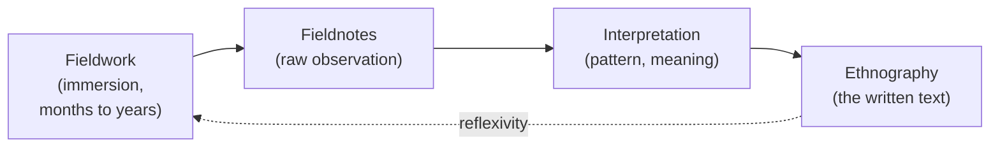

# Ethnography and Fieldwork

Ethnography is anthropology's signature method and its signature product: it is both the
*practice* of studying a way of life through firsthand, long-term immersion, and the
*written account* that results. The word means, literally, "writing culture." To do
ethnography is to live among the people you study, participate in their daily life, and
learn to see the world as they see it — then to render that understanding in a text.

## Participant observation

The core technique is **participant observation**: the researcher takes part in everyday
activities while simultaneously observing and recording them. It is a deliberate paradox —
close enough to grasp meaning from the inside (the emic view; see
[the-culture-concept](the-culture-concept.md)), detached enough to analyze. Bronisław
Malinowski, marooned in the Trobriand Islands during World War I, is credited with
establishing the modern standard: pitch your tent in the village, learn the local language,
stay long enough that the ordinary becomes legible, and record the "imponderabilia of
actual life" — the routine detail no informant would think to mention. See
[malinowski-argonauts-of-the-western-pacific](malinowski-argonauts-of-the-western-pacific.md).

Fieldwork is not a single interview or survey but a sustained relationship, typically
lasting a year or more. Its toolkit includes participant observation, informal and
structured interviews, life histories, mapping, genealogies, and the fieldnote — the daily
written record from which the eventual ethnography is built.

## Thick description

Geertz, borrowing the phrase from the philosopher Gilbert Ryle, argued that the
ethnographer's job is **thick description**: not merely recording behavior (a "thin"
account — an eyelid contracting) but interpreting the layered meanings that make it what it
is to the participants (a wink, a parody of a wink, a conspiratorial signal). The same
physical act carries wholly different social meaning depending on context, and only thick
description captures it. Ethnography, on this view, is fundamentally interpretive — closer to
reading a text than to running an experiment. See
[geertz-interpretation-of-cultures](geertz-interpretation-of-cultures.md) and
[../philosophy/epistemology.md](../philosophy/epistemology.md) for the interpretive-versus-explanatory
debate this raises.

## Reflexivity and positionality

Because the instrument of research is the researcher, who they are shapes what they can see.
**Positionality** names the researcher's social location — gender, race, nationality, age,
class — and how it affects access, rapport, and interpretation. **Reflexivity** is the
discipline of examining that influence openly rather than pretending to a view from nowhere.
The methodological reckoning here parallels the concern with researcher effects and validity
in [../psychology/research-methods-in-psychology.md](../psychology/research-methods-in-psychology.md),
though anthropology treats the researcher's involvement less as bias to be eliminated than as
an unavoidable and even productive part of understanding.

## Ethics and the politics of representation

Ethnography raises hard ethical questions because it turns real people's lives into text
written by an outsider, often across a steep power gradient. Central concerns:

- **Informed consent and harm** — people must understand and agree to being studied, and be
  protected from the consequences of exposure.
- **Anonymity and confidentiality** — protecting identities in the published account.
- **The politics of representation** — anthropology's colonial origins mean the field long
  spoke *about* subject peoples *for* Western audiences. The **"crisis of representation"**
  (see [anthropological-theory](anthropological-theory.md)) forced the question: who has the
  authority to describe whom, and whose voice does the text carry? This spurred experiments
  in collaborative, multi-voiced, and self-reflexive writing.

## Ethnography as method and as text

The double meaning is the point. As a *method*, ethnography prizes depth over breadth,
meaning over measurement, and the single well-understood case over the large sample. As a
*text*, it is a crafted piece of writing that necessarily selects, arranges, and
interprets — never a transparent window. Recognizing that the ethnographer *authors* rather
than merely *records* is one of the discipline's most important self-corrections.

## Why it matters

Participant observation is anthropology's answer to a genuine epistemological problem: some
things about human life — what a ritual *means*, why a practice *feels* obligatory — cannot
be captured by a questionnaire and can only be learned by living them. Ethnography's trade
is to sacrifice generalizability for a kind of understanding no other social-science method
delivers, and its self-awareness about its own limits is now part of the method itself.

## References

- [Argonauts of the Western Pacific](malinowski-argonauts-of-the-western-pacific.md) —
  Malinowski's founding statement of long-term, immersive fieldwork.
- [The Interpretation of Cultures](geertz-interpretation-of-cultures.md) — Geertz on thick
  description and ethnography as interpretation.
- [Coming of Age in Samoa](mead-coming-of-age-in-samoa.md) — Mead's influential (and
  later contested) fieldwork on adolescence.
