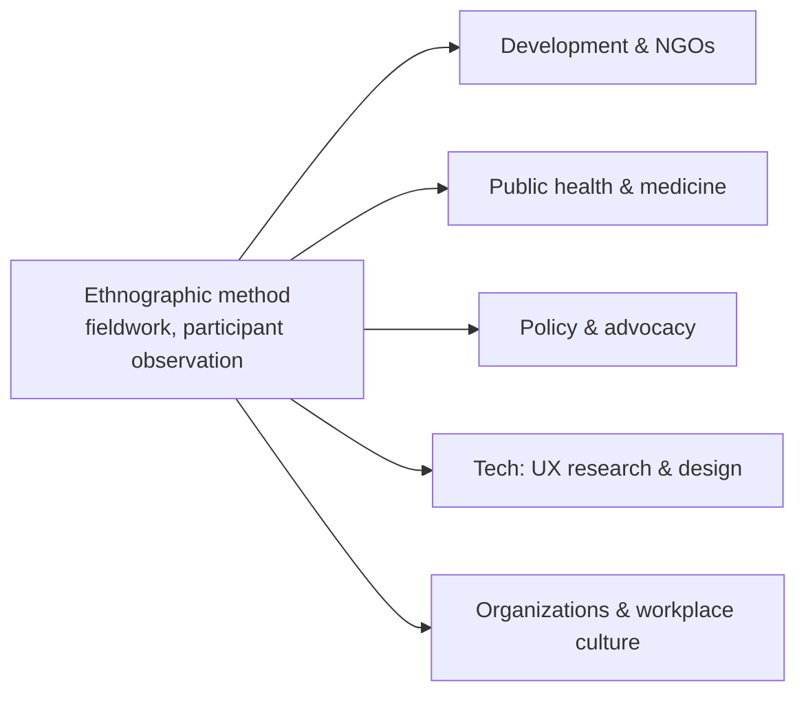

# Globalization and Applied Anthropology

Contemporary anthropology studies a world of intensifying connection — where
people, goods, money, images, and ideas move across borders at unprecedented speed
— and increasingly puts its methods to *practical* use outside the academy. Two
strands run together here: the anthropology **of** globalization (understanding
transnational processes) and **applied** anthropology (deploying ethnographic
insight in development, health, business, and technology).

## Globalization and cultural flows

Against early fears that globalization would homogenize the world into a single
consumer culture, anthropologists emphasize **friction, hybridity, and localization**.
Arjun Appadurai's influential framework maps global cultural flows as five uneven,
overlapping "-scapes":

| Scape | What flows |
|-------|-----------|
| **Ethnoscapes** | people — migrants, refugees, tourists, workers |
| **Technoscapes** | machinery and technical know-how |
| **Financescapes** | capital and currency |
| **Mediascapes** | images and information |
| **Ideoscapes** | ideologies and political keywords (freedom, rights) |

These scapes move independently and clash, producing local reworkings rather than
uniformity — a process often called **glocalization**. Global forms are always
reinterpreted through [the culture concept](the-culture-concept.md) on the ground.

## Migration and transnationalism

Migration is no longer modeled as a one-way rupture from homeland to host country.
Anthropologists document **transnationalism**: migrants sustaining dense ties across
borders — remittances, return visits, dual belonging, diaspora identities — living
in social fields that span multiple nation-states at once. This reframes questions
of citizenship, community, and the reach of [the state](../political-science/the-state-and-sovereignty.md).

## The critique of development

Applied anthropology has a sharply critical strand aimed at international
**development**. Arturo Escobar and others argue that "development" is a *discourse*
that constructs whole regions as "underdeveloped" and in need of Western-defined
intervention, often ignoring local knowledge and priorities and producing failure or
harm. Ethnographers repeatedly show that top-down projects fail when they misread the
social, ecological, and symbolic context in which they land. The lesson — attend to
what people actually value and do — is the discipline's core practical contribution.
Development also intersects with global protest and advocacy, linking to
[social movements and collective behavior](../sociology/social-movements-and-collective-behavior.md).

## Medical anthropology

A large applied subfield, medical anthropology treats health, illness, and healing
as culturally shaped. It distinguishes **disease** (biological pathology) from
**illness** (the patient's lived experience) and from **sickness** (the social role).
It documents diverse **explanatory models** of misfortune and healing, studies how
biomedicine is itself a cultural system, and critiques **structural violence** —
the way poverty and inequality become embodied as sickness (Paul Farmer). Applied
work here improves cross-cultural clinical communication, public-health campaigns,
and epidemic response by grounding them in local understanding.

## Applied and practicing anthropology

Beyond academia, anthropologists work as practitioners wherever human behavior in
context matters:

In technology, **UX research** is applied ethnography: observing how people actually
use products in situ, rather than how designers imagine they will. In organizations,
anthropologists study workplace culture, tacit norms, and how change is absorbed —
directly relevant to [organizational culture in AI-native companies](../ai-org/index.md),
where new practices and tools reshape how teams work and what they believe. All of
this rests on the discipline's signature method, [ethnography and fieldwork](ethnography-and-fieldwork.md).

## Why it matters

This is anthropology turned toward the present and the pragmatic. It equips us to
understand a hyper-connected world without flattening its differences, and to
intervene — in clinics, product teams, policy, and aid — in ways that respect how
people actually live. It closes the loop from theory back to
[what anthropology is](what-is-anthropology.md): the study of humanity, applied.

## References

- [Ethnography and fieldwork](ethnography-and-fieldwork.md)
- [The culture concept](the-culture-concept.md)
- [What is anthropology](what-is-anthropology.md)
- [Social movements and collective behavior](../sociology/social-movements-and-collective-behavior.md)
- [AI-org index (organizational culture)](../ai-org/index.md)
- [The state and sovereignty](../political-science/the-state-and-sovereignty.md)
