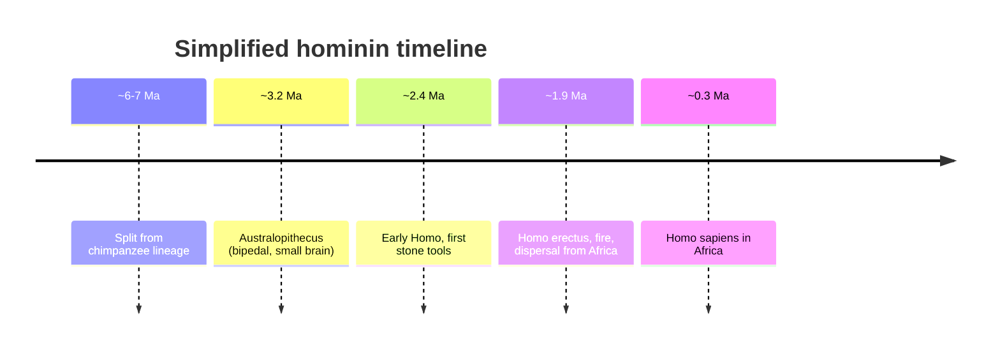

# Human Evolution and Biological Anthropology

Biological (or physical) anthropology is the subfield that studies humans as **evolved,
biological organisms**: our origins as a species, our place among the primates, and the
variation found in living populations. It grounds the discipline in the same framework
that governs all of life — [../biology/evolution-by-natural-selection.md](../biology/evolution-by-natural-selection.md)
— and locates *Homo sapiens* on the same
[../biology/the-tree-of-life-and-taxonomy.md](../biology/the-tree-of-life-and-taxonomy.md)
as every other organism, within the order Primates. It is the empirical counterweight to
purely cultural accounts of humanity: culture is itself a product of an evolved biology.

## Hominin evolution: australopithecines to Homo

The human lineage — the **hominins**, comprising humans and our extinct bipedal
relatives after the split from the chimpanzee line roughly 6–7 million years ago — is
reconstructed from fossils, and increasingly from ancient DNA. A simplified arc:

- **Australopithecines** (e.g. *Australopithecus afarensis*, the "Lucy" skeleton, ~3.2
  Ma) were bipedal but small-brained, with brains near chimpanzee size. Bipedalism came
  first; large brains came much later.
- Early ***Homo*** (*Homo habilis*, ~2.4 Ma) shows brain expansion and is associated
  with the first systematic stone tools (see
  [archaeology-and-material-culture](archaeology-and-material-culture.md)).
- ***Homo erectus*** (~1.9 Ma) had a substantially larger body and brain, controlled
  fire, made more sophisticated tools, and was the first hominin to disperse widely out
  of Africa.
- ***Homo sapiens*** arose in Africa ~300,000 years ago, coexisted and interbred with
  Neanderthals and Denisovans, and later spread across the globe.

Two changes dominate this story. **Bipedalism** — habitual upright walking — reshaped
the pelvis, spine, and foot and freed the hands; it long predates brain expansion.
**Encephalization** — the dramatic increase in brain size relative to body size — came
later and is entangled with tool use, diet, sociality, and, eventually, language (see
[linguistic-anthropology](linguistic-anthropology.md)).

## Primatology

Because humans are primates, our closest living relatives illuminate the evolved
baseline of human behavior. **Primatology** studies monkeys and apes — chimpanzees,
bonobos, gorillas — in the wild and in captivity, documenting tool use, social
hierarchy, cooperation, communication, and culture-like transmission of learned
behavior. Comparison lets anthropologists distinguish what is a shared primate
inheritance from what is distinctively human, disciplined throughout by
[../biology/evolution-by-natural-selection.md](../biology/evolution-by-natural-selection.md).

## Human variation and why race is not biological

Living humans vary — in skin pigmentation, stature, blood type, disease resistance — and
biological anthropology studies this variation as the outcome of evolutionary processes:
selection (e.g. skin pigmentation tracking UV exposure by latitude), drift, gene flow,
and adaptation. Crucially, this variation is **clinal** — it changes gradually and
continuously across geography, and different traits vary independently, following
different geographic gradients. There are no sharp, bundled boundaries that would carve
humanity into discrete biological "races." Most human genetic variation exists *within*
any so-called racial group, not between groups.

The scientific consensus is therefore that **race is not a valid biological category**;
it is a **social construction** — a real and consequential social classification, but
one that does not correspond to natural human subdivisions. This is one of biological
anthropology's most important public contributions: separating socially meaningful
categories (a matter of [the-culture-concept](the-culture-concept.md)) from biological
reality.

## Evolutionary perspectives on behavior

An evolutionary lens is also applied to behavior — the study of how natural selection
shaped human dispositions for cooperation, mate choice, kinship recognition, and
sociality. Such accounts are powerful but contested: their central caution is against
"just-so stories" that assume adaptation without evidence, and against sliding from
description into justification. Biological anthropology holds these hypotheses to the
same evidentiary standards as any evolutionary claim.

## Why it matters

Biological anthropology supplies the deep-time and comparative foundation on which the
rest of the discipline rests. It shows that human beings are simultaneously evolved
animals and culture-bearing beings, and it provides the discipline's clearest,
evidence-based rebuttals to biological determinism and scientific racism.

## References

- Concept note — synthesized from the biological anthropology literature; no single
  source. Heavily cross-linked to
  [../biology/evolution-by-natural-selection.md](../biology/evolution-by-natural-selection.md),
  [../biology/the-tree-of-life-and-taxonomy.md](../biology/the-tree-of-life-and-taxonomy.md),
  and [archaeology-and-material-culture](archaeology-and-material-culture.md).
