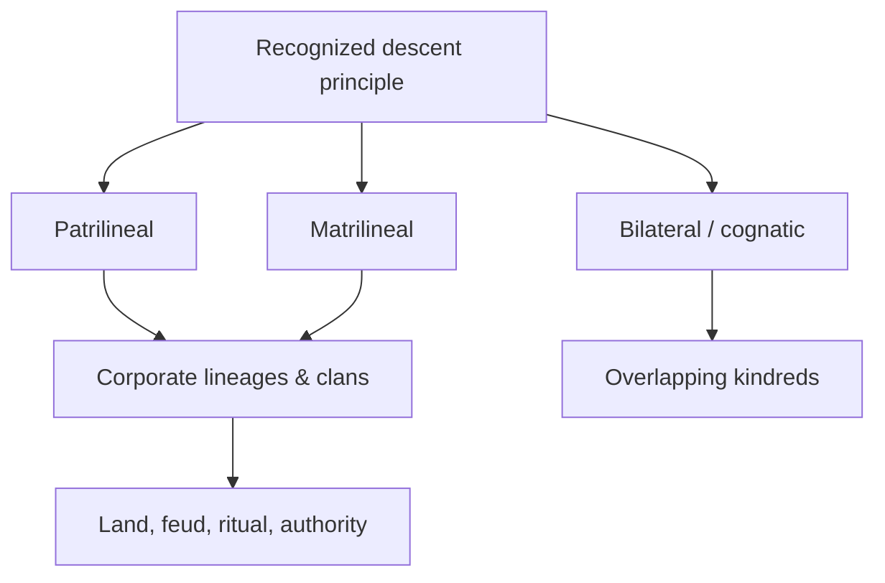

# Kinship and Social Organization

Kinship is anthropology's classic subject — for much of the discipline's history it was
the subject, the terrain on which social structure could be read most precisely. The
puzzle is that biological relatedness is universal but the *categories* built on top of
it are not: every society converts the raw facts of birth and mating into a culturally
specific system of persons, groups, obligations, and prohibitions. Studying kinship is
thus a way of studying how societies organize themselves — how they assign identity,
allocate rights and property, form alliances, and reproduce across generations — often
**without, or before, a centralized state** (see
[political-and-legal-anthropology](political-and-legal-anthropology.md)). Kinship is a
prime demonstration of [the-culture-concept](the-culture-concept.md): the same
biological substrate yields radically different social worlds.

## Descent: tracing the group

**Descent** is the culturally recognized line through which a person inherits group
membership, name, property, and ritual standing. Anthropologists distinguish the major
principles:

- **Patrilineal** — membership traced through the father's line.
- **Matrilineal** — traced through the mother's line (note: matrilineal is not
  matriarchal; men often still hold authority, frequently the mother's brother).
- **Bilateral / cognatic** — reckoned through both parents, as in most contemporary
  Western societies, producing overlapping "kindreds" rather than sharp corporate groups.

**Unilineal** systems (patri- or matrilineal) generate clear, non-overlapping corporate
descent groups — **lineages** (demonstrable common ancestor) and **clans** (assumed,
often mythical ancestor, sometimes a totem). These groups can act as durable political
and economic units: holding land, feuding, mediating disputes, and organizing ritual.

## Marriage and alliance

If descent organizes groups internally, **marriage** links them externally. Claude
Lévi-Strauss reframed marriage not as a bond between two individuals but as an
**exchange between groups** — his *alliance theory* treats the circulation of spouses
(most often women, given by wife-givers to wife-takers) as the fundamental act that
knits separate descent groups into a wider society. Related mechanisms recur
cross-culturally: **bridewealth** (goods from groom's to bride's kin), **dowry**
(wealth accompanying the bride), **exogamy** (marrying out of one's group) and
**endogamy** (marrying within a defined category). Marriage forms vary — monogamy,
polygyny, and (rarely) polyandry — and are best understood as strategies for managing
alliances, labor, and inheritance rather than mere expressions of sentiment.

## Kinship terminologies

Every language carves the field of relatives differently, and these
**terminologies** are systematic, not arbitrary. English lumps father's brother and
mother's brother as "uncle"; many systems keep them sharply distinct because they carry
different obligations. Anthropologists classify these schemes into recurring types
(Eskimo, Hawaiian, Iroquois, Crow, Omaha, Sudanese), each correlating with a pattern of
descent and marriage. Because a terminology encodes which relatives are equated,
distinguished, marriageable, or forbidden, the vocabulary of kinship is a compact map of
the social structure — a point where anthropology meets
[linguistic-anthropology](linguistic-anthropology.md) and the way language partitions
experience.

## The incest taboo

The **incest taboo** — the prohibition on sex and marriage between certain close kin —
is effectively universal in some form, though *which* relatives it covers varies. For
Lévi-Strauss it is the pivot between nature and culture: by forbidding marriage inside
the immediate group, the taboo *forces* exchange with other groups, and so is the very
mechanism that generates alliance and society. It marks the threshold at which humans
stop simply reproducing biologically and begin organizing themselves culturally —
turning kin into a system rather than a fact.

## Why it matters

Kinship shows how much social order can be generated from a few structural principles,
and it anchored the comparative, structural ambition of the discipline — the search,
pursued by Lévi-Strauss in [levi-strauss-savage-mind](levi-strauss-savage-mind.md), for
the underlying logics that recur across otherwise dissimilar societies. Even in
state-governed, individualistic modern life, kinship still allocates inheritance,
citizenship, care, and identity — which is why its study remains foundational rather
than merely historical.

## References

- Concept note — synthesized from the anthropological literature on kinship; no single
  source. Anchored by [levi-strauss-savage-mind](levi-strauss-savage-mind.md); see also
  [the-culture-concept](the-culture-concept.md),
  [political-and-legal-anthropology](political-and-legal-anthropology.md), and
  [linguistic-anthropology](linguistic-anthropology.md).
