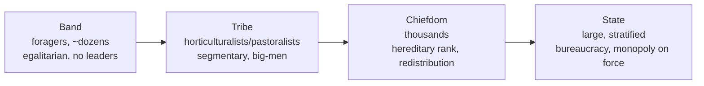

# Political and Legal Anthropology

Political and legal anthropology studies how societies organize power, make
collective decisions, maintain order, and resolve conflict — including the many
societies that have no state, no formal government, and no written law. Its
comparative lens shows that centralized coercive authority is one solution to the
problem of social order, not the only or natural one, which sharpens the analysis
in [political science](../political-science/the-state-and-sovereignty.md).

## A classic typology of political organization

Elman Service proposed an influential (if simplified) ladder of political
integration, keyed to scale, subsistence, and the concentration of authority:

The scheme is a heuristic, not a law of progress — real societies mix features and
do not march up the ladder. But it usefully highlights how leadership, ranking, and
coercion intensify as scale grows.

## Acephalous ("stateless") societies

A foundational discovery of the field is that order does not require a state.
**Acephalous** (headless) societies coordinate without centralized rulers. In
Evans-Pritchard's account of the Nuer, order is maintained through a **segmentary
lineage system**: kin groups nest at multiple levels and align *situationally* —
close lineages that feud among themselves unite against a more distant group, and
all unite against outsiders. Authority is diffuse and relational rather than
institutional. Such systems rely heavily on [kinship and social organization](kinship-and-social-organization.md)
to do the work that governments do elsewhere.

## Authority, leadership, and power

Anthropologists distinguish **power** (the capacity to compel) from **authority**
(power recognized as legitimate). Leadership styles vary sharply:

- The **big-man** (Melanesia) has no office; influence is earned and constantly
  re-earned by generosity, oratory, and building a following. Redistribution of
  wealth (see [economic anthropology](economic-anthropology.md)) is the engine of
  his standing, and it evaporates if he fails to deliver.
- The **chief** holds an inherited office with durable rank, but often still leads
  by persuasion and by redistributing goods rather than by force.
- The **state** claims a monopoly on legitimate coercion, backed by bureaucracy and,
  frequently, by sacralized authority — rulers who are divine or divinely sanctioned
  (a theme shared with [ritual, symbolism, and religion](ritual-symbolism-and-religion.md)).

## Dispute resolution and customary law

Legal anthropology examines how societies define wrongs and restore order without
necessarily having courts, codes, or police. Mechanisms range widely: mediation and
negotiation, compensation payments (**wergild**), feud and its ritualized limits,
oaths and ordeals, witchcraft accusations, moots, and shaming. **Customary law** —
unwritten, orally transmitted, embedded in social relationships — often prioritizes
*restoring relationships* over assigning individual guilt, in contrast to Western
adversarial law. The classic debate (Bohannan vs. Gluckman) over whether to describe
such systems in local terms or in cross-cultural analytic categories mirrors the
formalist–substantivist tension in [economic anthropology](economic-anthropology.md).

## Colonialism's impact

Political and legal anthropology cannot be separated from the colonial context in
which much of it was produced. Colonial administrations frequently **invented or
hardened "tradition"** — appointing "chiefs" where none had existed, codifying
fluid customary practices into rigid "native law," and imposing borders that cut
across existing polities. The discipline has since reckoned critically with its own
complicity, and turned its tools on the colonial and post-colonial state itself —
studying bureaucracy, citizenship, resistance, and the persistence of colonial
categories in modern legal systems. This critical turn feeds into
[globalization and applied anthropology](globalization-and-applied-anthropology.md).

## Why it matters

By documenting order without the state and law without courts, the field
denaturalizes our own political institutions. It shows that legitimacy, justice,
and governance are cultural achievements assembled in many ways — essential context
for anyone theorizing [sovereignty and the state](../political-science/the-state-and-sovereignty.md).

## References

- [Kinship and social organization](kinship-and-social-organization.md)
- [Economic anthropology](economic-anthropology.md)
- [Ritual, symbolism, and religion](ritual-symbolism-and-religion.md)
- [The state and sovereignty](../political-science/the-state-and-sovereignty.md)
