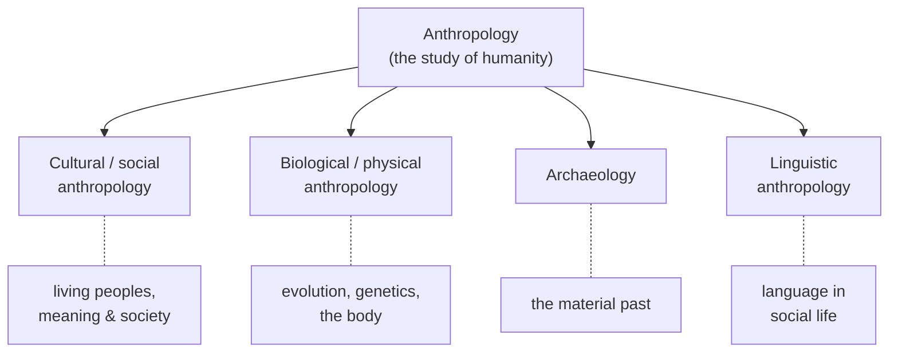

# What Is Anthropology

Anthropology is the study of humanity in its fullest scope — biological, social, cultural,
linguistic, and historical — across all times and places. Where most disciplines carve off
a slice of human life (economies, minds, governments), anthropology's defining ambition is
to keep the whole in view: to ask what it means to be human, and to answer using evidence
from every human society, past and present, rather than from one's own alone. Two
commitments follow from that ambition and give the field its character: **holism** and the
**comparative perspective**.

## The four fields

In the North American tradition, anthropology is conventionally organized into four
subfields. The four-field model reflects the discipline's origins in the late nineteenth
century, when the study of "the human" was not yet split among biology, history, and the
social sciences. Each field asks the human question through a different kind of evidence.

- **Cultural (or social) anthropology** studies living human societies — their meanings,
  institutions, and ways of life — primarily through long-term fieldwork. It is the field
  most people picture when they hear "anthropology." See
  [the-culture-concept](the-culture-concept.md) and
  [ethnography-and-fieldwork](ethnography-and-fieldwork.md). ("Cultural" is the American
  label and "social" the British one; the traditions differ in emphasis but overlap
  heavily — see [anthropological-theory](anthropological-theory.md).)
- **Biological (or physical) anthropology** studies humans as evolved organisms:
  human evolution, primate behavior, genetics, growth, and variation. See
  [human-evolution-and-biological-anthropology](human-evolution-and-biological-anthropology.md).
- **Archaeology** reconstructs past human life from its material remains — tools, dwellings,
  refuse, monuments — bridging deep prehistory and recent history. See
  [archaeology-and-material-culture](archaeology-and-material-culture.md).
- **Linguistic anthropology** studies language as a human capacity and as social action:
  how languages are structured, how they change, and how speaking does cultural work. See
  [linguistic-anthropology](linguistic-anthropology.md).

## Holism and the comparative perspective

**Holism** is the claim that the pieces of human life only make sense in relation to the
whole. A marriage rule, a farming technique, a myth, and a pattern of disease are not
separate facts to be studied in isolation; they interlock, and explaining one usually means
tracing its connections to the others. Holism is why the four fields are held together at
all: a full account of a people may need their language, their material past, their biology,
and their social meanings at once.

The **comparative perspective** is the discipline's guard against parochialism. By setting
societies side by side — including ones radically unlike the anthropologist's own —
anthropology tries to separate what is genuinely universal about humans from what is merely
local and taken for granted. Comparison is what turns "the way we do things" into one case
among many, and it underwrites [cultural relativism](the-culture-concept.md): the
methodological rule of understanding a practice on its own terms before judging it.

## How anthropology differs from sociology

Anthropology and sociology are close cousins — both study human social life, and their
theories cross-pollinate (see [../sociology/sociological-theory.md](../sociology/sociological-theory.md)).
The differences are ones of tradition and emphasis rather than hard boundaries.

| | Anthropology | Sociology |
|---|---|---|
| Classic subject | Small-scale, non-Western, or "other" societies (now: everywhere) | Modern, large-scale, often the researcher's own society |
| Signature method | Ethnography / participant observation, long immersion | Surveys, statistics, comparative macro-analysis |
| Scope | Holistic — culture, biology, language, the past together | Focused on social structure and institutions |
| Core question | What does it mean to be human, across all human variation? | How is modern society organized and reproduced? |

Both fields have converged over time — sociologists now do ethnography (see
[../sociology/sociological-methods.md](../sociology/sociological-methods.md)) and
anthropologists now study cities, corporations, and their own societies (see
[globalization-and-applied-anthropology](globalization-and-applied-anthropology.md)). The
enduring distinction is anthropology's insistence on the full range of human variation and
on understanding people from the inside out.

## Why it matters

Anthropology's payoff is a disciplined defense against the assumption that one's own way of
living is the natural or only way. It supplies the long, wide baseline — every society, the
whole species, the deep past — against which claims about "human nature," "normal" family
life, or "rational" economics can be tested. That baseline is what the rest of this folder
builds on: the [culture concept](the-culture-concept.md), the
[fieldwork method](ethnography-and-fieldwork.md), and the arc of
[theory](anthropological-theory.md).

## References

- [Argonauts of the Western Pacific](malinowski-argonauts-of-the-western-pacific.md) —
  Malinowski's founding demonstration of the holistic, fieldwork-based approach.
- [The Interpretation of Cultures](geertz-interpretation-of-cultures.md) — Geertz on
  culture as the discipline's central object.
- [Coming of Age in Samoa](mead-coming-of-age-in-samoa.md) — Mead's use of comparison to
  question what is universal versus culturally shaped in human development.
