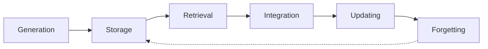

# Architecting Agent Memory — Principles, Patterns, and Best Practices

A talk by **Richmond Alake (MongoDB)** at the AI Engineer conference, arguing
that **memory** is the component that turns a *stateless* AI application into a
*stateful* one — and the discipline of the emerging "AI memory engineer."

## The evolution that led here

Chatbots → RAG (domain knowledge, personalized answers) → scaled compute yielding
emergent reasoning and tool use → **agents**. Agent-ness is a *spectrum* (like
self-driving levels): from a minimal agent that is just an LLM running a loop, up
to autonomous multi-agent systems. What every point on the spectrum shares is
some form of **memory** — short-term or long-term. Memory is what makes an agent
reflective, interactive, proactive, reactive, and autonomous.

## Memory borrowed from the brain

Human memory (short-term, long-term, working, **semantic**, **episodic**,
**procedural** — the last stored in the cerebellum as skills/routines like a
backflip) is the template. Agents can mirror these types. The premise: if AI aims
to mimic human intelligence, and human intelligence is largely the ability to
**recall**, then agents need memory by design.

## Memory management is the real job

The core discipline is **memory management** — systematically organizing what goes
into the context window. A large context window is *not* a place to stuff all your
data; it's where you pull the *relevant* memory in and structure it for a relevant
response. The lifecycle:

Note the last step is **forgetting**, not deletion — humans don't delete memories
(except trauma). Research is exploring forgetting mechanisms (recency/recall
signals) rather than hard deletes. **Retrieval** is the most important stage.

## Memory patterns (modeled in a document store)

Alake's open-source library *Memoriz* encodes these patterns; he models each in
MongoDB using its flexible document model plus graph/vector/text/geospatial search:

- **Persona memory** — the agent's personality, for believable, relationship-building agents.
- **Toolbox memory** — store tool JSON schemas in the DB and retrieve only the relevant ~10–20 before hitting the LLM, so tool count scales beyond the context limit.
- **Conversation memory** — timestamped back-and-forth with recall/recency signals.
- **Workflow memory** — record failed execution steps as *experience*; pull them into the next run so the LLM avoids the failing path. (Echoes [Voyager's](voyager-embodied-agent.md) learn-from-execution loop.)
- **Episodic, long-term, entity memory**, and an **agent registry** (agent's tools/persona/config).

The framing: RAG is not just vector search — you need multiple retrieval types.
Dedicated memory tools exist (MemGPT/Letta, Mem0, Zep) but there's **no single way
to solve memory**; you assemble a custom solution. (MongoDB's stance as a "memory
provider"; it acquired Voyage AI for embeddings/rerankers to reduce hallucination.)

## Related

- [Memory Engineering](memory-engineering.md) — the same generate → store → retrieve → update → forget lifecycle.
- [Agent Memory Systems and Knowledge Graphs](agent-memory-systems-knowledge-graphs.md) — Letta/Mem0/Zep/Cognee compared.
- [Best AI Agent Memory 2026](best-ai-agent-memory-2026.md) — picking a memory tool.
- [Voyager](voyager-embodied-agent.md) — workflow/skill memory as executable experience.

## References
- [Architecting Agent Memory: Principles, Patterns, and Best Practices — Richmond Alake, MongoDB (AI Engineer)](https://www.youtube.com/watch?v=W2HVdB4Jbjs)
