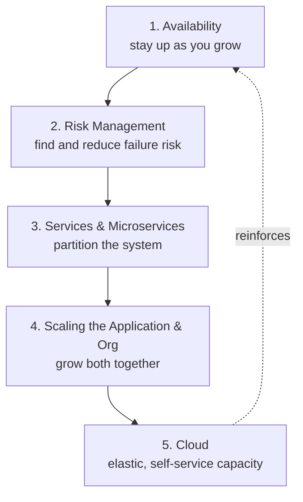
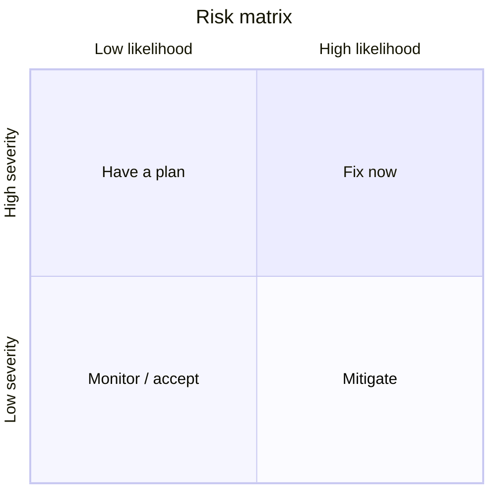

# Architecting for Scale

Lee Atchison's *Architecting for Scale* (O'Reilly, 1st edition, 2016) is a practitioner's
guide to keeping an application dependable as it grows. Its central argument is that scale
is not a switch you flip late — it is a set of habits you build in early, organized around
five reinforcing concerns. The book grows out of Atchison's experience running large
systems at Amazon and New Relic, and it reads as operational discipline more than
academic theory.

## Availability is not reliability

The book opens by pulling apart two words that engineers use interchangeably and shouldn't:

- **Reliability** is about whether the application does the *right* thing — correct
  behavior, correct results. It's a property of the software's logic.
- **Availability** is about whether the application is *there to be used at all* — up,
  reachable, responding. It's a property of the running system.

A perfectly reliable app that is frequently down is useless; so is a highly available app
that returns wrong answers. But Atchison's focus is availability, because at scale the
thing that erodes first — under load, under partial failure, under change — is the system's
ability to stay up. Availability is measured against a target (the familiar "nines"), and
crucially it is a shared responsibility across engineering, not something an ops team can
bolt on afterward.

## The five focus areas

The book is structured around five areas that together determine whether an application
scales gracefully. They are ordered so that each builds on the previous.

1. **Availability** — treat staying up as a first-class design goal, not luck.
2. **Risk management** — systematically identify what can fail and reduce the exposure.
3. **Services and microservices** — decompose the system so failures and growth stay
   local rather than global.
4. **Scaling the application and the organization** — recognize that a growing system and a
   growing team must scale in step; ownership boundaries mirror service boundaries.
5. **Cloud** — use elastic, self-service infrastructure so capacity can follow demand.

## Designing with failure in mind

A recurring theme is that at scale, *failure is normal*. Individual components will fail
constantly; the question is never "how do we prevent all failure" but "how does the system
behave when a part of it fails." Good architecture assumes failure and contains its blast
radius — a failed dependency should degrade one capability, not topple the whole product.
This mindset directly motivates the service decomposition in focus area 3: smaller,
independently-owned services fail independently. It's the same operational philosophy that
runs through [production-ready microservices](production-ready-microservices.md), which
formalizes the properties (stability, reliability, fault tolerance) a service must have to
be trusted in production.

## Risk management: the risk matrix

Atchison's most concrete tool is treating risk as an explicit, managed backlog rather than
a vague worry. Every known risk is plotted on a two-axis **risk matrix**:

- **Likelihood** — how probable is this failure?
- **Severity** — how bad is the impact if it happens?

The matrix turns an amorphous set of fears into a prioritized list. For each risk you then
choose a response:

- **Remove the risk** — eliminate the failure mode entirely (e.g. remove a single point of
  failure by adding redundancy). Best where feasible.
- **Mitigate the risk** — reduce its likelihood or its severity when you can't remove it
  (e.g. add retries, circuit breakers, fallbacks, or degrade gracefully).
- **Monitor / accept** — for low-likelihood, low-severity risks, watch them and consciously
  accept the exposure rather than over-investing.

The point is that risk is *managed continuously*, not audited once. New services and new
features add new risks; the matrix is a living artifact reviewed regularly.

## Graceful degradation

Following from "design with failure in mind," the book stresses **graceful degradation**:
when a dependency is unavailable, the system should shed the affected functionality while
keeping everything else working, rather than failing hard. A recommendation widget that
can't reach its backend should render an empty section, not crash the page. Degradation is
planned in advance — you decide ahead of time which features are essential and which can be
switched off or served stale under stress. This is a mitigation strategy from the risk
matrix made concrete, and it depends on the fault isolation that a
[microservice architecture](microservice-architecture.md) provides: because services are
loosely coupled and independently deployable, one can fall away without dragging the others
down.

## Capacity and self-service scaling

The final concern is capacity: matching resources to demand as the system grows. Atchison
frames the cloud's value as **elastic, self-service** capacity — teams should be able to
provision what they need, when they need it, without a ticket queue or a hardware lead time.
Two ideas anchor this:

- **Self-service infrastructure.** Owning teams provision and scale their own services. This
  mirrors the service/ownership boundaries: the team that owns a service owns its capacity.
- **Scale to match demand.** Rather than statically over-provisioning for a peak, capacity
  should track load — scaling out under pressure and back in when it subsides — so cost
  follows usage. Understanding a service's real capacity limits (through load testing and
  monitoring) is a prerequisite for both automatic scaling and for the risk work above.

Capacity planning, service decomposition, and organizational ownership are the same problem
viewed from three angles: a system scales well only when the software, the infrastructure,
and the teams all scale together.

## References

- [Architecting for Scale — O'Reilly](https://www.oreilly.com/library/view/architecting-for-scale/9781491943380/)
