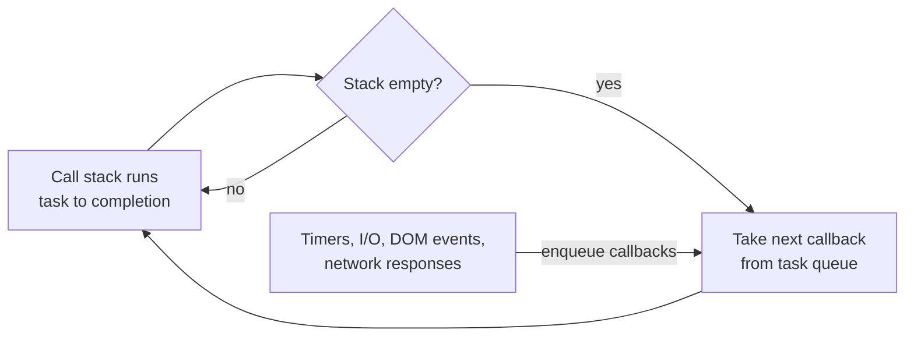
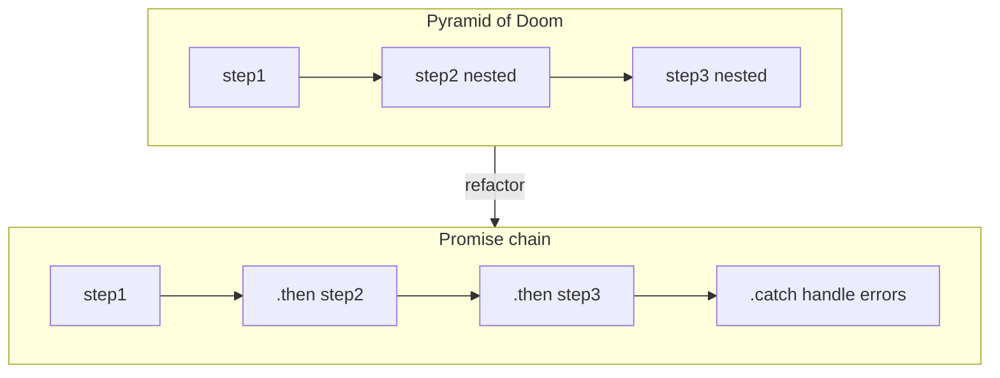

# Async JavaScript: Build More Responsive Apps with Less Code

Trevor Burnham's short guide (Pragmatic Bookshelf, 2012) is about one thing:
writing asynchronous JavaScript that stays clean as the number of events grows.
It predates `async`/`await` and even the standardization of Promises, so its API
specifics are dated — but its mental model of how JavaScript runs is not. The
event loop it describes is still exactly how the language behaves, which is why
the book remains worth reading a decade later.

## The single-threaded concurrency model

JavaScript runs on a single thread. It cannot do two things at literally the same
instant. Instead of threads with mutexes and semaphores, it uses an **event loop**:
work is scheduled as tasks, and the runtime pulls one task off the queue, runs it
to completion, then pulls the next. Async functions don't run in parallel — they
register a callback and return immediately, and that callback fires later when the
loop gets around to it.

The practical consequence is the rule *run-to-completion*: whatever code is
currently executing finishes before any queued callback runs. A timer set for 0ms
does not fire "now"; it fires after the current stack unwinds and the loop is free.
This eliminates the whole category of data-race bugs that haunt multithreaded code,
because nothing else can touch your state mid-function. The cost is that any long
synchronous computation blocks everything — including UI rendering and other
events — until it returns.



Because you never block, you express "do this when that finishes" by handing the
runtime a **callback**. That single idea — defer the continuation as a function —
is the source of both the language's async power and its worst readability problem.

## The Pyramid of Doom

When one async step depends on the result of the previous, the naive approach nests
each callback inside the last. Three or four dependent steps and the code marches
diagonally across the screen, closing braces piling up at the bottom:

```javascript
step1(function (result1) {
  step2(function (result2) {
    step3(function (result3) {
      // ...and so on
    });
  });
});
```

Burnham calls this the **Pyramid of Doom** (a.k.a. callback hell). The problem
isn't the language — it's how the language is used. Deep nesting hurts because
error handling is duplicated at every level, scope leaks across layers, and the
logical order of operations gets buried in indentation. The rest of the book is a
tour of patterns that flatten this pyramid.

## Patterns for taming async

- **Named functions.** The cheapest fix: hoist each inline callback out into a
  named function and pass the name instead of an anonymous literal. The pyramid
  becomes a flat sequence of definitions, each independently readable and testable,
  and stack traces gain meaningful function names. No library required.

- **Error-first discipline.** Node's convention passes `(err, result)` to every
  callback, forcing the error to be handled (or explicitly passed on) at each hop.
  A `try/catch` cannot span an async boundary — the `try` block has already returned
  by the time the callback fires — so errors must be threaded through the callback
  chain deliberately.

- **PubSub and evented models.** Instead of wiring caller directly to callee,
  decouple them through events: one part of the system *publishes* to a named
  channel and any number of *subscribers* react, with neither side knowing about
  the other. This is the publish/subscribe pattern, the same idea behind Node's
  `EventEmitter`, Backbone model events, and jQuery custom events. It turns a rigid
  callback chain into a loose, many-to-many notification graph — good when several
  independent pieces need to react to the same thing.

- **Promises and Deferreds.** A **promise** is a first-class object standing in for
  a value that isn't available yet. Rather than passing a callback *into* a
  function, the function *returns* a promise you attach handlers to. The decisive
  win is composition: promises chain (`.then(...).then(...)`) so dependent steps
  read as a flat vertical sequence instead of a nested pyramid, a single rejection
  handler can catch errors for a whole chain, and multiple promises can be combined
  and awaited together. A **Deferred** is the producer-side handle used to resolve
  or reject a promise. The book covers the jQuery flavor and the Promises/A spec —
  the direct ancestor of today's standard `Promise`.



## Async workflow tooling

Beyond restructuring individual callbacks, the book surveys tools for orchestrating
whole workflows:

- **Async.js** — a flow-control library with collection helpers (async `map`,
  `filter`, `each`) and orchestration primitives (`series`, `parallel`, `waterfall`)
  plus a dynamic task queue, so you can express "run these in order," "run these at
  once," or "feed each result into the next" declaratively instead of by hand-nesting.
- **Step** — a minimalist flow-control library for chaining steps in sequence.
- **Web Workers / Node `cluster`** — true parallelism by spawning separate threads
  or processes that communicate by message passing, sidestepping the single-thread
  limit for CPU-bound work without shared mutable state.
- **Async script loading** — loading `<script>` resources without blocking page
  render, both via the tag itself and programmatically.

An appendix looks ahead to language-level solutions (TameJS, StratifiedJS,
Streamline.js, Node-Fibers) and, presciently, to **generators** as "the future of
JavaScript" — the mechanism that would later underpin `async`/`await`.

## Why it still holds up

Everything about the *syntax* has moved on: `async`/`await` now hides the callbacks
and promises the book so carefully untangles. But `await` is sugar over exactly the
promise-and-event-loop machinery described here. Understanding *why* the pyramid
forms, *why* a `try/catch` can't cross an async boundary, and *how* the loop
schedules a deferred callback is what lets you reason about modern async code when
it misbehaves. The mental model endures even though the APIs are period pieces.

Related: [JavaScript: The Good Parts](javascript-the-good-parts.md) for the language
fundamentals underneath this, and [Simplifying JavaScript](simplifying-javascript.md)
for a more modern take on writing clean JS.

## References

- [Async JavaScript: Build More Responsive Apps with Less Code](https://pragprog.com/titles/tbajs/async-javascript/) — Trevor Burnham, Pragmatic Bookshelf, 2012
