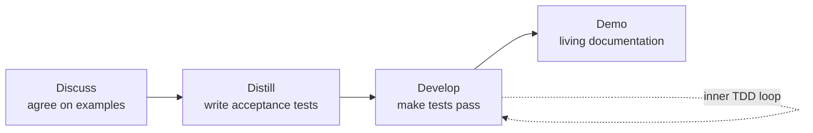

# ATDD by Example: A Practical Guide to Acceptance Test-Driven Development

Markus Gärtner's *ATDD by Example* (Addison-Wesley, 2012) is a hands-on
introduction to **Acceptance Test-Driven Development** — the practice of turning a
feature's acceptance criteria into automated tests *before* the feature is built,
and doing so collaboratively across the people who ask for the work, the people
who build it, and the people who test it.

## What ATDD is

ATDD extends the red-green-refactor rhythm of
[unit-level TDD](test-driven-development-by-example.md) up to the level of
business-facing behavior. Where a unit test pins down a function, an acceptance
test pins down a *feature* in the customer's language. The workflow:

1. **Discuss** — the "three amigos" (business, development, testing) agree on
   concrete examples of the expected behavior, including edge cases.
2. **Distill** — the examples are written as acceptance tests in a form both
   humans and a test framework can read.
3. **Develop** — the team implements the feature until the acceptance tests pass,
   using unit-level TDD inside that outer loop.
4. **Demo** — the passing tests double as the demonstration and as living
   documentation of what the system does.

## The book's approach

Gärtner teaches through a worked example rather than theory, walking a realistic
feature end to end. Practical themes:

- **Collaboration first.** The most valuable output of ATDD is the shared
  understanding produced by discussing examples, not the test files. Tools come
  after the conversation.
- **Tooling.** The book uses acceptance-testing frameworks such as FitNesse,
  Robot Framework, Cucumber, and Selenium to show that ATDD is
  framework-agnostic; the pattern matters more than any tool.
- **Keeping tests maintainable.** Acceptance tests rot faster than unit tests if
  written carelessly. Gärtner covers writing them at the right level of
  abstraction, hiding UI/technical detail behind a fixture layer so the tests
  express intent, not mechanics.

## Where it sits

ATDD is the executable expression of the "confirmation" step in
[User Stories Applied](user-stories-applied.md) and the *verifiable* criterion in
[Software Requirements](software-requirements.md). It shares its core with
[Specification by Example](specification-by-example.md) — the two describe the
same practice from complementary angles (Gärtner emphasizes the test-driven
mechanics; Adzic emphasizes the living-documentation payoff). The end-to-end
browser-facing variant is the subject of
[The Way of the Web Tester](the-way-of-the-web-tester.md), and the broader
automation discipline is covered in [automated QA](automated-qa.md).

## References

- [ATDD by Example — Pearson](https://www.pearson.com/en-us/subject-catalog/p/atdd-by-example-a-practical-guide-to-acceptance-test-driven-development/P200000009127)
