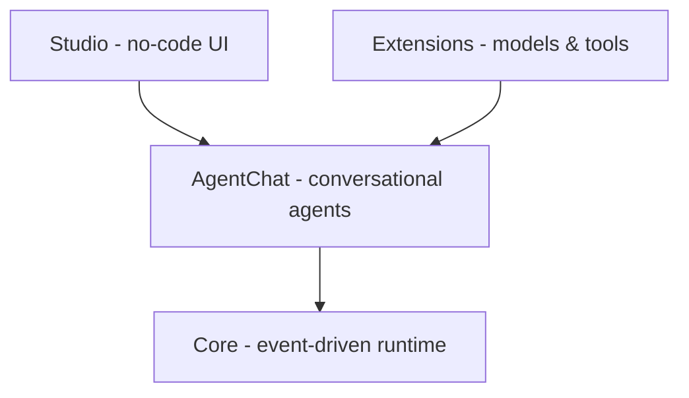

# AutoGen

AutoGen is Microsoft's open-source framework for building AI agents and
multi-agent applications. Its central abstraction is the **conversation**: you
compose systems out of agents that talk to each other (and to tools and humans),
and the application's behavior emerges from those exchanges rather than from a
hand-wired control graph.

## Layered architecture

Post-0.4, AutoGen is organized as a stack of layers so you can enter at the
altitude that fits the task:

- **Core** — the low-level, event-driven foundation: an actor-style message
  passing runtime for agents. Everything else is built on it. Start here for
  full control and custom runtimes.
- **AgentChat** — the high-level programming framework for conversational single-
  and multi-agent applications, built on Core. This is where most application
  code lives (e.g. `AssistantAgent` backed by a model client). Start here to
  prototype in Python.
- **Extensions** — integrations with specific model providers, tools, and
  external systems (e.g. the OpenAI model client) that plug into the above.
- **Studio** — a web UI for prototyping agents with no code, built on AgentChat.
  Start here if you are new and want to experiment before writing code.

## Conversation patterns

The framework's value is in orchestrating dialogue between specialized agents.
Common patterns include two-agent back-and-forth (e.g. an assistant paired with a
code executor or a user-proxy), and group chats where several agents contribute
and a manager decides who speaks next. Termination conditions and turn-taking
rules govern when a conversation stops. This makes AutoGen a natural fit for the
multi-agent and orchestrator-worker patterns in
[building effective agents](building-effective-agents.md), and a contrasting
design point against graph-based frameworks like [LangGraph](langgraph.md) (which
makes the control flow explicit) and role-based ones like [CrewAI](crewai.md).

Tools that agents call are increasingly surfaced through the
[Model Context Protocol](model-context-protocol.md); see also the general
[agent runtime](agent-runtime.md) note.

## References

- [AutoGen documentation](https://microsoft.github.io/autogen/) (current version at [microsoft.github.io/autogen/stable](https://microsoft.github.io/autogen/stable/))
